# Єдиний звіт із практики ServiceTrack Tesla

Філатов Олександр Юрійович, КН-42. Робоча збірка матеріалів станом на 29.09.2026.

Це накопичувальна основа, а не завершений звіт для здачі. Зібрано матеріали ПЗ5–11 та ПЗ13–20 та ПЗ22–23 (ПЗ18 очікує незалежного review; ПЗ21 пропущено; у ПЗ22 відгук модельований); наступні теми додавати сюди. Остаточний документ оформити за notes/templates/report.docx: титул, підстави, календар, зміст, вступ, розділи, висновки, джерела. Не заявляти завершення всіх тем.

## Аналіз аналогів ServiceTrack Tesla

Практичне заняття 5. Філатов Олександр Юрійович, КН-42. Дата дослідження: 29.09.2026.

### Мета і межі аналізу

Проєкт призначений для обліку сервісних замовлень незалежної майстерні Tesla. Порівняно два прямі аналоги — Orderry і Shopmonkey — та непрямий аналог Google Sheets. Мета — визначити функції мінімально життєздатного продукту (MVP) і його відмінності від наявних рішень.

### Характеристика аналогів

Orderry об’єднує замовлення, клієнтів, автомобілі, призначення майстрів, статуси, кошториси та історію ремонту. Також пропонує склад і платежі [1]. Перевага — готовий широкий процес майстерні; для навчального MVP це орієнтир повноти, а не вимога повторити весь продукт.

Shopmonkey пропонує кошториси, пошук робіт і деталей, VIN-сканування, фотоогляд, електронне погодження та історію взаємодій [2]. Перевага — зв’язок кошторису з погодженням; ServiceTrack обмежується ручною фіксацією процесу.

Google Sheets — спільні електронні таблиці [3, 4]. Клієнтів, VIN, строки й суми можна обліковувати у стовпцях і формулах. Це непряма альтернатива: зв’язки та процес ремонту потрібно налаштовувати самостійно. Такий спосіб використання таблиць є висновком цього аналізу.

### Порівняння функціональності

Таблиця 1. Порівняння 14 функцій. Наш MVP — ServiceTrack Tesla; «Так» — підтверджено; «Вручну» — власна таблиця; «Н/п» — не підтверджено джерелом, що не означає відсутності.

| Функція | Наш MVP | Orderry [1] | Shopmonkey [2] | Sheets [3,4] |
| --- | --- | --- | --- | --- |
| Облік клієнтів | Так | Так | Н/п | Вручну |
| Дані авто та VIN | Так | Так | Так | Вручну |
| Окремі замовлення | Так | Так | Так | Вручну |
| Призначення майстра | Так | Так | Так | Вручну |
| Контроль етапів ремонту | 7 статусів | Так | Так | Вручну |
| Перелік робіт і деталей | Так | Так | Так | Вручну |
| Розрахунок кошторису | Так | Так | Так | Формули |
| Історія обслуговування | Так | Так | Так | Вручну |
| Коментарі до робіт | Так | Так | Так | Коментарі |
| Планові строки | Так | Так | Н/п | Вручну |
| VIN-сканування | Ні | Н/п | Так | Н/п |
| Електронне погодження клієнтом | Ні | Так | Так | Н/п |
| Складський облік | Ні | Так | Так | Вручну |
| Онлайн-оплата | Ні | Так | Так | Н/п |

### Висновки та унікальна пропозиція

Базові функції ремонту вже добре представлені на ринку. Твердження «такого продукту немає» було б необґрунтованим. Доцільність розробки полягає у навчальній реалізації та можливості пристосувати невелику систему до процесів власної майстерні.

УТП: «ServiceTrack Tesla — компактне робоче середовище українською для незалежної майстерні Tesla: картка авто, ручні коди помилок, сім етапів ремонту й попередній кошторис із локальним зберіганням даних».

Відмінність полягає у поєднанні вузького обсягу й власного контролю над кодом, а не в унікальності кожної функції. Припущення про зручність і економію часу потрібно перевірити з адміністраторами та механіками під час UAT. Ціни тарифів, недокументовані обмеження й задоволеність клієнтів не оцінювалися.

### Джерела

[1] Orderry. Auto Repair Shop Management Software. https://orderry.com/auto-repair-shop-management-software-20148/ (переглянуто 29.09.2026).

[2] Shopmonkey. Repair estimate software for service shops. https://www.shopmonkey.io/product/estimates (переглянуто 29.09.2026).

[3] Google Workspace. Google Sheets. https://workspace.google.com/products/sheets/ (переглянуто 29.09.2026).

[4] Google Workspace Learning Center. Share and collaborate on a spreadsheet. https://support.google.com/a/users/answer/13309904?hl=en (переглянуто 29.09.2026).

## Цільова аудиторія ServiceTrack Tesla

Практичне заняття №6 — Визначення цільової аудиторії та опис потреб користувачів  
Виконав: Філатов Олександр Юрійович, група КН-42  
Дата: 29 вересня 2026 року

### Мета та цільова аудиторія

ServiceTrack Tesla призначений для працівників однієї незалежної майстерні, яка обслуговує електромобілі Tesla. Система має поєднати відомості про клієнта, автомобіль, ремонт, відповідального механіка, строк і попередню вартість. Основні користувачі — адміністратор, який організовує роботу майстерні, і механік, який виконує діагностику та ремонт.

Власник автомобіля отримує користь від актуальної інформації про ремонт, але в поточній версії не входить до системи: з ним спілкується адміністратор. Особистий кабінет клієнта, оплата та автоматичне підключення до Tesla не входять до обсягу MVP.

### Підстава для створення профілів

Профілі узгоджені з концепцією ПЗ №4, аналізом аналогів у ПЗ №5 та двома ролями застосунку. Це вигадані проєктні персони: їхні біографії, звички та проблеми є припущеннями для перевірки. Інтерв’ю, опитування та спостереження за реальними користувачами поки не проводилися. Опис не є звітом про такі дослідження.

### Персона 1 — Олена

**Ім’я та вік:** Олена, 34 роки.  
**Роль:** адміністратор незалежної майстерні Tesla.

#### Біографія та робоче середовище

Олена має професійну освіту за напрямом організації обслуговування та досвід адміністративної роботи в автосервісі. Одружена, виховує одну дитину. На роботі приймає звернення, записує контакти клієнтів, уточнює скарги, розподіляє замовлення між механіками та повідомляє клієнтам стан ремонту. Основний пристрій — ноутбук на рецепції; смартфон потрібний, коли вона відходить від робочого місця.

Сімейний стан додає контекст вигаданому профілю, але не визначає права доступу чи функції системи.

#### Цілі та мотивації

- Бачити актуальний стан відкритих замовлень і відповідального за кожне авто.
- Швидко знаходити клієнта та автомобіль під час телефонної розмови.
- Пояснювати клієнту попередню вартість і плановий строк на основі записаних даних.
- Вчасно помічати прострочені ремонти та уточнювати причину затримки.
- Зберігати історію звернень, щоб повторно не збирати ті самі відомості.

Мотивація — менше пропущених домовленостей і повторного введення даних, зрозуміла організація роботи майстерні.

#### Проблеми та виклики

Контакти й домовленості можуть бути розкидані між повідомленнями та нотатками. Повторне створення картки автомобіля ускладнює пошук його історії. Без єдиного списку статусів доводиться запитувати механіка про кожний ремонт. Ручне підсумовування робіт і деталей створює ризик помилок, а планові строки легко пропустити.

#### Технічні навички та очікування

Рівень навичок — середній: Олена користується браузером, месенджерами, електронною поштою та таблицями, але не адмініструє сервери. Вона очікує український інтерфейс, підписані поля, зрозумілі повідомлення про помилки, пошук за клієнтом/VIN/номером замовлення і автоматичний підсумок кошторису. Збереження даних має супроводжуватися помітним підтвердженням.

#### Типовий сценарій

1. Клієнт привозить Tesla зі скаргою на шум у підвісці.
2. Олена знаходить автомобіль за VIN або створює клієнта та картку авто.
3. Створює замовлення, записує скаргу, призначає механіка й планову дату.
4. Після діагностики читає висновок механіка, додає роботи й деталі до кошторису та обговорює їх із клієнтом поза системою.
5. Фіксує результат домовленості коментарем і відповідним статусом.
6. Після готовності перевіряє дані, видає автомобіль і переводить замовлення у кінцевий статус «Видано».

**Ознака успішного сценарію:** клієнт, автомобіль, кошторис і події ремонту пов’язані в одному замовленні; сума правильна; запис зберігається після повторного відкриття.

### Персона 2 — Максим

**Ім’я та вік:** Максим, 29 років.  
**Роль:** механік електромобілів у тій самій майстерні.

#### Біографія та робоче середовище

Максим має технічну освіту з обслуговування автомобілів і досвід діагностики електромобілів. Неодружений. Протягом дня працює біля автомобілів, виконує діагностику та ремонт, передає результати адміністратору. Для ServiceTrack користується переважно смартфоном, а за потреби — ноутбуком у майстерні. Діагностичне обладнання та його програми працюють окремо від ServiceTrack.

#### Цілі та мотивації

- Швидко відкривати призначені йому замовлення та бачити скаргу клієнта.
- Зберігати діагностичні висновки й коди помилок у картці відповідного ремонту.
- Передавати адміністратору відомості про стан роботи без повторних усних пояснень.
- Фіксувати зупинку через очікування погодження чи запчастин.
- Позначати готовність автомобіля після завершення робіт.

Мотивація — мати актуальне завдання під рукою й витрачати менше часу на пошук та повторну передачу інформації.

#### Проблеми та виклики

Нотатки можуть залишатися в телефоні й не потрапляти до адміністратора. Усне повідомлення про несправність легко втратити або пов’язати не з тим автомобілем. Загальний список усіх ремонтів відволікає від власних завдань. Дрібні елементи керування та довгі форми незручні на телефоні. Після зміни домовленостей потрібний доступ до актуального коментаря адміністратора.

#### Технічні навички та очікування

Максим впевнено користується діагностичними програмами й смартфоном, але не програмує. Йому потрібні читабельні поля на вузькому екрані, короткий шлях до власного замовлення, окремі поля діагностики та кодів помилок, коментарі й дозволені переходи статусу. У разі помилки збереження він має побачити повідомлення, а не помилково вважати запис збереженим.

Механік не має змінювати клієнтів, ціни або видавати автомобіль. Автоматичне зчитування кодів із Tesla не передбачене: результати вносяться вручну.

#### Типовий сценарій

1. Максим входить у ServiceTrack і відкриває призначене йому замовлення.
2. Перевіряє автомобіль, скаргу клієнта, строк і коментарі.
3. Переводить замовлення у статус «Діагностика» та виконує перевірку окремими діагностичними засобами.
4. Вручну зберігає висновок і виявлені коди, додає пояснення для адміністратора.
5. За необхідності ставить дозволений статус очікування; після погодження переходить до ремонту.
6. Після завершення позначає «Готово». Видачу клієнту оформлює адміністратор.

**Ознака успішного сценарію:** записані висновки доступні адміністратору; зміна статусу має автора й час; механік бачить лише свої замовлення та не може виконати заборонені дії.

### Як профілі впливають на проєкт

| Потреба | Рішення для MVP | Зв’язок із вимогами ТЗ |
|---|---|---|
| Олена швидко знаходить звернення | Пошук за клієнтом, VIN і номером замовлення | FR09 |
| Олена уникає повторних карток авто | Перевірка VIN, зв’язок клієнт–авто–замовлення | FR02–FR04 |
| Олена контролює строки та вартість | Планова дата, прострочення, автоматичний кошторис | FR04, FR07, FR09 |
| Максим зберігає результати біля авто | Адаптивні форми діагностики й ручних кодів | FR05, NFR03 |
| Працівники бачать актуальний стан | Статуси, коментарі, історія з автором і часом | FR06, FR08 |
| Кожен виконує лише свої дії | Дві ролі та перевірка прав на сервері | FR01, NFR01 |
| Обом зрозуміло, чи дані збережено | Українські підписи та повідомлення успіху/помилки | NFR02 |

Пріоритетними є облік клієнтів і авто, власні замовлення механіка, діагностика, статуси, кошторис та історія. Не слід додавати до MVP складський облік чи клієнтський кабінет лише для збільшення кількості функцій: профілі цього не обґрунтовують.

### Перевірка припущень

Під час користувацького тестування слід залучити представників обох ролей і перевірити сценарії без покрокових підказок. Питання для короткого інтерв’ю:

1. Де зараз зберігаються контакти, дані авто та історія ремонту?
2. Яку інформацію найчастіше доводиться перепитувати або шукати?
3. Які статуси реально використовує майстерня і хто їх змінює?
4. Хто встановлює ціни, погоджує кошторис і оформлює видачу?
5. На якому пристрої працівник відкриватиме систему та що заважає роботі з ним?

Фіксувати потрібно фактичні труднощі, помилки й побажання. За результатами уточнити профілі, назви полів, порядок дій і вимоги. До проведення тестування не робити висновків про доведену економію часу чи задоволеність користувачів.

### Висновок

Для ServiceTrack Tesla визначено дві основні персони з різними обов’язками: адміністратор організовує облік і взаємодію з клієнтом, механік виконує ремонт та фіксує його результат. Профілі обґрунтовують розподіл прав, склад даних і пріоритет мобільного доступу для механіка. Подальша перевірка з реальними працівниками має підтвердити або скоригувати ці припущення.

Умова ПЗ №6: https://b.optima-osvita.org/mod/lesson/view.php?id=183955. Окреме прикріплення результату на платформі не вимагається.

## Вимоги до ServiceTrack Tesla

Практичне заняття №7 — Збір і систематизація вимог  
Виконав: Філатов Олександр Юрійович, група КН-42  
Версія 1.0 від 29 вересня 2026 року

### Мета і межі

ServiceTrack Tesla має забезпечити облік ремонту в одній незалежній майстерні: від створення клієнта й автомобіля до видачі авто зі збереженням історії робіт. Основні користувачі — адміністратор і механік. Поточний обсяг — локальний вебзастосунок українською з ручним введенням діагностичних результатів.

Цей перелік визначає очікувану поведінку і способи її перевірки. Наявність вимоги в документі не означає, що її реалізація вже перевірена. Фактичні результати мають фіксуватися окремо у матриці тестування.

### Джерела та метод збору

Використано аналіз погодженої концепції ПЗ №4, матеріалів аналізу аналогів ПЗ №5, персон адміністратора Олени та механіка Максима з ПЗ №6, а також умов практичного курсу. Уточнення правил сформовано під час розбору сценаріїв приймання, ремонту та видачі авто.

Інтерв’ю, опитування й командні зустрічі для цього документа не проводилися. Потреби персон є проєктними гіпотезами; під час UAT їх слід перевірити з реальними представниками обох ролей.

### Пріоритети MoSCoW

- **Must:** обов’язково для приймання MVP.
- **Should:** важливо; якщо перевірка не пройдена, обмеження потрібно зафіксувати та визначити строк виправлення.
- **Could:** можливе розширення після завершення MVP.
- **Won’t:** свідомо не входить у поточну версію.

### Функціональні вимоги

| Код | Пріоритет | Що має робити система | Критерій приймання |
|---|---|---|---|
| FR01 | Must | Забезпечувати вхід, вихід і дві ролі. Облікові записи створює уповноважений адміністратор через засоби адміністрування; відкритої реєстрації немає | Коректний пароль відкриває робочу область; неправильний — повідомлення без входу. Після виходу захищені дані недоступні. Механік не може змінити клієнта, ціну чи видати авто навіть прямим API-запитом |
| FR02 | Must | Створювати, переглядати й редагувати клієнта: ім’я, телефон, email, примітки. Видаляти лише клієнта без пов’язаних авто | Ім’я й телефон обов’язкові. Email необов’язковий, але за наявності перевіряється. Дані зберігаються після повторного відкриття; небезпечне для зв’язків видалення відхиляється |
| FR03 | Must | Вести автомобілі: власник, модель Tesla, рік, VIN, номер і пробіг | Власник, модель, рік і VIN обов’язкові; VIN нормалізується у верхній регістр, має 17 допустимих символів без I/O/Q і не дублюється; пробіг не від’ємний. Авто із замовленнями не видаляється |
| FR04 | Must | Дозволяти адміністратору створювати замовлення з авто, скаргою, відповідальним механіком і плановою датою | Авто, скарга та планова дата обов’язкові. Номер формується системою. Непризначений механік явно позначається; призначати можна лише активного механіка. Механік бачить лише призначені йому замовлення |
| FR05 | Must | Зберігати висновок діагностики й коди помилок, введені вручну | Адміністратор або призначений механік зберігає та повторно читає текст. Сторонній механік не отримує доступ до замовлення. Автоматичне зчитування з авто не виконується |
| FR06 | Must | Керувати сімома статусами за встановленою схемою переходів | Нове замовлення має стан «Прийнято». Недозволений перехід відхиляється без зміни даних. Для кожної успішної зміни створюється подія. Статус «Видано» встановлює лише адміністратор |
| FR07 | Must | Формувати попередній кошторис із робіт і деталей: тип, назва, кількість, ціна за одиницю | Лише адміністратор додає, змінює й видаляє позиції відкритого замовлення. Кількість > 0, ціна ≥ 0. Для 1,5 × 1000 результат становить 1500,00 грн; порожній кошторис — 0,00 грн |
| FR08 | Must | Показувати історію статусів і дозволяти коментарі до доступних замовлень | Події мають автора, час і текст. Порожній коментар відхиляється. Автор визначається сервером; підмінити його через запит не можна |
| FR09 | Must | Шукати клієнтів, автомобілі та замовлення; фільтрувати замовлення за статусом і простроченням | Пошук за клієнтом, VIN і номером замовлення повертає відповідні записи. Порожній результат пояснюється повідомленням. Список розбитий на сторінки по 50 записів, наступні сторінки доступні |
| FR10 | Must | Відкривати історію замовлень автомобіля з його картки | Для обраного авто показуються всі доступні користувачу пов’язані замовлення, включно з наступними сторінками. Дані іншого авто не домішуються |
| FR11 | Must | Закривати замовлення після видачі автомобіля | У статусі «Видано» поля замовлення і кошторис не редагуються, статус не змінюється. Уточнювальні коментарі дозволені. Повторне звернення оформлюється новим замовленням |
| FR12 | Must | Показувати огляд замовлень: кількість, активні та прострочені | Показники узгоджені з поточною сторінкою відфільтрованого списку; підпис прямо вказує цей обсяг. Їх не подавати як підсумок усієї бази |

#### Дані і валідація

Модель Tesla обирається зі списку підтримуваних моделей. Рік — ціле число 2008–2100, пробіг — ціле число від 0 до 3 000 000 км. VIN має бути унікальним у базі; формат не доводить існування реального автомобіля. Державний номер необов’язковий; пробіг має початкове значення 0 і уточнюється під час приймання; персональні дані в демонстрації — вигадані.

Планова дата обов’язкова і не є часом фактичного завершення ремонту. Без неї створення замовлення відхиляється. Видалення клієнта чи автомобіля не повинно знищувати ремонтну історію. Історичні події статусу не редагуються користувачем.

#### Схема статусів

| Поточний статус | Дозволені наступні статуси |
|---|---|
| Прийнято | Діагностика |
| Діагностика | Очікує погодження; Очікує запчастин; У ремонті |
| Очікує погодження | Діагностика; Очікує запчастин; У ремонті |
| Очікує запчастин | Діагностика; У ремонті |
| У ремонті | Діагностика; Очікує запчастин; Готово |
| Готово | У ремонті; Видано |
| Видано | Переходів немає |

Погодження клієнтом відбувається поза застосунком. Результат домовленості працівник записує коментарем; електронний підпис або доказ онлайн-погодження система не створює.

Прострочення: планова дата раніша за поточну дату в часовій зоні Europe/Kyiv, а статус не «Готово» і не «Видано». Активними для огляду вважаються замовлення до цих двох станів.

### Нефункціональні вимоги

| Код | Категорія та пріоритет | Вимога | Спосіб перевірки |
|---|---|---|---|
| NFR01 | Безпека — Must | Авторизація перевіряється на сервері для кожної операції. Записи іншого механіка недоступні. Сесійні запити зміни захищені CSRF; текст користувача не виконується як HTML/JavaScript | Позитивні й негативні API-тести для обох ролей, запити без CSRF, перевірка небезпечного тексту у формах |
| NFR02 | Зручність — Must | Українські підписи й зрозумілі стани завантаження, порожнього списку, успіху та помилки. Збій запиту не показується як успішне збереження | Пройти створення і редагування з правильними/помилковими даними; змоделювати збій запиту й перевірити повідомлення |
| NFR03 | Адаптивність — Must | Основні дії доступні на ширинах 390, 768 та 1280 px; таблиця може прокручуватися, але кнопки й поля не перекриваються | Перевірити вхід/вихід, відкриття замовлення, коментар, дозволену зміну статусу на трьох ширинах |
| NFR04 | Продуктивність — Should | Для 1000 демонстраційних замовлень p95 часу відповіді API списку 50 записів < 2 с за одного локального користувача | Виконати 5 прогрівальних і 50 вимірюваних запитів в однаковому середовищі; записати конфігурацію та p95. Це не оцінка швидкості зовнішньої мережі |
| NFR05 | Надійність — Must | Підтверджені зміни зберігаються після перезапуску. Зміна статусу та відповідна подія записуються разом або не записуються взагалі | Створити дані, перезапустити сервер і повторно прочитати; змоделювати помилку створення події та перевірити відкат зміни статусу |
| NFR06 | Точність — Must | Грошові значення зберігаються десятковим типом; підсумок подається у гривнях із точністю до 0,01. Для підсумку округлюється сума добутків позицій | Перевірити нуль, дробові кількості та ціни, кілька позицій і граничні значення; зіставити результат з десятковим розрахунком |
| NFR07 | Супроводжуваність — Must | Запуск відтворюється за інструкцією; залежності зафіксовані, схема БД керується міграціями, демодані створюються окремою командою, API задокументовано | Запустити чисту копію на порожній базі, застосувати міграції, створити демодані й виконати тести; звірити документацію з маршрутами |
| NFR08 | Розгортання та резервування — Must перед роботою з реальними даними | HTTPS, DEBUG=0, зовнішній секрет, захищені cookies, обмежений доступ до БД і резервних копій. Копія даних щонайменше раз на добу й перед оновленням; перевірене відновлення | Окремо перевірити налаштування розгортання, створити узгоджену резервну копію та відновити її у тестовому середовищі. Локальне HTTP-демо цю вимогу не підтверджує |
| NFR09 | Сумісність — Should | Ключові сценарії працюють у двох різних сучасних браузерах і в мобільному розмірі; для курсової перевірки — 3–4 комбінації браузер/пристрій | Записати фактичні браузери/версії/пристрої; у кожній комбінації перевірити вхід, пошук, відкриття замовлення та дозволену зміну статусу |

Локальний MVP орієнтований на невелике навантаження однієї майстерні. Гарантії доступності 99,9%, підтримки тисяч одночасних користувачів чи стійкості до всіх конкурентних записів не заявляються. За переходу до багатокористувацької експлуатації необхідні окрема перевірка конкурентних операцій і вибір відповідної БД.

### Можливі розширення та виключення

| Код | MoSCoW | Функція або напрям | Причина |
|---|---|---|---|
| EXT01 | Could | Фото й файли в замовленні | Корисно для огляду, але потребує окремого зберігання та контролю доступу |
| EXT02 | Could | Нагадування про строки | У MVP є фільтр прострочення; автоматичні повідомлення потребують окремих правил |
| EXT03 | Could | Перехід на PostgreSQL | Розглядати за зростання одночасних записів після вимірювань |
| EXC01 | Won’t | Tesla API, Toolbox, автоматичне зчитування чи керування авто | Поточний продукт веде облік, а результати діагностики вводяться вручну |
| EXC02 | Won’t | Складські залишки, закупівлі та онлайн-оплата | Позиції кошторису не є складським або платіжним обліком |
| EXC03 | Won’t | Кілька майстерень, самореєстрація та кабінет клієнта | Поточна модель призначена для однієї майстерні й двох внутрішніх ролей |

### Приймання та керування змінами

MVP приймається після перевірки всіх застосовних Must-вимог. Неперевірені вимоги позначаються як неперевірені, а не виконані. Вимогу NFR08 перевіряють до переходу від демонстраційних до реальних даних. Для Should-вимог фіксують результат, відхилення та рішення щодо виправлення.

Наскрізна перевірка: адміністратор створює клієнта, авто й замовлення → призначений механік додає діагностику → адміністратор формує кошторис → працівники проводять замовлення через дозволені статуси → адміністратор видає авто → історія доступна, а редагування закритого замовлення заблоковане.

Коди FR01–FR12 і NFR01–NFR09 збережено для узгодженості з технічним завданням. При зміні вимоги потрібно зазначити її причину, оновити відповідний тест і технічне завдання. Нові потреби з UAT спочатку оцінюються щодо обсягу, пріоритету та впливу на обидві ролі.

### Висновок

Систематизовано 12 груп функціональних і 9 нефункціональних вимог із пріоритетами та критеріями перевірки. Окремо визначено життєвий цикл замовлення, правила доступу, дані, можливі розширення та виключення. Цей документ є основою ПЗ №8 — оформлення технічного завдання.

Умова ПЗ №7: https://b.optima-osvita.org/mod/lesson/view.php?id=183957. Прикріплення результату на платформу не вимагається.

## Технічне завдання ServiceTrack Tesla

Практичне заняття №8. Філатов Олександр Юрійович, група КН-42. Версія 1.0 від 29 вересня 2026 року.

### 1 Загальний опис проєкту

ServiceTrack Tesla — вебзастосунок для обліку ремонтів в одній незалежній майстерні електромобілів Tesla. Мета — поєднати клієнта, автомобіль, скаргу, відповідального механіка, строк, діагностику та попередній кошторис в одному процесі.

Завдання: забезпечити приймання авто, розподіл робіт, збереження результатів діагностики, контроль статусів і строків, розрахунок вартості та видачу автомобіля зі збереженням історії. Перевірний результат — наскрізний сценарій від приймання до видачі без втрати підтверджених даних.

#### Цільова аудиторія

Олена, 34 роки — адміністратор із професійною освітою та досвідом автосервісу. Працює з ноутбуком і смартфоном, має середні цифрові навички. Потребує пошуку клієнтів, єдиного переліку ремонтів, строків і кошторисів. Основні труднощі — розрізнені повідомлення, дублікати карток і пропущені домовленості.

Максим, 29 років — механік із технічною освітою, впевнено користується діагностичними програмами. Працює переважно зі смартфоном біля авто. Потребує доступу до власних замовлень, запису діагностики й передачі результатів. Труднощі — втрачені нотатки, повторні пояснення та незручні форми на малому екрані.

Підстави ТЗ — концепція ПЗ №4, аналіз аналогів ПЗ №5 і матеріали ПЗ №6–7. Персони є проєктними гіпотезами; їх потрібно перевірити з реальними користувачами. Власник авто не має окремого облікового запису в MVP.

### 2 Функціональні вимоги

FR01–FR12 мають пріоритет Must — обов’язкові для MVP. Нижче наведено очікувану поведінку та критерії приймання; це не звіт про вже виконані перевірки.

#### FR01 Must

Забезпечувати вхід, вихід і дві ролі. Облікові записи створює уповноважений адміністратор через засоби адміністрування; відкритої реєстрації немає.

Приймання: Коректний пароль відкриває робочу область; неправильний — повідомлення без входу. Після виходу захищені дані недоступні. Механік не може змінити клієнта, ціну чи видати авто навіть прямим API-запитом.

#### FR02 Must

Створювати, переглядати й редагувати клієнта: ім’я, телефон, email, примітки. Видаляти лише клієнта без пов’язаних авто.

Приймання: Ім’я й телефон обов’язкові. Email необов’язковий, але за наявності перевіряється. Дані зберігаються після повторного відкриття; небезпечне для зв’язків видалення відхиляється.

#### FR03 Must

Вести автомобілі: власник, модель Tesla, рік, VIN, номер і пробіг.

Приймання: Власник, модель, рік і VIN обов’язкові; VIN нормалізується у верхній регістр, має 17 допустимих символів без I/O/Q і не дублюється; пробіг не від’ємний. Авто із замовленнями не видаляється.

#### FR04 Must

Дозволяти адміністратору створювати замовлення з авто, скаргою, відповідальним механіком і плановою датою.

Приймання: Авто, скарга та планова дата обов’язкові. Номер формується системою. Непризначений механік явно позначається; призначати можна лише активного механіка. Механік бачить лише призначені йому замовлення.

### 2 Функціональні вимоги продовження

#### FR05 Must

Зберігати висновок діагностики й коди помилок, введені вручну.

Приймання: Адміністратор або призначений механік зберігає та повторно читає текст. Сторонній механік не отримує доступ до замовлення. Автоматичне зчитування з авто не виконується.

#### FR06 Must

Керувати сімома статусами за встановленою схемою переходів.

Приймання: Нове замовлення має стан «Прийнято». Недозволений перехід відхиляється без зміни даних. Для кожної успішної зміни створюється подія. Статус «Видано» встановлює лише адміністратор.

#### FR07 Must

Формувати попередній кошторис із робіт і деталей: тип, назва, кількість, ціна за одиницю.

Приймання: Лише адміністратор додає, змінює й видаляє позиції відкритого замовлення. Кількість > 0, ціна ≥ 0. Для 1,5 × 1000 результат становить 1500,00 грн; порожній кошторис — 0,00 грн.

#### FR08 Must

Показувати історію статусів і дозволяти коментарі до доступних замовлень.

Приймання: Події мають автора, час і текст. Порожній коментар відхиляється. Автор визначається сервером; підмінити його через запит не можна.

### 2 Функціональні вимоги продовження

#### FR09 Must

Шукати клієнтів, автомобілі та замовлення; фільтрувати замовлення за статусом і простроченням.

Приймання: Пошук за клієнтом, VIN і номером замовлення повертає відповідні записи. Порожній результат пояснюється повідомленням. Список розбитий на сторінки по 50 записів, наступні сторінки доступні.

#### FR10 Must

Відкривати історію замовлень автомобіля з його картки.

Приймання: Для обраного авто показуються всі доступні користувачу пов’язані замовлення, включно з наступними сторінками. Дані іншого авто не домішуються.

#### FR11 Must

Закривати замовлення після видачі автомобіля.

Приймання: У статусі «Видано» поля замовлення і кошторис не редагуються, статус не змінюється. Уточнювальні коментарі дозволені. Повторне звернення оформлюється новим замовленням.

#### FR12 Must

Показувати огляд замовлень: кількість, активні та прострочені.

Приймання: Показники узгоджені з поточною сторінкою відфільтрованого списку; підпис прямо вказує цей обсяг. Їх не подавати як підсумок усієї бази.

### 3 Дані та правила ремонту

Клієнт: ім’я й телефон обов’язкові; email і примітки необов’язкові. Авто: власник, модель Tesla, рік та унікальний VIN обов’язкові. VIN — 17 символів без I/O/Q, верхній регістр. Рік 2008–2100, пробіг 0–3 000 000 км. Номер авто необов’язковий. Формат VIN не підтверджує існування реального автомобіля.

Замовлення: автомобіль, скарга й планова дата обов’язкові; механіка можна призначити пізніше. Позиція кошторису: тип, назва, кількість > 0 та ціна ≥ 0. Видалення пов’язаного клієнта або авто блокується; видалення замовлень через робочий API не передбачене.

Таблиця 1. Дозволені переходи статусів

| Поточний статус | Наступний статус |

| --- | --- |

| Прийнято | Діагностика |

| Діагностика | Очікує погодження; Очікує запчастин; У ремонті |

| Очікує погодження | Діагностика; Очікує запчастин; У ремонті |

| Очікує запчастин | Діагностика; У ремонті |

| У ремонті | Діагностика; Очікує запчастин; Готово |

| Готово | У ремонті; Видано |

| Видано | Переходів немає |

Прострочення: дата раніше сьогодні у Europe/Kyiv, статус не «Готово» і не «Видано». Погодження відбувається поза застосунком і фіксується коментарем. Після видачі уточнювальні коментарі дозволені; повторний ремонт — нове замовлення.

### 4 Нефункціональні вимоги

#### NFR01 Безпека — Must

Авторизація перевіряється на сервері для кожної операції. Записи іншого механіка недоступні. Сесійні запити зміни захищені CSRF; текст користувача не виконується як HTML/JavaScript.

Перевірка: Позитивні й негативні API-тести для обох ролей, запити без CSRF, перевірка небезпечного тексту у формах.

#### NFR02 Зручність — Must

Українські підписи й зрозумілі стани завантаження, порожнього списку, успіху та помилки. Збій запиту не показується як успішне збереження.

Перевірка: Пройти створення і редагування з правильними/помилковими даними; змоделювати збій запиту й перевірити повідомлення.

#### NFR03 Адаптивність — Must

Основні дії доступні на ширинах 390, 768 та 1280 px; таблиця може прокручуватися, але кнопки й поля не перекриваються.

Перевірка: Перевірити вхід/вихід, відкриття замовлення, коментар, дозволену зміну статусу на трьох ширинах.

#### NFR04 Продуктивність — Should

Для 1000 демонстраційних замовлень p95 часу відповіді API списку 50 записів < 2 с за одного локального користувача.

Перевірка: Виконати 5 прогрівальних і 50 вимірюваних запитів в однаковому середовищі; записати конфігурацію та p95. Це не оцінка швидкості зовнішньої мережі.

#### NFR05 Надійність — Must

Підтверджені зміни зберігаються після перезапуску. Зміна статусу та відповідна подія записуються разом або не записуються взагалі.

Перевірка: Створити дані, перезапустити сервер і повторно прочитати; змоделювати помилку створення події та перевірити відкат зміни статусу.

### 4 Нефункціональні вимоги продовження

#### NFR06 Точність — Must

Грошові значення зберігаються десятковим типом; підсумок подається у гривнях із точністю до 0,01. Для підсумку округлюється сума добутків позицій.

Перевірка: Перевірити нуль, дробові кількості та ціни, кілька позицій і граничні значення; зіставити результат з десятковим розрахунком.

#### NFR07 Супроводжуваність — Must

Запуск відтворюється за інструкцією; залежності зафіксовані, схема БД керується міграціями, демодані створюються окремою командою, API задокументовано.

Перевірка: Запустити чисту копію на порожній базі, застосувати міграції, створити демодані й виконати тести; звірити документацію з маршрутами.

#### NFR08 Розгортання та резервування — Must перед роботою з реальними даними

HTTPS, DEBUG=0, зовнішній секрет, захищені cookies, обмежений доступ до БД і резервних копій. Копія даних щонайменше раз на добу й перед оновленням; перевірене відновлення.

Перевірка: Окремо перевірити налаштування розгортання, створити узгоджену резервну копію та відновити її у тестовому середовищі. Локальне HTTP-демо цю вимогу не підтверджує.

#### NFR09 Сумісність — Should

Ключові сценарії працюють у двох різних сучасних браузерах і в мобільному розмірі; для курсової перевірки — 3–4 комбінації браузер/пристрій.

Перевірка: Записати фактичні браузери/версії/пристрої; у кожній комбінації перевірити вхід, пошук, відкриття замовлення та дозволену зміну статусу.

Must — обов’язково; Should — бажано. NFR08 застосовується до реальних даних.

### 5 Архітектура системи

Клієнт-серверний модульний моноліт: браузерний інтерфейс, API та бізнес-правила Django, реляційна база через ORM. Інтерфейс і API мають спільне походження, що спрощує сесії та CSRF-захист.

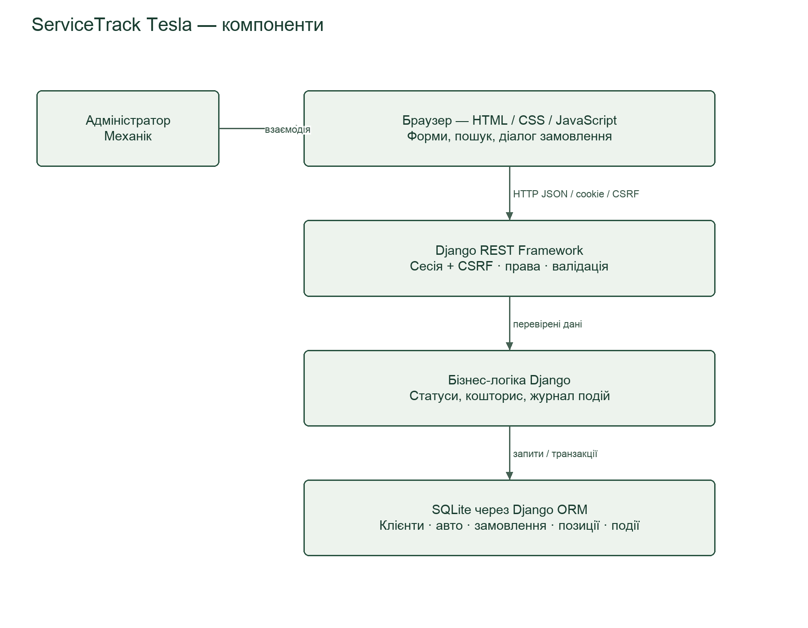

Рисунок 1. Компоненти та напрям передавання запиту

Відповідь JSON повертається тим самим шляхом до інтерфейсу. Зовнішніх сервісів у процесі обліку ремонту немає. GitHub використовується для розробки. Локальне демо працює через HTTP; робоче розгортання потребує HTTPS.

Зв’язки даних: клієнт → автомобілі → замовлення → позиції кошторису та події (1:N). Користувач може бути механіком багатьох замовлень і автором багатьох подій. VIN унікальний; зовнішні ключі зберігають зв’язки.

### 6 Технологічний стек

#### Python 3 і Django 5.2

Серверна логіка, ORM, міграції, сесії та адміністрування користувачів. Це зменшує кількість окремих компонентів. Ризик — помилки налаштування доступу або production; потрібні тести й перевірка конфігурації. Альтернатива Flask потребувала б додаткової інтеграції цих засобів.

#### Django REST Framework і OpenAPI

DRF забезпечує JSON API, серіалізацію, валідацію, пошук і пагінацію. drf-spectacular формує схему OpenAPI. Права на об’єкти та нестандартні дії потребують окремих тестів і перевірки документації. Власні JSON views збільшили б дублювання.

#### SQLite та Django ORM

SQLite спрощує локальний запуск без окремого сервера БД. Обмеження — конкурентні записи; блокування рядків select_for_update не діє як у PostgreSQL. Для мережевої експлуатації потрібні перевірка конфліктів та оцінка переходу на PostgreSQL. ORM і десяткова арифметика застосовуються для даних та сум.

#### HTML CSS і JavaScript

Форми, адаптивні стилі та модулі JavaScript працюють із API через fetch. Окрема збірка інтерфейсу не потрібна. При розростанні екранів підтримка ручного керування станом ускладнюється; React/Vue можна оцінити для наступних версій.

#### Git GitHub та перевірки

Git і гілки — історія змін; GitHub — репозиторій і review. Django TestCase/APIClient та Node test runner — автоматичні перевірки; браузерні сценарії — перевірка взаємодії. Залежності фіксуються у requirements.txt; інструкція запуску — у README.

### 7 Етапи та орієнтовні терміни

Це план доопрацювання та приймання версії 1.0, складений 29.09.2026. Він не підмінює фактичні дати виконання календарем практики. Виконавець індивідуальної роботи — Філатов Олександр Юрійович. Інструментальна допомога та результати перевірок фіксуються в робочих матеріалах.

#### Етап 1 Аналіз і ТЗ

29.09.2026, орієнтовно 4 години. Узгодити аналоги, персони, FR/NFR, архітектуру та межі. Результат: матеріали ПЗ5–8 і діаграма. Приймання: кожна вимога має пріоритет і перевірний критерій, суперечності усунено.

#### Етап 2 Реалізація та інтеграція

29–30.09.2026, орієнтовно 12 годин. Завершити моделі, API, ролі, інтерфейс і демонстраційні дані. Приймання: сценарій створення клієнта, авто, ремонту й кошторису працює; механік не виконує заборонені дії.

#### Етап 3 Перевірка і документація

30.09–01.10.2026, орієнтовно 8 годин. Перевірити критерії, негативні сценарії, браузери, швидкодію, виправити критичні дефекти. Результат: журнали, матриця відповідності, посібник користувача й документація запуску.

#### Етап 4 UAT та підготовка захисту

Орієнтовно 02–05.10.2026, 4 години роботи виконавця без часу очікування учасників. Залучити 2–3 добровольців, виконати 3–5 сценаріїв, опрацювати відгуки та підготувати демонстрацію. Дати уточнюються після узгодження доступності учасників.

#### Етап 5 Передавання версії

Орієнтовно 06.10.2026, 2 години. Зібрати код, документацію, результати перевірок і release notes; позначити стабільну версію тегом. Передумова — виконані критерії приймання. Незавершені зовнішні перевірки фіксуються окремо.

### 8 Приймання та межі версії

Функціональне приймання: FR01–FR12 перевірено, застосовні Must-вимоги виконано, критичних невиправлених дефектів немає. Для Should-вимог є результат вимірювання або явно зафіксоване відхилення та рішення щодо нього. NFR08 перевіряється до застосування реальних даних.

Наскрізний сценарій: адміністратор створює клієнта, авто та замовлення → призначений механік записує діагностику → адміністратор формує кошторис → дозволені переходи приводять до «Готово» → адміністратор видає авто → історія збережена, редагування закритого ремонту заблоковане.

Комплект результатів: вихідний код і міграції, requirements.txt, README, демодані без персональної інформації, OpenAPI, посібник користувача, результати тестів і опис версії. Приймання застосунку не замінює вимог курсу щодо людського review, зовнішніх перевірок, UAT і захисту.

Could: файли до ремонту, нагадування, PostgreSQL після оцінки навантаження. Won’t: Tesla API/Toolbox, автоматична діагностика, складські залишки, оплата, кілька майстерень, самореєстрація чи кабінет клієнта. Кошторис не є податковим або фіскальним документом.

Зміни ТЗ: зберігати коди FR/NFR, зазначати причину та нову версію, оцінювати вплив на строки, права й тести. Фактичні результати фіксувати в матриці відповідності; не позначати неперевірений пункт виконаним.

#### Джерела

Умова ПЗ №8: https://b.optima-osvita.org/mod/lesson/view.php?id=183958. Внутрішні матеріали: концепція ПЗ4, аналіз ПЗ5, персони ПЗ6, вимоги ПЗ7.

Django: https://docs.djangoproject.com/en/5.2/

Django REST Framework: https://www.django-rest-framework.org/

OpenAPI: https://drf-spectacular.readthedocs.io/en/latest/

SQLite: https://www.sqlite.org/whentouse.html

## Архітектура ServiceTrack Tesla
Практичне заняття №9. Філатов Олександр Юрійович, КН-42. 29 вересня 2026 року.

### Компоненти і взаємодія
Тип архітектури — клієнт-серверний модульний моноліт із трьома логічними рівнями: представлення, бізнес-логіка та дані. API і бізнес-правила є частинами одного Django-застосунку, а не окремими мікросервісами.

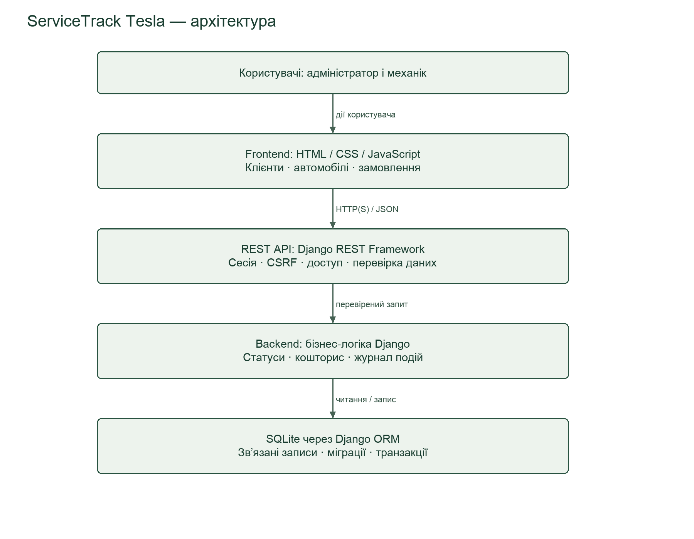

Стрілки показують шлях запиту. Дані або повідомлення про помилку повертаються у зворотному напрямі: БД → бізнес-логіка → API → інтерфейс → користувач. Локальне демо використовує HTTP; робоче розгортання потребує HTTPS.

### Структура бази даних

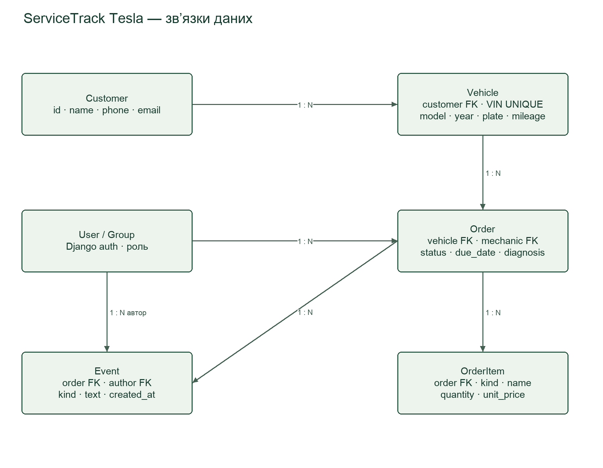

Позначення 1:N означає «один до багатьох», FK — зовнішній ключ, UNIQUE — унікальне значення. Клієнт має автомобілі; авто — замовлення; замовлення — позиції кошторису та події. User / Group узагальнює підсистему користувачів і ролей; показані зв’язки ведуть від User.
Механік у замовленні може бути не призначений. Event.author фіксує автора події з поточної сесії. Видалення клієнта або авто з залежними записами блокується; робочий API не пропонує видалення замовлення. VIN унікальний, кількість і ціна перевіряються перед збереженням.

### API та послідовність роботи
Основні ресурси API: /api/customers/, /api/vehicles/, /api/orders/ та /api/items/. Браузер виконує запити, API перевіряє сесію, CSRF, роль, доступ до конкретного запису та введені дані. ORM читає й зберігає сутності; інтерфейс обробляє JSON-відповідь.
1. Користувач відкриває доступне йому замовлення та обирає дозволений новий статус.
2. API перевіряє автентифікацію, роль і доступ; механік може працювати лише з власним замовленням, а видачу підтверджує адміністратор.
3. Сервіс у транзакції перевіряє перехід, змінює статус і створює подію з автором та часом.
4. Після успішного запису інтерфейс оновлює стан та історію. Помилка не повинна відображатися як успіх.

### Зовнішні сервіси та обмеження
Зовнішні бізнес-сервіси у MVP не використовуються: немає підключення до Tesla API/Toolbox, платежів чи SMS. GitHub потрібний для розробки, а не обробки ремонтів. Інтерактивна Swagger-довідка може завантажувати бібліотеку з CDN; основні робочі екрани використовують локальні ресурси.
Моноліт спрощує запуск, міграції та узгодженість даних. Моделі, серіалізатори, сервіси й обробники API розділяють відповідальність. Ролі перевіряються на сервері. Зміна статусу і подія записуються в одній транзакції; резервування та захищене розгортання визначені ТЗ.
SQLite обрана для локального MVP. Її select_for_update не забезпечує блокування рядків як у PostgreSQL. Перед конкурентною роботою реальної майстерні потрібні перевірка одночасних змін, політика конфліктів і оцінка переходу на PostgreSQL. Розділення інтерфейсу, бізнес-логіки та доступу до даних спрощує таке розширення.

## Обґрунтування технологій ServiceTrack Tesla
Практичне заняття №10. Філатов Олександр Юрійович, КН-42. 29.09.2026.

### Зв’язок із вимогами
Для однієї майстерні потрібні пов’язані дані, ролі, форми, історія й точні суми. Пріоритет — відтворюваний локальний MVP із невеликою кількістю компонентів. Стек відповідає концепції ServiceTrack Tesla; склад установлених залежностей зафіксований у requirements.txt. Основні компоненти: Python/Django, DRF, SQLite, HTML/CSS/JavaScript; допоміжні — OpenAPI, Git/GitHub та засоби тестування. Обсяг — дві ролі й одна майстерня, без платежів та підключення до автомобілів.
План версії 1.0 передбачає доопрацювання 29.09–06.10.2026. Числовий бюджет не погоджено; на етапі локального MVP платний хостинг не потрібний. Витрати на подальше розгортання слід оцінити окремо. Вибір враховує короткий термін та можливість запуску без окремого сервера бази даних.

### Python 3 і Django 5.2
Python використано для моделей, валідації, прав і тестів. Django надає ORM, міграції, сесійну автентифікацію, CSRF та керування обліковими записами [1]. Це скорочує кількість окремих компонентів для FR01–08. Перевага Python — читабельність бізнес-правил і спільна мова для реалізації та тестів; ризик — витрати часу на важкі обчислення, тому автоматичну обробку діагностичних потоків у MVP не передбачено.
Ризики: неправильні налаштування DEBUG/SECRET_KEY, блокувальні довгі операції. Заходи: налаштування через середовище, окремий production checklist, відсутність важких фонових задач у MVP. Flask потребував би більше власної інтеграції auth/ORM/admin. Express є можливою альтернативою, але означав би зміну погодженої серверної платформи й додаткові пакети для тих самих задач.

### Django REST Framework і drf spectacular
DRF застосовано для JSON API, серіалізаторів, перевірки введення, пагінації, пошуку й дозволів [2]. drf-spectacular формує OpenAPI, щоб опис типів залишався близьким до коду [3]. Ризики — помилки прав на рівні об’єктів і неповні описи нестандартних actions; їх перевіряють тести й ручне звіряння схеми. Власні JSON views були б простішими лише для кількох маршрутів, але збільшили б дублювання.

### SQLite і Django ORM
Реляційна модель відповідає зв’язкам клієнт–авто–замовлення; зовнішні ключі захищають цілісність. SQLite не потребує окремого сервера й підходить для локального навчального запуску [4]. ORM параметризує запити, а DecimalField описує точність грошових полів; підсумок розраховується десятковою арифметикою в застосунку. Особливості числового зберігання SQLite потребують перевірки граничних значень.
Ризики: обмежена конкурентність запису, відсутність повноцінного серверного адміністрування БД. PostgreSQL краще підходить для мережевого багатокористувацького розгортання, але ускладнює початковий запуск. MongoDB не обрано, бо зв’язки та цілісність у цьому проєкті важливіші за гнучку структуру документів.

### HTML CSS і JavaScript
Семантичні форми, CSS Grid/Flex і модулі JavaScript реалізують три основні розділи та діалог замовлення. Fetch обробляє API, стан очікування й помилки. Немає окремої збірки Front-end або залежності від CDN у основних екранах. Для невеликого MVP це зменшує складність запуску.
HTML задає структуру і стандартні форми, CSS — адаптивне компонування, JavaScript — динамічну взаємодію з API. Ризики: семантичні помилки у формах, відмінності верстки між браузерами й помилки стану інтерфейсу. Заходи: підписи полів, адаптивні перевірки, екранування введення, обробка невдалих запитів. Логіку форматування та пошуку винесено в helpers.js, побудову полів — у form-fields.js. React/Vue доцільні при багатьох екранах і складному стані, але для поточного обсягу додають інструменти збірки без обов’язкової функціональної потреби.

### Git та GitHub
Git обрано для історії змін, гілок і відтворення версій. GitHub передбачений умовою курсу для репозиторію та перевірки змін іншою людиною. Перевага — зв’язок коду, комітів і pull request. Ризики — конфлікти та випадкове потрапляння секретів; заходи — невеликі коміти, review та виключення .env, локальних паролів і бази через .gitignore. GitLab/Bitbucket є альтернативами, але не дають підстав відхиляти вимогу курсу про GitHub. Локальний Git уже використовується; віддалений репозиторій і людський review ще потрібно організувати.

### Засоби тестування
Django TestCase та DRF APIClient обрано для ізольованих перевірок ролей, CRUD, кошторисів, переходів і CSRF. Перевага — робота з тестовою БД та інтеграція зі стеком. Альтернатива pytest із плагінами зручна для складних наборів тестів, але тут додає конфігурацію без необхідності.
Node test runner обрано для перевірки чистих функцій JavaScript без додаткового тестового фреймворку. Node використовується як засіб розробки, а не як сервер застосунку. Jest/Vitest можуть дати більше засобів для складного інтерфейсу, проте збільшують залежності. Обмеження обох підходів — модульні тести не доводять зручність інтерфейсу та правильність верстки; їх доповнюють браузерні сценарії й UAT.

### Розгортання та масштабування
Docker і Kubernetes у локальний MVP не включено: для одного процесу вони не потрібні. Перед роботою з реальними даними потрібні WSGI-сервер, HTTPS reverse proxy, резервування та перевірка безпеки за NFR08. Конкретні засоби й бюджет цього етапу обираються після визначення середовища. Локальний сервер розробки не призначений для такої експлуатації.
Обраний стек покриває FR01–FR12 та дозволяє перевіряти NFR01–NFR09. Основний компроміс — простота локального запуску за обмеженої конкурентності SQLite. Перехід до інтенсивної одночасної роботи потребує перевірки конфліктів і оцінки PostgreSQL; сам вибір технологій не є доказом виконання вимог швидкодії.

### Джерела
[1] Django documentation 5.2. https://docs.djangoproject.com/en/5.2/
[2] Django REST Framework. https://www.django-rest-framework.org/
[3] drf-spectacular documentation. https://drf-spectacular.readthedocs.io/
[4] SQLite — Appropriate Uses. https://www.sqlite.org/whentouse.html
Версії встановленого середовища перевірено локально; посилання наведено для відтворення й поглибленого вивчення.


---

## ПЗ11. Планування першого спринту

Філатов Олександр Юрійович, КН-42. ServiceTrack Tesla. План складено 29.09.2026.

### Мета, строки та вихідний стан

Спринт 1: 29.09–05.10.2026. Мета — перевірити і довести наявний MVP до демонстрації наскрізного процесу: клієнт → автомобіль → замовлення → ремонт → кошторис → видача → історія. Код уже частково реалізований; наведені нижче задачі описують подальшу перевірку й доведення, а не вигадану розробку з нуля. Початковий статус усіх задач — «Заплановано»; старі тести не є доказом виконання нових критеріїв.

У ТЗ передбачено 30 годин: 4 години на аналітичну частину, 12 на реалізацію, 8 на QA/документацію, 4 на UAT і 2 на випуск. Тут 4 години аналітики — попередній плановий бюджет уже підготовлених матеріалів, НЕ фактичний табель часу. На залишок спринту виділено 24 години: S01–S07 — 14, S08–S10 — 6, S11–S12 — 4. Це уточнений розподіл 20 годин реалізації/QA через наявний код; загальний бюджет не збільшено. Випуск 06.10 — окремі 2 години поза спринтом і лише після приймання. Оцінки не включають очікування людей.

### Виконавець і порядок роботи

Індивідуальне виконання: єдиний відповідальний за всі задачі — Філатов Олександр Юрійович. Він послідовно виконує ролі аналітика, розробника і тестувальника. Вигаданих членів команди немає. Залучені добровольці перевіряють продукт, але власником задачі UAT залишається студент. Допоміжні інструменти не замінюють відповідальності виконавця.

Інструмент — окрема локальна Kanban-дошка planning/index.html: картки з епіком, історією користувача, технічним завданням, відповідальним, оцінкою, датами, залежностями та критерієм готовності. Статуси: «Заплановано», «У роботі», «Перевірка», «Готово», «Заблоковано». Зміни зберігаються у цьому браузері; кнопка експорту створює переносну резервну копію JSON, імпорт відновлює її. Початковий план — planning/sprint-01.json. Дошка локальна, без спільного онлайн-доступу; для одного виконавця цього достатньо. Jira/Trello у методичці наведені як приклади інструментів.

Одночасно в роботі не більше однієї задачі. Порядок визначають залежності. Щодня звіряти результат із критерієм, змінювати статус і зберігати експорт. «Готово» ставиться лише після перевірки та збереження доказу в QA/звіті. Якщо критерій не виконано — задача лишається відкритою. Дата є планом, а не твердженням про виконання. До 30.09 потрібно домовитися про участь добровольців; за їх відсутності S11 блокується і строк приймання переноситься. Технічні задачі займають 1–2 дні; S11 має довше календарне вікно для узгодження, але лише 3 години активної роботи.

### Декомпозиція: епіки → історії → технічні завдання

#### S01. Перевірити вхід, вихід, дві ролі та CSRF

Епік: Доступ. Як адміністратор, хочу керувати доступом, щоб захистити дані.

Вимоги: FR01, NFR01. Виконавець: Філатов Олександр Юрійович. Пріоритет: Must. Оцінка: 2 год. Строк: 2026-09-29 — 2026-09-30. Залежності: —.

Критерій готовності: Адміністратор має повний доступ; механік бачить тільки свої замовлення; чужий запит відхиляється.

#### S02. Перевірити форми клієнта, VIN і демодані

Епік: Клієнти й автомобілі. Як адміністратор, хочу реєструвати клієнта й авто для сервісу.

Вимоги: FR02–03. Виконавець: Філатов Олександр Юрійович. Пріоритет: Must. Оцінка: 2 год. Строк: 2026-09-29 — 2026-09-30. Залежності: —.

Критерій готовності: Обов’язкові поля та унікальний VIN перевіряються; недопустимі I/O/Q відхиляються; старі демонстраційні VIN виправлені.

#### S03. Перевірити створення замовлення, майстра та строк

Епік: Замовлення. Як адміністратор, хочу призначити ремонт і строк, щоб організувати роботу.

Вимоги: FR04. Виконавець: Філатов Олександр Юрійович. Пріоритет: Must. Оцінка: 2 год. Строк: 2026-09-30 — 2026-09-30. Залежності: S01, S02.

Критерій готовності: Немає збереження без авто, скарги та дати; можна призначити лише активного механіка.

#### S04. Перевірити діагноз і всі переходи статусів

Епік: Замовлення. Як механік, хочу фіксувати діагноз і змінювати етап ремонту.

Вимоги: FR05–06, NFR05. Виконавець: Філатов Олександр Юрійович. Пріоритет: Must. Оцінка: 2 год. Строк: 2026-09-30 — 2026-09-30. Залежності: S03.

Критерій готовності: Дозволені переходи проходять; заборонені відхиляються; статус і подія записуються атомарно.

#### S05. Перевірити Decimal-кошторис та заборону змін виданого замовлення

Епік: Кошторис. Як адміністратор, хочу бачити точну вартість робіт і деталей.

Вимоги: FR07, FR11, NFR06. Виконавець: Філатов Олександр Юрійович. Пріоритет: Must. Оцінка: 2 год. Строк: 2026-09-30 — 2026-09-30. Залежності: S03, S04.

Критерій готовності: Кількість >0, ціна ≥0, сума округлена до копійок; механік не редагує кошторис; видане замовлення незмінне, крім коментарів.

#### S06. Перевірити журнал, коментарі та пагінацію історії

Епік: Історія. Як працівник, хочу бачити історію авто й коментарі для наступного ремонту.

Вимоги: FR08, FR10. Виконавець: Філатов Олександр Юрійович. Пріоритет: Must. Оцінка: 2 год. Строк: 2026-10-01 — 2026-10-01. Залежності: S03, S04.

Критерій готовності: Автор і час задаються сервером; порожні коментарі відхиляються; доступна вся історія авто понад одну сторінку.

#### S07. Перевірити пошук, фільтри та статистику сторінки

Епік: Контроль робіт. Як адміністратор, хочу швидко знаходити замовлення та прострочення.

Вимоги: FR09, FR12. Виконавець: Філатов Олександр Юрійович. Пріоритет: Must. Оцінка: 2 год. Строк: 2026-10-01 — 2026-10-01. Залежності: S03.

Критерій готовності: Пошук за клієнтом/VIN/номером; прострочені виключають готові й видані; статистика чесно позначена як статистика поточної сторінки.

#### S08. Пройти сценарії на 390/768/1280 і в різних браузерах

Епік: Якість. Як користувач, хочу працювати з телефону та комп’ютера без помилок інтерфейсу.

Вимоги: NFR02–03, NFR09. Виконавець: Філатов Олександр Юрійович. Пріоритет: Must. Оцінка: 2 год. Строк: 2026-10-02 — 2026-10-02. Залежності: S01–S07.

Критерій готовності: Записані фактичні браузери/пристрої; 3–4 комбінації, українські повідомлення, доступний вихід; за відсутності пристрою задача залишається відкритою.

#### S09. Запустити тести, схему API та підготувати чисте встановлення

Епік: Відтворюваність. Як розробник, хочу відтворювану збірку й перевірки.

Вимоги: NFR07. Виконавець: Філатов Олександр Юрійович. Пріоритет: Must. Оцінка: 2 год. Строк: 2026-10-02 — 2026-10-02. Залежності: S01–S07.

Критерій готовності: Збережені нові журнали тестів, схема API, інструкція запуску без секретів; відновлення середовища перевірене.

#### S10. Перевірити резервування, відновлення та локальний p95

Епік: Надійність. Як власник, хочу зберігати дані та мати прийнятний час відповіді.

Вимоги: NFR04–05, NFR08. Виконавець: Філатов Олександр Юрійович. Пріоритет: Must. Оцінка: 2 год. Строк: 2026-10-02 — 2026-10-02. Залежності: S09.

Критерій готовності: На копії демобази перевірені backup/restore і перезапуск; p95 за методикою ТЗ записано без видавання локального тесту за зовнішній аудит.

#### S11. Підготувати 3–5 сценаріїв і провести перевірку з 2–3 добровольцями

Епік: Приймання. Як власник, хочу перевірку реальними користувачами.

Вимоги: Приймання ТЗ, ПЗ28. Виконавець: Філатов Олександр Юрійович. Пріоритет: Must. Оцінка: 3 год. Строк: 2026-10-03 — 2026-10-05. Залежності: S08–S10.

Критерій готовності: Зафіксовані тільки справжні відповіді 2–3 осіб; без учасників статус «Заблоковано», результати не вигадуються.

#### S12. Звести результати UAT, пріоритети виправлень і підсумок спринту

Епік: Приймання. Як власник, хочу розуміти готовність продукту і залишкові недоліки.

Вимоги: Приймання ТЗ. Виконавець: Філатов Олександр Юрійович. Пріоритет: Must. Оцінка: 1 год. Строк: 2026-10-05 — 2026-10-05. Залежності: S11.

Критерій готовності: Є перелік фактів, дефектів та відкритих ризиків; великі виправлення переоцінено в наступний спринт.

### Особистий план на тиждень

| Дата | Робота | Бюджет |
|---|---|---|
|29.09|S01–S02: початок перевірки ролей, клієнтів і VIN|2 год|
|30.09|Завершення S01–S02; S03–S05: замовлення, статуси, кошторис|8 год|
|01.10|S06–S07: історія та пошук|4 год|
|02.10|S08–S10: UI, тести, відновлення й вимірювання|6 год|
|03–05.10|S11: реальні перевірки за узгодженням із добровольцями|3 год|
|05.10|S12: підсумок після S11|1 год|

Це уточнення плану ТЗ: QA розширено до 02.10, UAT перенесено на 03–05.10 без збільшення 24 годин залишку спринту. 30.09 потребує повного 8-годинного робочого дня; якщо він недоступний, задачі й дату випуску потрібно перепланувати.

### Решта беклогу й межі цього спринту

ПЗ13: віддалений GitHub і робочий процес гілок; ПЗ18: справжній review іншою людиною; ПЗ23: три оформлені реальні баги в системі управління; ПЗ28: реальний UAT; наступні теми: зовнішні вимірювання, повна документація, звіт, презентація та захист. Частина робіт перекривається зі спринтом, але це не підтверджує виконання усіх наступних практичних. ПЗ12 — реальна зустріч/семінар, участь не замінюється цим планом.

Обмеження обсягу продукту збережені: без Tesla API, Toolbox, автоматичної діагностики, платежів і складського обліку. Приймання спринту: виконані Must-критерії, перевірений наскрізний сценарій обох ролей, відомі дефекти й докази зафіксовані; невиконані Should та зовнішні залежності явно перенесені. Будь-яка значна нова робота потребує переоцінки плану.

Умова ПЗ11: https://b.optima-osvita.org/mod/lesson/view.php?id=183962. Окреме прикріплення результатів не потрібне; матеріал включено до накопичувального звіту.


---

## ПЗ13. Налаштування робочого процесу в Git

Філатов Олександр Юрійович, КН-42. ServiceTrack Tesla. 29.09.2026.

### Умова й результат

Урок: https://b.optima-osvita.org/mod/lesson/view.php?id=183966&pageid=725297. У назві Moodle — №13; у тексті першої сторінки помилково зазначено №14. На другій сторінці прямо вимагаються GitHub, локальний клон, стратегія розробки, можливість роботи у власних гілках та посилання.

Репозиторій: https://github.com/s6a6t6anfil-create/servicetrack-tesla

Репозиторій публічний на період практики за рішенням власника. Після завершення власник планує повернути приватність. Опубліковано код і матеріали проєкту; локальна база, паролі, секрети та віртуальне середовище виключені. Відкрита видимість не надає стороннім права push.

| Вимога | Реалізація і доказ |
|---|---|
| Віддалений репозиторій GitHub | Репозиторій за наведеним посиланням, гілка main, справжня історія комітів |
| Зв’язок локального репозиторію | origin вказує на HTTPS-адресу цього GitHub; main відстежує origin/main; push виконано |
| Клон на комп’ютері | Реально виконано git clone з GitHub у чисту папку qa/servicetrack/pz13/clone поза вихідним репозиторієм; анонімне читання підтверджене |
| Стратегія | GitHub Flow; правила в CONTRIBUTING.md |
| Власна робоча гілка | У клоні створено feature/S01-access-checks після pull --ff-only origin main; це підготовлена гілка, не твердження про виконання S01 |
| Локальне середовище | Створено нове .venv, встановлено зафіксовані залежності, застосовано міграції, успішно виконано 16 Django та 6 JavaScript тестів |
| Організація спільної роботи | README, CONTRIBUTING, шаблон PR, конфігурація CI, локальні pull.ff=only та fetch.prune=true |
| Посилання для здачі | Наведено вище; в інтерфейсі другої сторінки немає поля для прикріплення, посилання ще не подано в Moodle |

### Обґрунтування стратегії

GitHub Flow підходить для невеликого проєкту з короткими задачами та однією основною версією. На відміну від повного GitFlow, окрема develop і цикл release-гілок не потрібні. Є одна основна main та окремі гілки за задачами; feature — префікс, а не одна спільна гілка для всіх.

Порядок: оновити main → створити гілку → внести й перевірити зміни → коміт → push → pull request → перевірки та review → злиття → оновлення локальної main. Команди початку роботи, синхронізації та розв’язання конфліктів наведені в CONTRIBUTING.md. Початкову локальну історію збережено; для першого наповнення GitHub виконано bootstrap main, подальші зміни оформлюються через PR.

Індивідуальний виконавець — Філатов Олександр Юрійович. Новий учасник зможе клонувати репозиторій і створити власну гілку; для push потрібен дозвіл власника або fork. Облікові записи чи схвалення інших людей не створювалися. Самоперевірка не замінює незалежного review, потрібного в наступних заняттях.

### Автоматичні перевірки та обмеження

.github/workflows/ci.yml визначає Django check, контроль міграцій, 16 серверних тестів, JavaScript тести та валідацію OpenAPI на push у main і PR. Сам файл конфігурації не є доказом успішного запуску GitHub Actions: результат слід перевіряти у вкладці Actions. Локальна перевірка чистого клону пройшла; журнали install.log, migrate.log, backend.log, frontend.log збережені на ноутбуці в qa/servicetrack/pz13.

Захист main на сервері не вмикався. Незалежне review і приймання користувачами ще не проведені. Встановлення з чистого клону підтверджує відтворюваність середовища; воно не означає готовність застосунку до виробничого використання.

### Перевірка GitHub

PR №1: https://github.com/s6a6t6anfil-create/servicetrack-tesla/pull/1 — відкритий, не злитий. GitHub Actions увімкнено, workflow активний, але API на момент перевірки показує 0 запусків та 0 check runs. Успішний CI не заявляється; PR залишено відкритим. Локальні 22 тести чистого клону пройшли.


---

## ПЗ14. Документація Back-end API ServiceTrack Tesla

Філатов Олександр Юрійович, КН-42. Версія контракту 0.1.0, 29.09.2026.

### Огляд

API забезпечує облік клієнтів, автомобілів, замовлень, кошторисів і журналу незалежної майстерні Tesla. Базовий URL локального екземпляра: `http://127.0.0.1:8943/api/`. Це адреса локального запуску, не опублікований вебсервіс. JSON UTF-8, заголовок `Accept: application/json`; для тіла — `Content-Type: application/json`. Усі маршрути наведено з кінцевим `/`. Ідентифікатори — цілі числа. Date: YYYY-MM-DD, date-time: ISO8601 з часовим поясом. Decimal у відповідях — рядки, щоб не втрачати точність.

Машиночитаний контракт: [openapi.yaml](openapi.yaml); інтерактивний Swagger — `/api/docs/` запущеного застосунку. Приклади [api-examples.json](api-examples.json) отримано з окремої тестової бази: 26 успішних операцій і 10 помилок. Об’єкти й час ілюстративні; для повторення спочатку створіть залежні записи та використайте отримані ID. DELETE-приклади перевірялися на окремих незв’язаних записах. Не надсилайте всі приклади бездумно в робочу базу.

### Автентифікація та заголовки

Використовується Django SessionAuthentication; API-ключів, OAuth і JWT немає. Облікові записи створює адміністратор, відкритої реєстрації немає.

1. GET `/accounts/login/` повертає HTML-фому, CSRF-cookie та приховане поле csrfmiddlewaretoken.
2. POST `/accounts/login/`: form-urlencoded поля username:string, password:string, csrfmiddlewaretoken:string обов’язкові; next:string необов’язковий. Відправити разом отриману cookie. Успіх — 302 на `/` (або дозволений next), cookie sessionid; неправильний пароль — 200 HTML із помилкою, не JSON/401; неправильний CSRF — 403 HTML.
3. Після входу взяти актуальний csrftoken: він може змінитися. Для JSON-запитів зі зміною даних передавати sessionid/CSRF cookies і `X-CSRFToken`. Заголовок Authorization не використовується.
4. POST `/accounts/logout/` із CSRF завершує сесію, 302 на `/accounts/login/`; GET logout не підтримується (405). Не передавати пароль у URL.

У браузері клієнт працює на тому самому origin; окремий cross-origin доступ не налаштований. Session cookie HttpOnly; у production потрібний HTTPS. GET не потребує CSRF-заголовка. CSRF-приклади в документації не є реальними секретами.

### Ролі та правила доступу

Адміністратор — superuser або член групи «Адміністратор». Він керує клієнтами, авто й кошторисом, створює замовлення, призначає активного користувача групи «Механік», підтверджує видачу. Механік бачить свої замовлення та лише пов’язаних клієнтів/авто/позиції. PATCH замовлення для механіка дозволяє тільки diagnosis і fault_codes. Коментарі й дозволені переходи доступні обом ролям у межах видимих замовлень. Чужий detail зазвичай повертає 404, щоб не розкривати об’єкт. Для клієнтів/авто/позицій заборона запису перевіряється раніше пошуку об’єкта й може повернути 403.

Видане замовлення не редагується, його позиції не змінюються; коментарі залишаються дозволеними. DELETE замовлення та PUT замовлення не підтримуються. У клієнтів і авто видалення за наявності залежностей дає 400.

### Поля й валідація

POST вимагає обов’язкових writable-полів. PUT також вимагає обов’язкові поля; у цій реалізації пропущені необов’язкові поля можуть зберігати старе значення. PATCH змінює лише передані поля. Read-only поля задає сервер; у звичайних serializers надіслані read-only поля ігноруються, але роль механіка додатково перевіряє ключі PATCH. Null дозволено лише там, де це явно зазначено. Порожній рядок не тотожний null.

| Сутність | Поля запису та обмеження | Поля відповіді, лише читання |
|---|---|---|
| Customer | name:string обов.,1–120; phone:string обов.,1–30 (без спеціальної перевірки формату телефону); email:string необов.,валідний email або порожній,≤254; notes:string необов.,≤4000 | id:int, created_at:date-time |
| Vehicle | customer:int обов.,наявний клієнт; model:enum обов.; year:int обов.,2008–2100; vin:string обов.,унікальний,17 символів; plate:string необов.,≤20; mileage:int необов.,0–3000000,default0 | id:int, customer_name:string |
| Order | vehicle:int обов.; complaint:string обов.,1–4000; due_date:date обов.; mechanic:int/null необов.; diagnosis:string необов.,≤8000; fault_codes:string необов.,≤1000 | id,number,vehicle_label,vin,customer_name,mechanic_name,status,status_label,created_at,updated_at,total,items,transitions |
| Item | order:int обов.; kind:enum labor/part обов.; name:string обов.,1–200; quantity:decimal обов.,0.01–999999.99; unit_price:decimal обов.,0–99999999.99 | id:int |
| Comment | text:string обов.,непорожній після обрізання пробілів,≤4000 | Event: id:int,kind:string,text:string,author_name:string,created_at:date-time |
| Transition | status:string обов.,один із семи статусів і допустимий перехід | Повний Order |

Моделі: Model S, Model 3, Model X, Model Y, Cybertruck, Roadster. VIN нормалізується trim+uppercase, допускає лише латинські літери/цифри без I/O/Q; формат не підтверджує існування реального авто. Сума = сума quantity×unit_price з округленням підсумку до двох знаків. Грошова одиниця проєкту — гривня; окремого currency-поля немає.

| Поточний статус | Наступні статуси |
|---|---|
| received | diagnosis |
| diagnosis | approval, parts, repair |
| approval | diagnosis, parts, repair |
| parts | diagnosis, repair |
| repair | diagnosis, parts, ready |
| ready | repair, delivered (лише адміністратор) |
| delivered | немає |

Поле transitions відображає граф станів, але не фільтрується за роллю: механік може побачити delivered у переліку ready, однак POST буде відхилено з400. Повторний той самий статус теж недозволений. Зміна статусу та подія журналу атомарні.

### Списки, параметри та помилки

Списки customers/vehicles/orders/items: 50 записів на сторінку, `{count,next,previous,results}`; page — номер від1, next/previous — URL або null. Параметр page_size не підтримується. history повертає весь масив, без пагінації. Порядок: клієнти за name; авто й замовлення за id спадно; items за id зростаюче; події за id спадно.

Пошук search: клієнти — name/phone/email; авто — VIN/номерний знак/ім’я клієнта; замовлення — VIN/номерний знак/ім’я/скарга. Пошук номера замовлення виконується через number. Фільтри комбінуються. overdue працює тільки для буквального `true`: дата раніше поточної за Europe/Kyiv, статус не ready/delivered. Невідомий status повертає порожній список. Невалідні customer/vehicle/number — 400. Фільтри queryset і search можуть впливати й на detail-запити; не додавайте зайвих query-параметрів. items не має фільтра order.

Кожен бізнес-ендпоїнт вимагає сесію; 600 запитів/хв на автентифікованого користувача, усі API-запити цього користувача поділяють ліміт. Це кешований throttle DRF, не жорстка гарантія точного ліміту за конкурентного навантаження. 429 містить Retry-After. На login цей throttle не поширюється. Schema/docs мають окремі стандартні налаштування drf-spectacular і не потребують сесії; не вважати їх бізнес-операціями.

| HTTP | Значення / дія клієнта |
|---|---|
|200|Читання, PUT/PATCH, зміна статусу|
|201|Створення ресурсу або коментаря|
|204|Видалено, тіла немає|
|400|Валідація полів/фільтра, недозволений перехід, закрите замовлення, залежні записи; показати повідомлення біля поля|
|403|Немає сесії, прав або CSRF; перевірити вхід і актуальну cookie|
|404|Об’єкт/сторінка не існують або недоступні; не припускати наявності чужого запису|
|405|Метод не підтримується; перевірити Allow|
|406|Непідтримуваний Accept|
|415|Непідтримуваний Content-Type для тіла|
|429|Зачекати Retry-After, не повторювати запит негайно|
|500|Неочікувана серверна помилка; формат JSON не гарантований, особливо з DEBUG|

Власного поля machine-readable error_code поки немає. Контракт помилок — HTTP-код і структура `{detail: string}` або `{field: [string]}`; бізнес-помилка може мати `{field: string}`. Не прив’язувати клієнт до точного локалізованого тексту. Для бізнес-API не обіцяється 401: сесійна автентифікація DRF повертає403. Інфраструктура може додавати302/413/502/503; це не прикладні коди цього API.

### Детальні операції

У кожній операції нижче загальні заголовки/права/коди помилок із попередніх розділів застосовуються разом із локальними параметрами. GET і DELETE не мають JSON-тіла; 204 навмисно без JSON-відповіді. Успішні приклади — фактичні відповіді тестового екземпляра.

#### GET /api/customers/

Отримати customers. Потрібна сесія. Механік читає лише призначені йому замовлення та пов’язані записи. Зміни customers/vehicles/items доступні лише адміністратору.

| Параметр | Де | Тип | Обов’язковий | Призначення |
|---|---|---|---|---|
|page|query|integer|ні|A page number within the paginated result set.|
|search|query|string|ні|A search term.|

Приклад запиту: `GET /api/customers/`. Тіло відсутнє.

Успіх **200**:

```json
{
  "count": 1,
  "next": null,
  "previous": null,
  "results": [
    {
      "id": 1,
      "name": "Демо клієнт",
      "phone": "+380000000001",
      "email": "demo@example.invalid",
      "notes": "",
      "created_at": "2026-09-29T13:33:27.005687+03:00"
    }
  ]
}
```

Приклад помилки **403** (спільний формат класу помилки):

```json
{
  "detail": "Реквізити перевірки достовірності не надані."
}
```

HTTP-коди контракту: 200, 400, 403, 404, 405, 406, 429, 500. Причини та дії наведено в таблиці помилок; не кожна помилка виникає за кожного набору параметрів.

#### POST /api/customers/

Створити customers. Потрібна сесія. Механік читає лише призначені йому замовлення та пов’язані записи. Зміни customers/vehicles/items доступні лише адміністратору.

| Параметр | Де | Тип | Обов’язковий | Призначення |
|---|---|---|---|---|
|X-CSRFToken|header|string|так|Актуальний CSRF після входу; cookie sessionid і csrftoken надсилаються разом.|

Поля JSON-тіла (призначення й обмеження див. таблицю сутностей вище):

| Поле | Тип | Обов’язкове | Призначення |
|---|---|---|---|
|name|string|так|Ім’я клієнта або назва позиції|
|phone|string|так|Телефон для зв’язку|
|email|string|ні|Електронна адреса|
|notes|string|ні|Примітки про клієнта|

Приклад запиту: `POST /api/customers/`.

```json
{
  "name": "Демо клієнт",
  "phone": "+380000000001",
  "email": "demo@example.invalid",
  "notes": ""
}
```

Успіх **201**:

```json
{
  "id": 1,
  "name": "Демо клієнт",
  "phone": "+380000000001",
  "email": "demo@example.invalid",
  "notes": "",
  "created_at": "2026-09-29T13:33:27.005687+03:00"
}
```

Приклад помилки **400** (спільний формат класу помилки):

```json
{
  "name": [
    "Це поле обов'язкове."
  ],
  "phone": [
    "Це поле обов'язкове."
  ]
}
```

HTTP-коди контракту: 201, 400, 403, 404, 405, 406, 415, 429, 500. Причини та дії наведено в таблиці помилок; не кожна помилка виникає за кожного набору параметрів.

#### GET /api/customers/{id}/

Отримати customers. Потрібна сесія. Механік читає лише призначені йому замовлення та пов’язані записи. Зміни customers/vehicles/items доступні лише адміністратору.

| Параметр | Де | Тип | Обов’язковий | Призначення |
|---|---|---|---|---|
|id|path|integer|так|A unique integer value identifying this customer.|

Приклад запиту: `GET /api/customers/1/`. Тіло відсутнє.

Успіх **200**:

```json
{
  "id": 1,
  "name": "Демо клієнт",
  "phone": "+380000000001",
  "email": "demo@example.invalid",
  "notes": "",
  "created_at": "2026-09-29T13:33:27.005687+03:00"
}
```

Приклад помилки **404** (спільний формат класу помилки):

```json
{
  "detail": "No Order matches the given query."
}
```

HTTP-коди контракту: 200, 400, 403, 404, 405, 406, 429, 500. Причини та дії наведено в таблиці помилок; не кожна помилка виникає за кожного набору параметрів.

#### PUT /api/customers/{id}/

Оновити обов’язковий набір полів customers. Потрібна сесія. Механік читає лише призначені йому замовлення та пов’язані записи. Зміни customers/vehicles/items доступні лише адміністратору.

| Параметр | Де | Тип | Обов’язковий | Призначення |
|---|---|---|---|---|
|id|path|integer|так|A unique integer value identifying this customer.|
|X-CSRFToken|header|string|так|Актуальний CSRF після входу; cookie sessionid і csrftoken надсилаються разом.|

Поля JSON-тіла (призначення й обмеження див. таблицю сутностей вище):

| Поле | Тип | Обов’язкове | Призначення |
|---|---|---|---|
|name|string|так|Ім’я клієнта або назва позиції|
|phone|string|так|Телефон для зв’язку|
|email|string|ні|Електронна адреса|
|notes|string|ні|Примітки про клієнта|

Приклад запиту: `PUT /api/customers/1/`.

```json
{
  "name": "Демо клієнт",
  "phone": "+380000000001",
  "email": "demo@example.invalid",
  "notes": ""
}
```

Успіх **200**:

```json
{
  "id": 1,
  "name": "Демо клієнт",
  "phone": "+380000000001",
  "email": "demo@example.invalid",
  "notes": "",
  "created_at": "2026-09-29T13:33:27.005687+03:00"
}
```

Приклад помилки **400** (спільний формат класу помилки):

```json
{
  "name": [
    "Це поле обов'язкове."
  ],
  "phone": [
    "Це поле обов'язкове."
  ]
}
```

HTTP-коди контракту: 200, 400, 403, 404, 405, 406, 415, 429, 500. Причини та дії наведено в таблиці помилок; не кожна помилка виникає за кожного набору параметрів.

#### PATCH /api/customers/{id}/

Частково оновити customers. Потрібна сесія. Механік читає лише призначені йому замовлення та пов’язані записи. Зміни customers/vehicles/items доступні лише адміністратору.

| Параметр | Де | Тип | Обов’язковий | Призначення |
|---|---|---|---|---|
|id|path|integer|так|A unique integer value identifying this customer.|
|X-CSRFToken|header|string|так|Актуальний CSRF після входу; cookie sessionid і csrftoken надсилаються разом.|

Поля JSON-тіла (призначення й обмеження див. таблицю сутностей вище):

| Поле | Тип | Обов’язкове | Призначення |
|---|---|---|---|
|name|string|ні|Ім’я клієнта або назва позиції|
|phone|string|ні|Телефон для зв’язку|
|email|string|ні|Електронна адреса|
|notes|string|ні|Примітки про клієнта|

Приклад запиту: `PATCH /api/customers/1/`.

```json
{
  "notes": "Уточнення"
}
```

Успіх **200**:

```json
{
  "id": 1,
  "name": "Демо клієнт",
  "phone": "+380000000001",
  "email": "demo@example.invalid",
  "notes": "Уточнення",
  "created_at": "2026-09-29T13:33:27.005687+03:00"
}
```

Приклад помилки **404** (спільний формат класу помилки):

```json
{
  "detail": "No Order matches the given query."
}
```

HTTP-коди контракту: 200, 400, 403, 404, 405, 406, 415, 429, 500. Причини та дії наведено в таблиці помилок; не кожна помилка виникає за кожного набору параметрів.

#### DELETE /api/customers/{id}/

Видалити customers. Потрібна сесія. Механік читає лише призначені йому замовлення та пов’язані записи. Зміни customers/vehicles/items доступні лише адміністратору.

| Параметр | Де | Тип | Обов’язковий | Призначення |
|---|---|---|---|---|
|id|path|integer|так|A unique integer value identifying this customer.|
|X-CSRFToken|header|string|так|Актуальний CSRF після входу; cookie sessionid і csrftoken надсилаються разом.|

Приклад запиту: `DELETE /api/customers/1/`. Тіло відсутнє.

Успіх **204**:

Тіло відповіді відсутнє.

Приклад помилки **400** (спільний формат класу помилки):

```json
{
  "detail": "Запис має пов’язані дані. Спочатку опрацюй залежні записи."
}
```

HTTP-коди контракту: 204, 400, 403, 404, 405, 406, 429, 500. Причини та дії наведено в таблиці помилок; не кожна помилка виникає за кожного набору параметрів.

#### GET /api/items/

Отримати items. Потрібна сесія. Механік читає лише призначені йому замовлення та пов’язані записи. Зміни customers/vehicles/items доступні лише адміністратору.

| Параметр | Де | Тип | Обов’язковий | Призначення |
|---|---|---|---|---|
|page|query|integer|ні|A page number within the paginated result set.|
|search|query|string|ні|A search term.|

Приклад запиту: `GET /api/items/`. Тіло відсутнє.

Успіх **200**:

```json
{
  "count": 1,
  "next": null,
  "previous": null,
  "results": [
    {
      "id": 1,
      "order": 1,
      "kind": "labor",
      "name": "Огляд",
      "quantity": "1.50",
      "unit_price": "1000.00"
    }
  ]
}
```

Приклад помилки **403** (спільний формат класу помилки):

```json
{
  "detail": "Реквізити перевірки достовірності не надані."
}
```

HTTP-коди контракту: 200, 400, 403, 404, 405, 406, 429, 500. Причини та дії наведено в таблиці помилок; не кожна помилка виникає за кожного набору параметрів.

#### POST /api/items/

Створити items. Потрібна сесія. Механік читає лише призначені йому замовлення та пов’язані записи. Зміни customers/vehicles/items доступні лише адміністратору.

| Параметр | Де | Тип | Обов’язковий | Призначення |
|---|---|---|---|---|
|X-CSRFToken|header|string|так|Актуальний CSRF після входу; cookie sessionid і csrftoken надсилаються разом.|

Поля JSON-тіла (призначення й обмеження див. таблицю сутностей вище):

| Поле | Тип | Обов’язкове | Призначення |
|---|---|---|---|
|order|integer|так|ID замовлення|
|kind|string|так|Тип позиції: робота чи запчастина|
|name|string|так|Ім’я клієнта або назва позиції|
|quantity|string|так|Кількість|
|unit_price|string|так|Ціна одиниці, грн|

Приклад запиту: `POST /api/items/`.

```json
{
  "order": 1,
  "kind": "labor",
  "name": "Огляд",
  "quantity": "1.50",
  "unit_price": "1000.00"
}
```

Успіх **201**:

```json
{
  "id": 1,
  "order": 1,
  "kind": "labor",
  "name": "Огляд",
  "quantity": "1.50",
  "unit_price": "1000.00"
}
```

Приклад помилки **400** (спільний формат класу помилки):

```json
{
  "quantity": [
    "Переконайтесь, що значення більше або дорівнює 0.01."
  ]
}
```

HTTP-коди контракту: 201, 400, 403, 404, 405, 406, 415, 429, 500. Причини та дії наведено в таблиці помилок; не кожна помилка виникає за кожного набору параметрів.

#### GET /api/items/{id}/

Отримати items. Потрібна сесія. Механік читає лише призначені йому замовлення та пов’язані записи. Зміни customers/vehicles/items доступні лише адміністратору.

| Параметр | Де | Тип | Обов’язковий | Призначення |
|---|---|---|---|---|
|id|path|integer|так|A unique integer value identifying this order item.|

Приклад запиту: `GET /api/items/1/`. Тіло відсутнє.

Успіх **200**:

```json
{
  "id": 1,
  "order": 1,
  "kind": "labor",
  "name": "Огляд",
  "quantity": "1.50",
  "unit_price": "1000.00"
}
```

Приклад помилки **404** (спільний формат класу помилки):

```json
{
  "detail": "No Order matches the given query."
}
```

HTTP-коди контракту: 200, 400, 403, 404, 405, 406, 429, 500. Причини та дії наведено в таблиці помилок; не кожна помилка виникає за кожного набору параметрів.

#### PUT /api/items/{id}/

Оновити обов’язковий набір полів items. Потрібна сесія. Механік читає лише призначені йому замовлення та пов’язані записи. Зміни customers/vehicles/items доступні лише адміністратору.

| Параметр | Де | Тип | Обов’язковий | Призначення |
|---|---|---|---|---|
|id|path|integer|так|A unique integer value identifying this order item.|
|X-CSRFToken|header|string|так|Актуальний CSRF після входу; cookie sessionid і csrftoken надсилаються разом.|

Поля JSON-тіла (призначення й обмеження див. таблицю сутностей вище):

| Поле | Тип | Обов’язкове | Призначення |
|---|---|---|---|
|order|integer|так|ID замовлення|
|kind|string|так|Тип позиції: робота чи запчастина|
|name|string|так|Ім’я клієнта або назва позиції|
|quantity|string|так|Кількість|
|unit_price|string|так|Ціна одиниці, грн|

Приклад запиту: `PUT /api/items/1/`.

```json
{
  "order": 1,
  "kind": "labor",
  "name": "Огляд",
  "quantity": "1.50",
  "unit_price": "1000.00"
}
```

Успіх **200**:

```json
{
  "id": 1,
  "order": 1,
  "kind": "labor",
  "name": "Огляд",
  "quantity": "1.50",
  "unit_price": "1000.00"
}
```

Приклад помилки **400** (спільний формат класу помилки):

```json
{
  "quantity": [
    "Переконайтесь, що значення більше або дорівнює 0.01."
  ]
}
```

HTTP-коди контракту: 200, 400, 403, 404, 405, 406, 415, 429, 500. Причини та дії наведено в таблиці помилок; не кожна помилка виникає за кожного набору параметрів.

#### PATCH /api/items/{id}/

Частково оновити items. Потрібна сесія. Механік читає лише призначені йому замовлення та пов’язані записи. Зміни customers/vehicles/items доступні лише адміністратору.

| Параметр | Де | Тип | Обов’язковий | Призначення |
|---|---|---|---|---|
|id|path|integer|так|A unique integer value identifying this order item.|
|X-CSRFToken|header|string|так|Актуальний CSRF після входу; cookie sessionid і csrftoken надсилаються разом.|

Поля JSON-тіла (призначення й обмеження див. таблицю сутностей вище):

| Поле | Тип | Обов’язкове | Призначення |
|---|---|---|---|
|order|integer|ні|ID замовлення|
|kind|string|ні|Тип позиції: робота чи запчастина|
|name|string|ні|Ім’я клієнта або назва позиції|
|quantity|string|ні|Кількість|
|unit_price|string|ні|Ціна одиниці, грн|

Приклад запиту: `PATCH /api/items/1/`.

```json
{
  "quantity": "2.00"
}
```

Успіх **200**:

```json
{
  "id": 1,
  "order": 1,
  "kind": "labor",
  "name": "Огляд",
  "quantity": "2.00",
  "unit_price": "1000.00"
}
```

Приклад помилки **404** (спільний формат класу помилки):

```json
{
  "detail": "No Order matches the given query."
}
```

HTTP-коди контракту: 200, 400, 403, 404, 405, 406, 415, 429, 500. Причини та дії наведено в таблиці помилок; не кожна помилка виникає за кожного набору параметрів.

#### DELETE /api/items/{id}/

Видалити items. Потрібна сесія. Механік читає лише призначені йому замовлення та пов’язані записи. Зміни customers/vehicles/items доступні лише адміністратору.

| Параметр | Де | Тип | Обов’язковий | Призначення |
|---|---|---|---|---|
|id|path|integer|так|A unique integer value identifying this order item.|
|X-CSRFToken|header|string|так|Актуальний CSRF після входу; cookie sessionid і csrftoken надсилаються разом.|

Приклад запиту: `DELETE /api/items/1/`. Тіло відсутнє.

Успіх **204**:

Тіло відповіді відсутнє.

Приклад помилки **404** (спільний формат класу помилки):

```json
{
  "detail": "No Order matches the given query."
}
```

HTTP-коди контракту: 204, 400, 403, 404, 405, 406, 429, 500. Причини та дії наведено в таблиці помилок; не кожна помилка виникає за кожного набору параметрів.

#### GET /api/orders/

Отримати orders. Потрібна сесія. Механік читає лише призначені йому замовлення та пов’язані записи. Детальні правила ролей і статусів: docs/14-api.md.

| Параметр | Де | Тип | Обов’язковий | Призначення |
|---|---|---|---|---|
|page|query|integer|ні|A page number within the paginated result set.|
|search|query|string|ні|A search term.|
|status|query|string|ні|Точний статус; невідоме значення дає порожній результат.|
|overdue|query|string|ні|Тільки значення true вмикає прострочення.|
|vehicle|query|integer|ні|ID автомобіля, лише цифри.|
|number|query|string|ні|Номер ST-0001 або 1; точний збіг.|

Приклад запиту: `GET /api/orders/`. Тіло відсутнє.

Успіх **200**:

```json
{
  "count": 1,
  "next": null,
  "previous": null,
  "results": [
    {
      "id": 1,
      "number": "ST-0001",
      "vehicle": 1,
      "vehicle_label": "Model Y · ДЕМО",
      "vin": "TEST0000000000001",
      "customer_name": "Демо клієнт",
      "mechanic": null,
      "mechanic_name": "Не призначено",
      "complaint": "Огляд підвіски",
      "diagnosis": "",
      "fault_codes": "",
      "due_date": "2026-10-05",
      "status": "received",
      "status_label": "Прийнято",
      "created_at": "2026-09-29T13:33:27.012558+03:00",
      "updated_at": "2026-09-29T13:33:27.012570+03:00",
      "total": "1500.00",
      "items": [
        {
          "id": 1,
          "order": 1,
          "kind": "labor",
          "name": "Огляд",
          "quantity": "1.50",
          "unit_price": "1000.00"
        }
      ],
      "transitions": [
        {
          "value": "diagnosis",
          "label": "Діагностика"
        }
      ]
    }
  ]
}
```

Приклад помилки **403** (спільний формат класу помилки):

```json
{
  "detail": "Реквізити перевірки достовірності не надані."
}
```

HTTP-коди контракту: 200, 400, 403, 404, 405, 406, 429, 500. Причини та дії наведено в таблиці помилок; не кожна помилка виникає за кожного набору параметрів.

#### POST /api/orders/

Створити orders. Потрібна сесія. Механік читає лише призначені йому замовлення та пов’язані записи. Детальні правила ролей і статусів: docs/14-api.md.

| Параметр | Де | Тип | Обов’язковий | Призначення |
|---|---|---|---|---|
|X-CSRFToken|header|string|так|Актуальний CSRF після входу; cookie sessionid і csrftoken надсилаються разом.|

Поля JSON-тіла (призначення й обмеження див. таблицю сутностей вище):

| Поле | Тип | Обов’язкове | Призначення |
|---|---|---|---|
|vehicle|integer|так|ID автомобіля|
|mechanic|integer/null|ні|ID призначеного механіка або null|
|complaint|string|так|Скарга чи причина звернення|
|diagnosis|string|ні|Результати діагностики|
|fault_codes|string|ні|Вручну внесені коди несправностей|
|due_date|string|так|Планова дата завершення|

Приклад запиту: `POST /api/orders/`.

```json
{
  "vehicle": 1,
  "complaint": "Огляд підвіски",
  "due_date": "2026-10-05",
  "mechanic": null
}
```

Успіх **201**:

```json
{
  "id": 1,
  "number": "ST-0001",
  "vehicle": 1,
  "vehicle_label": "Model Y · ДЕМО",
  "vin": "TEST0000000000001",
  "customer_name": "Демо клієнт",
  "mechanic": null,
  "mechanic_name": "Не призначено",
  "complaint": "Огляд підвіски",
  "diagnosis": "",
  "fault_codes": "",
  "due_date": "2026-10-05",
  "status": "received",
  "status_label": "Прийнято",
  "created_at": "2026-09-29T13:33:27.012558+03:00",
  "updated_at": "2026-09-29T13:33:27.012570+03:00",
  "total": "0.00",
  "items": [],
  "transitions": [
    {
      "value": "diagnosis",
      "label": "Діагностика"
    }
  ]
}
```

Приклад помилки **400** (спільний формат класу помилки):

```json
{
  "vehicle": [
    "Це поле обов'язкове."
  ],
  "complaint": [
    "Це поле обов'язкове."
  ],
  "due_date": [
    "Це поле обов'язкове."
  ]
}
```

HTTP-коди контракту: 201, 400, 403, 404, 405, 406, 415, 429, 500. Причини та дії наведено в таблиці помилок; не кожна помилка виникає за кожного набору параметрів.

#### GET /api/orders/{id}/

Отримати orders. Потрібна сесія. Механік читає лише призначені йому замовлення та пов’язані записи. Детальні правила ролей і статусів: docs/14-api.md.

| Параметр | Де | Тип | Обов’язковий | Призначення |
|---|---|---|---|---|
|id|path|integer|так|A unique integer value identifying this order.|
|status|query|string|ні|Точний статус; невідоме значення дає порожній результат.|
|overdue|query|string|ні|Тільки значення true вмикає прострочення.|
|vehicle|query|integer|ні|ID автомобіля, лише цифри.|
|number|query|string|ні|Номер ST-0001 або 1; точний збіг.|

Приклад запиту: `GET /api/orders/1/`. Тіло відсутнє.

Успіх **200**:

```json
{
  "id": 1,
  "number": "ST-0001",
  "vehicle": 1,
  "vehicle_label": "Model Y · ДЕМО",
  "vin": "TEST0000000000001",
  "customer_name": "Демо клієнт",
  "mechanic": null,
  "mechanic_name": "Не призначено",
  "complaint": "Огляд підвіски",
  "diagnosis": "",
  "fault_codes": "",
  "due_date": "2026-10-05",
  "status": "received",
  "status_label": "Прийнято",
  "created_at": "2026-09-29T13:33:27.012558+03:00",
  "updated_at": "2026-09-29T13:33:27.012570+03:00",
  "total": "1500.00",
  "items": [
    {
      "id": 1,
      "order": 1,
      "kind": "labor",
      "name": "Огляд",
      "quantity": "1.50",
      "unit_price": "1000.00"
    }
  ],
  "transitions": [
    {
      "value": "diagnosis",
      "label": "Діагностика"
    }
  ]
}
```

Приклад помилки **404** (спільний формат класу помилки):

```json
{
  "detail": "No Order matches the given query."
}
```

HTTP-коди контракту: 200, 400, 403, 404, 405, 406, 429, 500. Причини та дії наведено в таблиці помилок; не кожна помилка виникає за кожного набору параметрів.

#### PATCH /api/orders/{id}/

Частково оновити orders. Потрібна сесія. Механік читає лише призначені йому замовлення та пов’язані записи. Детальні правила ролей і статусів: docs/14-api.md.

| Параметр | Де | Тип | Обов’язковий | Призначення |
|---|---|---|---|---|
|id|path|integer|так|A unique integer value identifying this order.|
|status|query|string|ні|Точний статус; невідоме значення дає порожній результат.|
|overdue|query|string|ні|Тільки значення true вмикає прострочення.|
|vehicle|query|integer|ні|ID автомобіля, лише цифри.|
|number|query|string|ні|Номер ST-0001 або 1; точний збіг.|
|X-CSRFToken|header|string|так|Актуальний CSRF після входу; cookie sessionid і csrftoken надсилаються разом.|

Поля JSON-тіла (призначення й обмеження див. таблицю сутностей вище):

| Поле | Тип | Обов’язкове | Призначення |
|---|---|---|---|
|vehicle|integer|ні|ID автомобіля|
|mechanic|integer/null|ні|ID призначеного механіка або null|
|complaint|string|ні|Скарга чи причина звернення|
|diagnosis|string|ні|Результати діагностики|
|fault_codes|string|ні|Вручну внесені коди несправностей|
|due_date|string|ні|Планова дата завершення|

Приклад запиту: `PATCH /api/orders/1/`.

```json
{
  "diagnosis": "Огляд завершено"
}
```

Успіх **200**:

```json
{
  "id": 1,
  "number": "ST-0001",
  "vehicle": 1,
  "vehicle_label": "Model Y · ДЕМО",
  "vin": "TEST0000000000001",
  "customer_name": "Демо клієнт",
  "mechanic": null,
  "complaint": "Огляд підвіски",
  "diagnosis": "Огляд завершено",
  "fault_codes": "",
  "due_date": "2026-10-05",
  "status": "received",
  "status_label": "Прийнято",
  "created_at": "2026-09-29T13:33:27.012558+03:00",
  "updated_at": "2026-09-29T13:33:27.044253+03:00",
  "total": "1500.00",
  "items": [
    {
      "id": 1,
      "order": 1,
      "kind": "labor",
      "name": "Огляд",
      "quantity": "1.50",
      "unit_price": "1000.00"
    }
  ],
  "transitions": [
    {
      "value": "diagnosis",
      "label": "Діагностика"
    }
  ]
}
```

Приклад помилки **404** (спільний формат класу помилки):

```json
{
  "detail": "No Order matches the given query."
}
```

HTTP-коди контракту: 200, 400, 403, 404, 405, 406, 415, 429, 500. Причини та дії наведено в таблиці помилок; не кожна помилка виникає за кожного набору параметрів.

#### POST /api/orders/{id}/comment/

Додати коментар до видимого замовлення, включно з виданим. Потрібна сесія. Механік читає лише призначені йому замовлення та пов’язані записи. Детальні правила ролей і статусів: docs/14-api.md.

| Параметр | Де | Тип | Обов’язковий | Призначення |
|---|---|---|---|---|
|id|path|integer|так|A unique integer value identifying this order.|
|X-CSRFToken|header|string|так|Актуальний CSRF після входу; cookie sessionid і csrftoken надсилаються разом.|

Поля JSON-тіла (призначення й обмеження див. таблицю сутностей вище):

| Поле | Тип | Обов’язкове | Призначення |
|---|---|---|---|
|text|string|так|Текст коментаря|

Приклад запиту: `POST /api/orders/1/comment/`.

```json
{
  "text": "Очікується погодження"
}
```

Успіх **201**:

```json
{
  "id": 3,
  "kind": "comment",
  "text": "Очікується погодження",
  "author_name": "api_demo",
  "created_at": "2026-09-29T13:33:27.061526+03:00"
}
```

Приклад помилки **400** (спільний формат класу помилки):

```json
{
  "text": [
    "Це поле не може бути порожнім."
  ]
}
```

HTTP-коди контракту: 201, 400, 403, 404, 405, 406, 415, 429, 500. Причини та дії наведено в таблиці помилок; не кожна помилка виникає за кожного набору параметрів.

#### GET /api/orders/{id}/history/

Отримати весь журнал видимого замовлення. Потрібна сесія. Механік читає лише призначені йому замовлення та пов’язані записи. Детальні правила ролей і статусів: docs/14-api.md.

| Параметр | Де | Тип | Обов’язковий | Призначення |
|---|---|---|---|---|
|id|path|integer|так|A unique integer value identifying this order.|

Приклад запиту: `GET /api/orders/1/history/`. Тіло відсутнє.

Успіх **200**:

```json
[
  {
    "id": 3,
    "kind": "comment",
    "text": "Очікується погодження",
    "author_name": "api_demo",
    "created_at": "2026-09-29T13:33:27.061526+03:00"
  },
  {
    "id": 2,
    "kind": "status",
    "text": "Прийнято → Діагностика",
    "author_name": "api_demo",
    "created_at": "2026-09-29T13:33:27.057226+03:00"
  },
  {
    "id": 1,
    "kind": "created",
    "text": "Замовлення прийнято",
    "author_name": "api_demo",
    "created_at": "2026-09-29T13:33:27.012904+03:00"
  }
]
```

Приклад помилки **404** (спільний формат класу помилки):

```json
{
  "detail": "No Order matches the given query."
}
```

HTTP-коди контракту: 200, 400, 403, 404, 405, 406, 429, 500. Причини та дії наведено в таблиці помилок; не кожна помилка виникає за кожного набору параметрів.

#### POST /api/orders/{id}/transition/

Змінити статус замовлення та створити подію журналу. Потрібна сесія. Механік читає лише призначені йому замовлення та пов’язані записи. Детальні правила ролей і статусів: docs/14-api.md.

| Параметр | Де | Тип | Обов’язковий | Призначення |
|---|---|---|---|---|
|id|path|integer|так|A unique integer value identifying this order.|
|X-CSRFToken|header|string|так|Актуальний CSRF після входу; cookie sessionid і csrftoken надсилаються разом.|

Поля JSON-тіла (призначення й обмеження див. таблицю сутностей вище):

| Поле | Тип | Обов’язкове | Призначення |
|---|---|---|---|
|status|string|так|Новий статус|

Приклад запиту: `POST /api/orders/1/transition/`.

```json
{
  "status": "diagnosis"
}
```

Успіх **200**:

```json
{
  "id": 1,
  "number": "ST-0001",
  "vehicle": 1,
  "vehicle_label": "Model Y · ДЕМО",
  "vin": "TEST0000000000001",
  "customer_name": "Демо клієнт",
  "mechanic": null,
  "mechanic_name": "Не призначено",
  "complaint": "Огляд підвіски",
  "diagnosis": "Огляд завершено",
  "fault_codes": "",
  "due_date": "2026-10-05",
  "status": "diagnosis",
  "status_label": "Діагностика",
  "created_at": "2026-09-29T13:33:27.012558+03:00",
  "updated_at": "2026-09-29T13:33:27.056958+03:00",
  "total": "2000.00",
  "items": [
    {
      "id": 1,
      "order": 1,
      "kind": "labor",
      "name": "Огляд",
      "quantity": "2.00",
      "unit_price": "1000.00"
    }
  ],
  "transitions": [
    {
      "value": "approval",
      "label": "Очікує погодження"
    },
    {
      "value": "parts",
      "label": "Очікує запчастин"
    },
    {
      "value": "repair",
      "label": "У ремонті"
    }
  ]
}
```

Приклад помилки **400** (спільний формат класу помилки):

```json
{
  "status": "Недозволений перехід статусу."
}
```

HTTP-коди контракту: 200, 400, 403, 404, 405, 406, 415, 429, 500. Причини та дії наведено в таблиці помилок; не кожна помилка виникає за кожного набору параметрів.

#### GET /api/session/

Отримати поточного користувача, прапорець адміністратора, активних механіків та статуси. Дані поточного користувача; mechanics порожній для механіка. Детальні правила ролей і статусів: docs/14-api.md.


Приклад запиту: `GET /api/session/`. Тіло відсутнє.

Успіх **200**:

```json
{
  "username": "api_demo",
  "manager": true,
  "mechanics": [],
  "statuses": [
    {
      "value": "received",
      "label": "Прийнято"
    },
    {
      "value": "diagnosis",
      "label": "Діагностика"
    },
    {
      "value": "approval",
      "label": "Очікує погодження"
    },
    {
      "value": "parts",
      "label": "Очікує запчастин"
    },
    {
      "value": "repair",
      "label": "У ремонті"
    },
    {
      "value": "ready",
      "label": "Готово"
    },
    {
      "value": "delivered",
      "label": "Видано"
    }
  ]
}
```

Приклад помилки **403** (спільний формат класу помилки):

```json
{
  "detail": "Реквізити перевірки достовірності не надані."
}
```

HTTP-коди контракту: 200, 400, 403, 404, 405, 406, 429, 500. Причини та дії наведено в таблиці помилок; не кожна помилка виникає за кожного набору параметрів.

#### GET /api/vehicles/

Отримати vehicles. Потрібна сесія. Механік читає лише призначені йому замовлення та пов’язані записи. Зміни customers/vehicles/items доступні лише адміністратору.

| Параметр | Де | Тип | Обов’язковий | Призначення |
|---|---|---|---|---|
|page|query|integer|ні|A page number within the paginated result set.|
|search|query|string|ні|A search term.|
|customer|query|integer|ні|ID клієнта, лише цифри.|

Приклад запиту: `GET /api/vehicles/`. Тіло відсутнє.

Успіх **200**:

```json
{
  "count": 1,
  "next": null,
  "previous": null,
  "results": [
    {
      "id": 1,
      "customer": 1,
      "customer_name": "Демо клієнт",
      "model": "Model Y",
      "year": 2023,
      "vin": "TEST0000000000001",
      "plate": "ДЕМО",
      "mileage": 12000
    }
  ]
}
```

Приклад помилки **403** (спільний формат класу помилки):

```json
{
  "detail": "Реквізити перевірки достовірності не надані."
}
```

HTTP-коди контракту: 200, 400, 403, 404, 405, 406, 429, 500. Причини та дії наведено в таблиці помилок; не кожна помилка виникає за кожного набору параметрів.

#### POST /api/vehicles/

Створити vehicles. Потрібна сесія. Механік читає лише призначені йому замовлення та пов’язані записи. Зміни customers/vehicles/items доступні лише адміністратору.

| Параметр | Де | Тип | Обов’язковий | Призначення |
|---|---|---|---|---|
|X-CSRFToken|header|string|так|Актуальний CSRF після входу; cookie sessionid і csrftoken надсилаються разом.|

Поля JSON-тіла (призначення й обмеження див. таблицю сутностей вище):

| Поле | Тип | Обов’язкове | Призначення |
|---|---|---|---|
|customer|integer|так|ID власника авто|
|model|string|так|Модель Tesla|
|year|integer|так|Рік випуску|
|vin|string|так|Ідентифікатор автомобіля|
|plate|string|ні|Номерний знак|
|mileage|integer|ні|Пробіг у км|

Приклад запиту: `POST /api/vehicles/`.

```json
{
  "customer": 1,
  "model": "Model Y",
  "year": 2023,
  "vin": "TEST0000000000001",
  "plate": "ДЕМО",
  "mileage": 12000
}
```

Успіх **201**:

```json
{
  "id": 1,
  "customer": 1,
  "customer_name": "Демо клієнт",
  "model": "Model Y",
  "year": 2023,
  "vin": "TEST0000000000001",
  "plate": "ДЕМО",
  "mileage": 12000
}
```

Приклад помилки **400** (спільний формат класу помилки):

```json
{
  "vin": [
    "VIN має містити 17 латинських літер або цифр, без I, O, Q."
  ]
}
```

HTTP-коди контракту: 201, 400, 403, 404, 405, 406, 415, 429, 500. Причини та дії наведено в таблиці помилок; не кожна помилка виникає за кожного набору параметрів.

#### GET /api/vehicles/{id}/

Отримати vehicles. Потрібна сесія. Механік читає лише призначені йому замовлення та пов’язані записи. Зміни customers/vehicles/items доступні лише адміністратору.

| Параметр | Де | Тип | Обов’язковий | Призначення |
|---|---|---|---|---|
|id|path|integer|так|A unique integer value identifying this vehicle.|
|customer|query|integer|ні|ID клієнта, лише цифри.|

Приклад запиту: `GET /api/vehicles/1/`. Тіло відсутнє.

Успіх **200**:

```json
{
  "id": 1,
  "customer": 1,
  "customer_name": "Демо клієнт",
  "model": "Model Y",
  "year": 2023,
  "vin": "TEST0000000000001",
  "plate": "ДЕМО",
  "mileage": 12000
}
```

Приклад помилки **404** (спільний формат класу помилки):

```json
{
  "detail": "No Order matches the given query."
}
```

HTTP-коди контракту: 200, 400, 403, 404, 405, 406, 429, 500. Причини та дії наведено в таблиці помилок; не кожна помилка виникає за кожного набору параметрів.

#### PUT /api/vehicles/{id}/

Оновити обов’язковий набір полів vehicles. Потрібна сесія. Механік читає лише призначені йому замовлення та пов’язані записи. Зміни customers/vehicles/items доступні лише адміністратору.

| Параметр | Де | Тип | Обов’язковий | Призначення |
|---|---|---|---|---|
|id|path|integer|так|A unique integer value identifying this vehicle.|
|customer|query|integer|ні|ID клієнта, лише цифри.|
|X-CSRFToken|header|string|так|Актуальний CSRF після входу; cookie sessionid і csrftoken надсилаються разом.|

Поля JSON-тіла (призначення й обмеження див. таблицю сутностей вище):

| Поле | Тип | Обов’язкове | Призначення |
|---|---|---|---|
|customer|integer|так|ID власника авто|
|model|string|так|Модель Tesla|
|year|integer|так|Рік випуску|
|vin|string|так|Ідентифікатор автомобіля|
|plate|string|ні|Номерний знак|
|mileage|integer|ні|Пробіг у км|

Приклад запиту: `PUT /api/vehicles/1/`.

```json
{
  "customer": 1,
  "model": "Model Y",
  "year": 2023,
  "vin": "TEST0000000000001",
  "plate": "ДЕМО",
  "mileage": 12000
}
```

Успіх **200**:

```json
{
  "id": 1,
  "customer": 1,
  "customer_name": "Демо клієнт",
  "model": "Model Y",
  "year": 2023,
  "vin": "TEST0000000000001",
  "plate": "ДЕМО",
  "mileage": 12000
}
```

Приклад помилки **400** (спільний формат класу помилки):

```json
{
  "vin": [
    "VIN має містити 17 латинських літер або цифр, без I, O, Q."
  ]
}
```

HTTP-коди контракту: 200, 400, 403, 404, 405, 406, 415, 429, 500. Причини та дії наведено в таблиці помилок; не кожна помилка виникає за кожного набору параметрів.

#### PATCH /api/vehicles/{id}/

Частково оновити vehicles. Потрібна сесія. Механік читає лише призначені йому замовлення та пов’язані записи. Зміни customers/vehicles/items доступні лише адміністратору.

| Параметр | Де | Тип | Обов’язковий | Призначення |
|---|---|---|---|---|
|id|path|integer|так|A unique integer value identifying this vehicle.|
|customer|query|integer|ні|ID клієнта, лише цифри.|
|X-CSRFToken|header|string|так|Актуальний CSRF після входу; cookie sessionid і csrftoken надсилаються разом.|

Поля JSON-тіла (призначення й обмеження див. таблицю сутностей вище):

| Поле | Тип | Обов’язкове | Призначення |
|---|---|---|---|
|customer|integer|ні|ID власника авто|
|model|string|ні|Модель Tesla|
|year|integer|ні|Рік випуску|
|vin|string|ні|Ідентифікатор автомобіля|
|plate|string|ні|Номерний знак|
|mileage|integer|ні|Пробіг у км|

Приклад запиту: `PATCH /api/vehicles/1/`.

```json
{
  "mileage": 12100
}
```

Успіх **200**:

```json
{
  "id": 1,
  "customer": 1,
  "customer_name": "Демо клієнт",
  "model": "Model Y",
  "year": 2023,
  "vin": "TEST0000000000001",
  "plate": "ДЕМО",
  "mileage": 12100
}
```

Приклад помилки **404** (спільний формат класу помилки):

```json
{
  "detail": "No Order matches the given query."
}
```

HTTP-коди контракту: 200, 400, 403, 404, 405, 406, 415, 429, 500. Причини та дії наведено в таблиці помилок; не кожна помилка виникає за кожного набору параметрів.

#### DELETE /api/vehicles/{id}/

Видалити vehicles. Потрібна сесія. Механік читає лише призначені йому замовлення та пов’язані записи. Зміни customers/vehicles/items доступні лише адміністратору.

| Параметр | Де | Тип | Обов’язковий | Призначення |
|---|---|---|---|---|
|id|path|integer|так|A unique integer value identifying this vehicle.|
|customer|query|integer|ні|ID клієнта, лише цифри.|
|X-CSRFToken|header|string|так|Актуальний CSRF після входу; cookie sessionid і csrftoken надсилаються разом.|

Приклад запиту: `DELETE /api/vehicles/1/`. Тіло відсутнє.

Успіх **204**:

Тіло відповіді відсутнє.

Приклад помилки **400** (спільний формат класу помилки):

```json
{
  "detail": "Запис має пов’язані дані. Спочатку опрацюй залежні записи."
}
```

HTTP-коди контракту: 204, 400, 403, 404, 405, 406, 429, 500. Причини та дії наведено в таблиці помилок; не кожна помилка виникає за кожного набору параметрів.

### Службові маршрути

- GET `/api/`: корінь DRF, JSON-посилання customers/vehicles/orders/items, 200; для неавтентифікованого403. Тіла та обов’язкових параметрів немає.
- GET `/api/schema/`: OpenAPI3, 200. Необов’язкові query: format (json/yaml як підтримує renderer), lang (локаль); формат визначається Accept. Канонічний файл поруч — openapi.yaml. Це службовий контракт, не бізнес-ресурс; не слід парсити його як список замовлень.
- GET `/api/docs/`: 200 HTML Swagger UI, без JSON-тіла. Для завантаження ресурсів Swagger потрібний доступ до CDN. Виконання бізнес-запитів у UI все одно потребує сесії/CSRF.
- HEAD зазвичай відповідає заголовками GET без тіла; OPTIONS — метадані доступних методів. Для session_info, оголошеного лише як GET, HEAD не обіцяється. Метод Allow визначає фактичну підтримку.
- `/` — HTML-інтерфейс, для гостя302 на login. `/admin/` — стандартна адмінпанель Django для staff; це не JSON API продукту.
- Django auth підключено стандартним include: додаткові password_change/password_reset маршрути зареєстровані фреймворком, але їхні шаблони й поштовий сценарій у цьому MVP не налаштовані. Вони не є підтримуваним контрактом фронтенду; не інтегрувати відновлення пароля до окремої реалізації та перевірки. Підтримувані входи/виходи описані вище.

### Підтримка документації та результат ПЗ14

Зміна serializers/models/views має супроводжуватися оновленням контракту й прикладів. Генерація: `python manage.py spectacular --file docs/openapi.yaml --validate`. Джерело доповнень — workshop/schema.py, приклади — docs/api-examples.json. Валідація схеми має проходити без помилок. Наявність опису не замінює тестування прав і бізнес-правил.

Умова: https://b.optima-osvita.org/mod/lesson/view.php?id=183968. У назві Moodle — №14, у тексті уроку №15; орієнтиром є назва й зміст заняття. Окреме прикріплення результатів не потрібне. Документацію включено до накопичувального звіту.


---

## ПЗ15. Реалізація серверної частини ServiceTrack Tesla

Філатов Олександр Юрійович, КН-42. 29.09.2026.

### Мета й результат

Реалізовано Back-end вебзастосунку незалежної майстерні Tesla відповідно до ТЗ: облік клієнтів і автомобілів, сервісні замовлення, призначення механіка, діагностика та ручні коди несправностей, статуси ремонту, кошторис і журнал подій. Стек: Python, Django, Django REST Framework, SQLite, Django ORM. Вебзастосунок не підключається до автомобілів або Tesla API.

Вихідний код і цей звіт містяться в гілці `feature/pz15-backend-validation` репозиторію [ServiceTrack Tesla](https://github.com/s6a6t6anfil-create/servicetrack-tesla/tree/feature/pz15-backend-validation). Це версія для перевірки ПЗ15; посилання на корінь main може не містити ще не злитих змін наступних практичних.

### Відповідність завданню

| Вимога | Реалізація | Перевірка |
|---|---|---|
| Взаємодія з БД | SQLite через Django ORM; моделі, зовнішні ключі, міграція 0001_initial | Міграції розгортають тестову БД; makemigrations --check не знаходить незбережених змін |
| Схема та зв’язки | Customer → Vehicle → Order → OrderItem/Event; User → Order/Event | Зовнішні ключі й PROTECT не дозволяють видалення клієнта/авто з залежностями |
| REST API | customers, vehicles, orders, items, session; додаткові команди transition/comment і history | CRUD, коди 200/201/204/400/403/404, пагінація та фільтри |
| Валідація | Обов’язкові поля, email, VIN, модель/рік/пробіг, дата, механік, кількість і ціна | Позитивні/негативні сценарії, граничні значення, некоректні query ID |
| Модульність | models, serializers, views, services, urls, settings, tests | Правила переходів відокремлені від обробників HTTP |
| Middleware та доступ | Django session/auth, CSRF, SecurityMiddleware; рольові перевірки DRF | Гість403, чужий об’єкт404, CSRF без токена403, правильний токен дозволяє запис |
| Документація | docs/14-api.md, OpenAPI, Swagger UI | Валідація OpenAPI без помилок |

### Структура бази даних

- **Customer:** ім’я, телефон, email, примітки, час створення.
- **Vehicle:** власник Customer, модель, рік, унікальний VIN, номерний знак, пробіг.
- **Order:** автомобіль, механік або null, скарга, діагноз, коди несправностей, строк, статус, часові мітки.
- **OrderItem:** замовлення, тип labor/part, назва, кількість та ціна Decimal.
- **Event:** замовлення, автор, тип created/status/comment, текст, час.
- **User/Group:** стандартні моделі Django для облікових записів і ролей.

Клієнт та автомобіль захищені PROTECT, позиції й події пов’язані із замовленням через CASCADE на рівні ORM. API видалення замовлень не надається, щоб зберігати сервісну історію. Є індекс статусу та комбінований індекс status/due_date. Часовий пояс — Europe/Kyiv.

### API і бізнес-правила

GET списку/об’єкта, POST створення, PUT/PATCH оновлення та DELETE доступні для клієнтів, авто й позицій кошторису. Для замовлень є GET/POST/PATCH; PUT і DELETE свідомо заборонені. Це відповідає ТЗ щодо історії та керованих переходів. Статус змінюється через POST `/api/orders/{id}/transition/`, коментар додається через `/comment/`, історія читається через GET `/history/`.

Адміністратор керує даними та кошторисом. Механік працює лише з призначеними замовленнями; може змінювати diagnosis/fault_codes, додавати коментарі та виконувати дозволені переходи, крім видачі. Видане замовлення й кошторис не редагуються, коментарі дозволені. Статус та запис журналу змінюються в одній транзакції: при помилці журналу статус відкочується.

VIN: 17 символів, uppercase, без I/O/Q, унікальність після нормалізації. Рік2008–2100, пробіг0–3000000. Кількість позиції від0.01, ціна не від’ємна, сума обчислюється Decimal. Планова дата, скарга та автомобіль обов’язкові. Механік має бути активним користувачем відповідної групи. Паролі зберігаються засобами Django; самореєстрації немає.

Пошук і фільтри підтримують ім’я клієнта, VIN, скаргу, номер замовлення, статус, автомобіль та прострочення; списки мають сторінки по50 записів. Детальний контракт усіх26 бізнес-операцій — [документація API](14-api.md).

### Виявлений і виправлений дефект

Початкова перевірка ID через isdigit() допускала Unicode-символ «²», який неможливо перетворити на int, і числа поза діапазоном SQLite. Це могло спричиняти серверну помилку під час фільтрації. Додано єдину функцію parse_identifier: ASCII-цифри, до19 символів, діапазон0–9223372036854775807. Для некоректних customer/vehicle/number API тепер повертає400 з повідомленням поля. Префікс ST- у номері замовлення обробляється до перевірки.

### Результати перевірки

**21 серверний тест пройшов**, у тому числі вкладені сценарії всіх49 комбінацій поточного й наступного статусу. Тести перевіряють авторизацію, ізоляцію механіків, CRUD/валідацію, email/VIN, кошторис, захист видалення, закриті замовлення, коментарі, фільтри, CSRF та відкат транзакції. Регресійний тест ID до виправлення падав; після виправлення всі сценарії пройшли.

[Журнал виконання тестів](verification/pz15-backend.txt). Перевірка міграцій: No changes detected. Генерація OpenAPI з --validate завершилася без помилок. Тести працювали в окремій тестовій БД; вони не змінювали робочі дані.

```sh
python -m pip install -r requirements.txt
python manage.py migrate
python manage.py check
python manage.py test workshop --verbosity 2
python manage.py makemigrations --check --dry-run
python manage.py spectacular --file docs/openapi.yaml --validate
```

Повний локальний запуск, створення демонстраційних записів і вхід описані в [README](../README.md). Секрети та база не входять до репозиторію.

### Висновок і межі

Серверна частина реалізує потрібну роботу з базою, REST API, перевірку даних та модульну архітектуру. Перевірено навчальний локальний сценарій. Навантажувальний аудит, незалежне review, перевірки з реальними користувачами та виробниче розгортання залишаються окремими наступними етапами. SQLite не забезпечує row-level locking через select_for_update; конкурентне навантаження потребує окремого тестування й за потреби PostgreSQL.

Умова: https://b.optima-osvita.org/mod/assign/view.php?id=183969. Назва заняття в Moodle — №15, у тексті шаблону №16. Для здачі дозволено документ або посилання на Git; підготовлено посилання на гілку з кодом і звітом.


---

## ПЗ16. Дизайн і прототип інтерфейсу ServiceTrack Tesla

Філатов Олександр Юрійович, КН-42. 29.09.2026.

### Результат

Створено окремий інтерактивний HTML/CSS/JavaScript-прототип: [prototype/index.html](../prototype/index.html). Завантажте файл і відкрийте браузером; встановлення залежностей не потрібне. GitHub показує вихідний код HTML, а не запускає прототип. Для локального перегляду можна запустити `python -m http.server 8946 --bind 127.0.0.1 --directory prototype` з кореня проєкту та відкрити http://127.0.0.1:8946/.

Прототип містить оформлені макети та режим «Показати вайрфрейм»: монохромні прямокутні блоки, ті самі поля й переходи без декоративного оформлення. Окремий екран «Дизайн і сценарії» містить клікабельну схему навігації та дизайн-систему. Використано браузерний прототип замість Figma: конкретний сервіс умовою не визначений.

### Користувачі та сценарії

Олена, адміністратор, і Максим, механік, — проєктні персони з ПЗ6, не учасники проведеного дослідження.

**Адміністратор:** вхід → клієнти → новий клієнт → автомобілі → нове авто → нове замовлення → діагностика → позиції кошторису → допустимі етапи ремонту → готово → видано → історія авто. На кожному створенні є скасування; після успіху відкривається відповідний список або картка.

**Механік:** вхід → призначені замовлення → картка → діагностика й ручні коди → дозволений статус → коментар. Немає керування клієнтами/авто/кошторисом та підтвердження видачі. Вихід доступний і на мобільному екрані.

### Ключові екрани та структура

| Екран | Структура вайрфрейму | Основна дія / відповідність ТЗ |
|---|---|---|
| Вхід | Назва продукту, поля логіна/пароля, кнопка | Початок сесії; FR01 |
| Замовлення | Заголовок, лічильники, пошук, список карток | Відкрити замовлення; FR09, FR12 |
| Клієнти | Список контактів, кнопка створення | Вибір клієнта; FR02 |
| Новий клієнт | Ім’я, телефон, email, зберегти/скасувати | Створення контакту; FR02 |
| Автомобілі | Модель, власник, VIN, історія | Перегляд авто; FR03, FR10 |
| Новий автомобіль | Власник, модель, рік, VIN | Прив’язка авто до клієнта; FR03 |
| Нове замовлення | Авто, механік, дата, скарга | Створити й перейти до картки; FR04 |
| Картка замовлення | Статус/строк, скарга, діагностика, кошторис, журнал | Ремонт, статус, коментар; FR05–08, FR11 |
| Історія авто | Доступні замовлення вибраного авто | Відкрити попереднє звернення; FR10 |

Формування відбувається з єдиних компонентів полів, кнопок, карток і рядків списку. На вузькому екрані поля стають однією колонкою, дії переносяться, а навігація залишається доступною.

### Дизайн-система

Основний текст #172A36, другорядний #526575, основна дія #006B60, фон #F3F5F7, поверхні #FFFFFF. Статус має текстову назву, тому значення не залежить лише від кольору. Шрифт system-ui, текст16px, заголовок30px (26px на мобільному). Відступи8/16/24/32px; заокруглення карток12px, кнопок8px. Основні кнопки мають висоту щонайменше44px. Технічна панель прототипу відокремлена від інтерфейсу продукту й не переноситься до готового застосунку.

Поля мають видимі підписи; обов’язкові позначені *. Фокус клавіатури виділений контуром. Після збереження показується повідомлення role=status. Переходи мають коротку анімацію появи, вимкнену за prefers-reduced-motion. Порожній пошук пояснює, як продовжити; браузер перевіряє обов’язкові поля й email. Некоректний VIN/рік/кошторис викликає пояснення. Видане замовлення явно позначено закритим для редагування.

### Межі прототипу

Це демонстраційний прототип, не заміна реалізації Back-end. Вхід і вибір ролі імітовані; у готовій системі роль визначає обліковий запис. Дані вигадані й зберігаються тільки в пам’яті сторінки до перезавантаження. Статуси та основні переходи відображають ТЗ; серверна безпека тут не реалізується.

Не деталізовано всі допоміжні поля й CRUD-операції: примітки клієнта, номерний знак/пробіг, редагування/видалення довідників, фільтри статусу/прострочення та пагінація залишаються вимогами реалізації ПЗ17. Прототип демонструє ключові екрани, як вимагає ПЗ16; ці спрощення не скасовують ТЗ. Сценарії затримок мережі та серверних помилок необхідно реалізувати й перевірити при підключенні API.

### Фактична перевірка

У браузері перевірено: вхід адміністратора; створення замовлення зі скаргою; відкриття нової картки; зміна статусу й запис історії; перехід diagnosis → repair → ready → delivered; блокування редагування після видачі; вхід механіка та відсутність кнопок створення замовлення/зміни кошторису. Візуально перевірено desktop і мобільний viewport390px та перемикання вайрфрейму. Це перевірка прототипу в одному браузерному рушії, не UAT із реальними людьми й не міжбраузерний аудит.

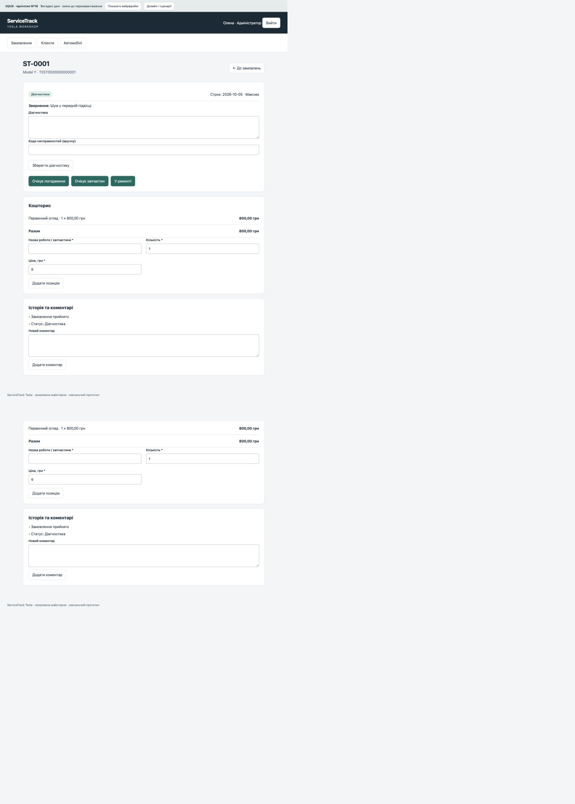

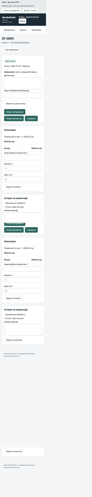

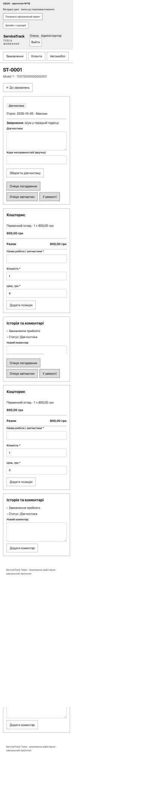

Умова: https://b.optima-osvita.org/mod/lesson/view.php?id=183971. Назва Moodle — ПЗ16; всередині шаблону помилково №17. Результати прикріпляти не потрібно; матеріал включено до накопичувального звіту.


---

## ПЗ17. Реалізація Front-end ServiceTrack Tesla

Філатов Олександр Юрійович, КН-42. 29.09.2026.

### Результат і відповідність завданню

Реалізовано HTML/CSS/JavaScript-інтерфейс, який працює із сервером Django REST Framework. Прототип ПЗ16 перенесено в робочий застосунок: кольори #172A36/#006B60/#F3F5F7, системний шрифт, верхня навігація, картки показників, форми, статуси, кошторис та журнал. На відміну від прототипу, записи зберігаються через API у SQLite і доступні після перезавантаження.

| Вимога | Реалізація |
|---|---|
| Ключові екрани MVP | Вхід, замовлення, клієнти, авто, форми створення/редагування, деталі ремонту, кошторис, історія авто |
| Компоненти | form-fields.js: input/area/select; helpers.js: форматування/екранування/фільтри; api.js: єдиний HTTP-клієнт; app.js: екрани та дії |
| API-запити | fetch GET/POST/PATCH/DELETE; cookies сесії та X-CSRFToken; PATCH використано для часткового оновлення |
| Завантаження | Текст у списку та спільний індикатор незавершених запитів; кнопки пагінації блокуються до відповіді |
| Успіх | Оновлення списку/картки, кошторису та історії, повідомлення про збереження |
| Помилка | Валідація у формі, повідомлення для403/404/429/5xx, некоректної відповіді й відсутності зв’язку |
| Порожній результат | Зрозуміле повідомлення з пропозицією змінити фільтри або створити запис |
| Адаптивність | Поля й показники перебудовуються; до720px рядки основних списків стають картками з підписами; кнопки від44px |
| Інтеграційна перевірка | Реальні GET/POST/PATCH через UI: клієнт, авто, замовлення, кошторис, статус, коментар, пошук |

### Реалізовані сценарії

Адміністратор створює та редагує клієнтів/авто, призначає механіка, додає роботи й запчастини, змінює статус та підтверджує видачу. Механік за серверними правами бачить призначені замовлення, редагує діагностику й коди, залишає коментарі та виконує дозволені переходи. Кнопки адміністратора приховуються, але захист даних забезпечує сервер, а не лише інтерфейс.

Пошук за клієнтом/VIN/скаргою, точний номер ST-xxxx, фільтри статусу/прострочення й пагінація використовують документований API. Історія автомобіля завантажує всі сторінки списку замовлень. Видане замовлення явно позначене закритим для редагування; коментарі залишаються доступними.

### Обробка станів і захист від помилок

HTTP-модуль відокремлено від екранів. Він завжди знімає індикатор у finally, підтримує204 без JSON, показує текст помилки поля, а для403/404/429/5xx і втрати зв’язку повертає зрозуміле повідомлення. Retry-After відображається користувачу. При неочікуваному HTML замість JSON інтерфейс не падає без пояснення.

Кожне завантаження списку має номер запиту: запізніла відповідь попереднього розділу не підміняє новий екран. Під час збереження форми й коментаря кнопка блокується. Дані екрануються перед вставленням у HTML. Діалоги мають кнопки скасування й закриття, поля — підписи, статуси — текст, інтерактивні елементи — видимий фокус.

### Фактична перевірка

В одному браузерному рушії виконано сценарій на реальному локальному Back-end:

1. Створено «ПЗ17 Демо клієнт», виконано пошук, збережено примітку через PATCH.
2. Спроба додати авто з уже наявним VIN повернула400; повідомлення з’явилося у формі, введені дані не втрачено.
3. Створено демонстраційне авто TEST0000000000017 і замовлення ST-0006, призначено mechanic.
4. Додано роботу1.50 ×1000.00: сервер та інтерфейс показали1500.00 грн.
5. Додано коментар, виконано перехід «Прийнято → Діагностика», перевірено історію.
6. Пошук без збігів показав порожній стан. Після перезавантаження замовлення та сума залишилися в базі.
7. Візуально перевірено1280px,768px,390px; мобільний список без горизонтального прокручування. Це не перевірка різних браузерів/реальних пристроїв.

**11 JavaScript-тестів пройшли**:6 попередніх тестів допоміжних компонентів і5 нових тестів API-клієнта. Нові тести перевіряють201/204, CSRF/credentials,400/403/404/429/503, втрату зв’язку, неправильний JSON, скасування та завершення loading. Мережеві помилки перевірено контрольованими тестовими відповідями; фактичне відключення мережі у браузері не проводилося. UI-видалення в цьому проході не виконувалося; обробник DELETE і204 збережено та перевірено на рівні HTTP-модуля.

[Журнал тестів](verification/pz17-frontend.txt). Команда: `node --test tests/*.test.js`.

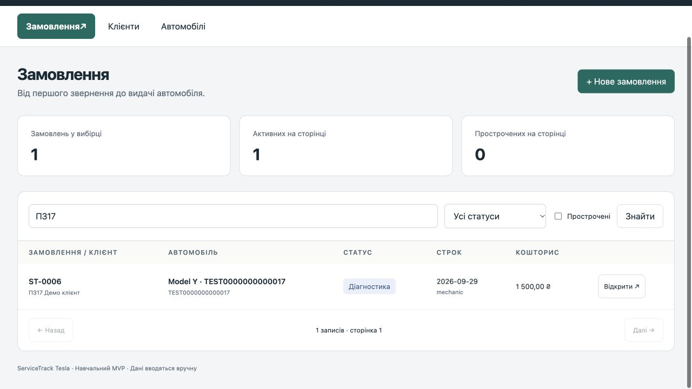

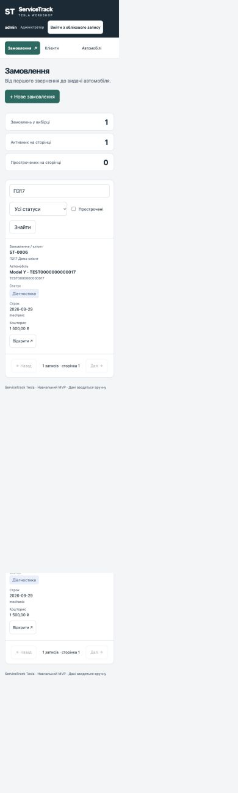

### Межі та матеріали для перевірки

Це навчальний MVP. Незалежне review, реальний UAT і ширший міжбраузерний аудит залишаються окремими наступними етапами. Запуск: інструкція в README; Front-end доступний на локальному сервері після входу.

Код цієї практичної: https://github.com/s6a6t6anfil-create/servicetrack-tesla/tree/feature/pz17-frontend. Умова https://b.optima-osvita.org/mod/assign/view.php?id=183972 дозволяє документ або Git-посилання; для файлового поля підготовлено PDF із посиланнями. Подання до Moodle виконується окремо.


## ПЗ18. Перевірка коду та підготовка до взаємного review

Філатов Олександр Юрійович, КН-42. ServiceTrack Tesla. 29.09.2026.

### Умова і стан виконання

[Заняття №18](https://b.optima-osvita.org/mod/lesson/view.php?id=183974) вимагає pull request після виконання завдання та перевірку коду іншим членом команди з коментарями й рекомендаціями. Прикріпляти результат до Moodle не потрібно. Усередині сторінки помилково зазначено №19; тут використана нумерація навігації курсу.

[PR №5 — Front-end](https://github.com/s6a6t6anfil-create/servicetrack-tesla/pull/5) створено й відкрито. Гілка `feature/pz17-frontend`, база `design/pz16-prototype`. Початкова версія перевірки: `965e31ba62ffe7e6245f5e727e7441592bde7c31`. База містить попередні незлиті роботи; цей PR не порівнюється безпосередньо з main.

Проведено попередню перевірку за допомогою ШІ та виправлено підтверджений дефект. Це не незалежне review іншого члена команди. На момент перевірки GitHub список reviews порожній. Особу незалежного рев’юера ще не визначено; його коментарі та рекомендації очікуються. ПЗ18 повністю не завершене.

### Обсяг попередньої перевірки

Переглянуті `static/app.js`, `static/api.js`, зміни адаптивного інтерфейсу, шаблон сторінки й тести PR №5. Основна увага: відповідність відображених даних цілі операції, порядок асинхронних відповідей, обробка помилок, CSRF і баланс індикатора завантаження. Це обмежена перевірка Front-end, а не аудит безпеки всього застосунку.

### Зауваження CR-01 — невідповідність картки та цілі змін

**Пріоритет: високий. Місце: `static/app.js`, функція `showOrder`.**

Конструктивний коментар: «У `showOrder` глобальне `currentOrder` змінюється ще до завантаження історії. Якщо користувач запускає відкриття A і B, а історія A надходить останньою, картка показує A, хоча обробники статусу/позицій використовують ID B. Якщо історія B завершується помилкою, стара картка A також може залишитися з новою ціллю B. Пропоную зберігати отримане замовлення локально, відкидати застарілі відповіді та змінювати `currentOrder` тільки разом із відображенням повністю завантаженої картки».

Відтворення в ізольованому тесті реальної функції, з контрольованими API-відповідями:

1. Запустити завантаження A; повернути дані A, затримати історію.
2. Запустити B; повернути дані й історію B.
3. Повернути історію A. До виправлення заголовок стає A замість B.
4. Окремо: показати A, повернути дані B, відхилити історію B. До виправлення `currentOrder.id` стає B, хоча заголовок лишається A.

**Відповідь на зауваження та виправлення:** додано лічильник `detailVersion`, перевірку актуальності після обох запитів і перед повідомленням про помилку. Присвоєння `currentOrder` перенесено після успішного отримання даних та історії. Обидва регресійні сценарії тепер проходять. Виправлення слід додатково переглянути незалежному рев’юеру.

### Перевірка після виправлення

Команда: `node --test tests/*.test.js` з кореня репозиторію. Результат: **13 тестів пройдено, 0 помилок**; два нові тести до зміни коду падали з очікуваними невідповідностями заголовка та ID. Тести знаходяться в `tests/detail.test.js`, журнал — [pz18-review.txt](verification/pz18-review.txt).

Нові тести виконують фактичну функцію з `app.js` у середовищі з мінімальною моделлю DOM та керованим API. Вони перевіряють порядок відповідей без запису до бази. Це не перевірка в реальному браузері під повільною мережею і не підтвердження проходження GitHub Actions. Backend не змінювався.

### Рекомендації незалежному рев’юеру

- На вкладці Files changed PR №5 перевірити `showOrder`: останній вибір користувача має визначати і картку, і ID для зміни статусу/кошторису.
- Перевірити виправлення CR-01 і адекватність обох тестів; повторити швидке відкриття двох замовлень та помилку історії у браузері.
- Перевірити ті самі операції під адміністратором і механіком, включно з відмовою в доступі та закритим замовленням.
- Дати рекомендацію щодо подальшого захисту асинхронних діалогів: закриття вікна під час запиту та відкриття історії автомобіля — окремі сценарії, не покриті двома новими тестами.
- Залишити власні коментарі до конкретних рядків і підсумок review: що перевірено, які зміни потрібні та чи усунено CR-01. Не копіювати попередню перевірку як власну без її виконання.

### Що ще потрібно для виконання умови

Інший член команди має самостійно відкрити PR, перевірити код, залишити коментарі й рекомендації. Після цього автор опрацьовує зауваження, за потреби додає виправлення та повторну перевірку. До звіту додаються фактичне ім’я/обліковий запис рев’юера, дата, посилання на review, перевірений commit і результати опрацювання. Поки ці дані відсутні, статус — **підготовлено до незалежного review**.


## ПЗ19. Інтеграція Back-end і Front-end

Філатов Олександр Юрійович, КН-42. ServiceTrack Tesla. 29.09.2026.

### Умова та результат

[Заняття №19](https://b.optima-osvita.org/mod/lesson/view.php?id=183975) вимагає об’єднати компоненти й перевірити їхню взаємодію. Прикріплення результатів не потрібне. Внутрішній заголовок «№20» не збігається з нумерацією навігації; цей звіт стосується №19.

Back-end і Front-end працюють як єдиний застосунок: Django віддає HTML та статичні модулі, JavaScript викликає DRF API того самого origin, сервер зберігає дані в SQLite. Перевірено робочий застосунок, а не автономний прототип ПЗ16. Контрольна версія коду — `674a3a7`, матеріали перевірки додані в гілку `test/pz19-integration`.

### Готовність і контракти

| Компонент | З’єднання та перевірка |
|---|---|
| Вхід | Django session cookie; вихід і повторний вхід через реальну форму |
| Сесія | `/api/session/` передає роль, механіків і словник статусів |
| Клієнти й автомобілі | `/api/customers/`, `/api/vehicles/`; ID пов’язують сутності |
| Замовлення | `/api/orders/`; списки з `count`, `next`, `previous`, `results` |
| Кошторис | `/api/items/`; серверний Decimal-підсумок, локалізоване відображення гривень |
| Статуси й аудит | `/api/orders/{id}/transition/`, `/history/`, `/comment/`; історія є масивом |
| Записи | POST/PATCH/DELETE із JSON та `X-CSRFToken`; cookie передаються same-origin |
| Помилки | API повертає коди й JSON, `api.js` перетворює їх на повідомлення; 204 без розбору JSON |

Документація контрактів: [ПЗ14](14-api.md). Модель ролей не передбачає відкриту реєстрацію: облікові записи видає адміністратор. Тому приклад реєстрації з уроку не додавався як нова функція; виконано реальний вхід двох наявних демонстраційних облікових записів.

### Автоматизована перевірка API

Виконано `python tools/check_integration.py`: 26 успішних операцій (разом зі службовою сесією) та 10 негативних сценаріїв. Перевірені точні коди 200/201/204, помилки 400/403/404/405, структура пагінованих списків та масиву історії. Дані й відповіді: [pz19-api.json](verification/pz19-api.json). Скрипт створює окрему тестову базу та прибирає її після завершення; робочі записи не видаляє.

Покрито створення, читання списків/карток, PUT/PATCH, дозволені DELETE, статус, коментар, історію й сесію. Негативні запити: неповні дані клієнта/замовлення, неправильний VIN, заборонений перехід, порожній коментар, видалення пов’язаного клієнта, відсутнє замовлення, недозволений метод, нульова кількість, анонімний доступ.

API перевірявся Django/DRF test client, не Postman/Insomnia. Цей рівень проходить маршрути, серіалізатори, бізнес-логіку й тестову БД, але сам не перевіряє мережу та браузерні cookie. Останні перевірено окремим реальним браузерним сценарієм нижче. API-скрипт використовує тестовий force_login; перевірки CSRF і звичайного входу не приписуються йому.

Додатково виконано `python manage.py test workshop`: **21 тест, OK**, зокрема розмежування ролей, CSRF, 49 пар переходів і відкат при помилці аудиту. `node --test tests/*.test.js`: **13 тестів, 0 помилок**, включно з регресією CR-01. Журнал: [pz19-checks.txt](verification/pz19-checks.txt).

### Наскрізний сценарій у реальному браузері

Усі використані дані — демонстраційні. Виконувався один браузерний рушій, без імітації HTTP-відповідей.

| Крок | Дія | Фактичний результат |
|---|---|---|
| 1 | Адміністратор створює замовлення для існуючого авто TEST0000000000017 та призначає mechanic | ST-0007, «Прийнято», нульовий кошторис; запис з’явився у списку |
| 2 | Вихід, вхід mechanic, пошук ST-0007 | Призначене замовлення доступне; кнопки створення й зміни кошторису відсутні |
| 3 | Перехід у «Діагностика», редагування результату та ручного TEST-PZ19 | Поля збережено; механік бачить лише дозволені поля редагування |
| 4 | Коментар, переходи «У ремонті» → «Готово» | Коментар і події мають автора mechanic; кнопки «Видано» немає |
| 5 | Вихід, вхід admin, повторне відкриття ST-0007 | Діагностика, коментар і статус механіка збереглися між сесіями |
| 6 | Адміністратор додає роботу: 1,25 × 800 грн | API та екран показують 1 000,00 грн |
| 7 | Адміністратор переводить у «Видано» | Подія має автора admin; редагування замовлення й позицій приховано |
| 8 | Перезавантаження, пошук і повторне відкриття | «Видано», діагностика, TEST-PZ19, кошторис і історія збережені |

У доступному журналі браузера після сценарію помилок і попереджень не зафіксовано. Це не доказ відсутності всіх можливих помилок. Самі серверні відмови в недозволених операціях перевірено тестами, а не лише прихованими кнопками.

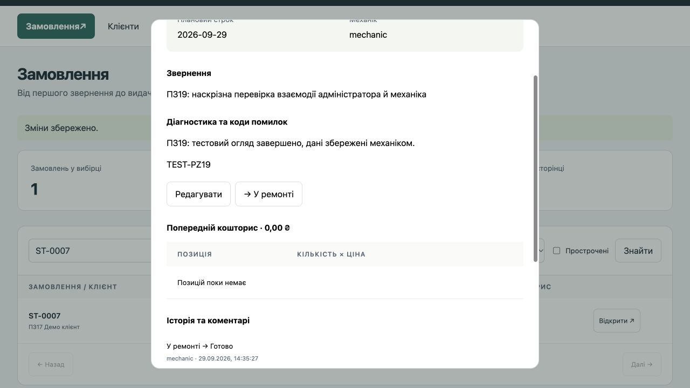

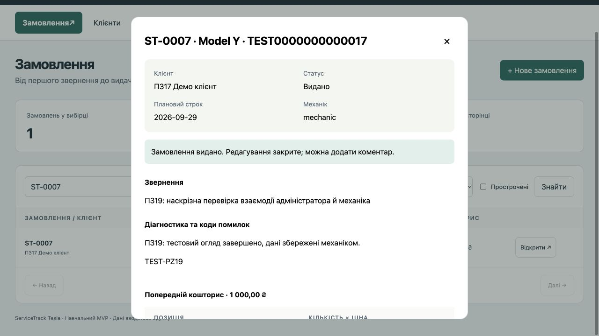

### Проблеми, Git та межі висновку

У виконаному сценарії нових дефектів інтеграції не виявлено. Раніше підтверджену асинхронну помилку CR-01 виправлено в ПЗ18; два регресійні тести повторно пройшли. Клієнтські дії й серверні відповіді узгоджені для перевірених сценаріїв.

Матеріали збережено в окремій гілці з pull request на основі `feature/pz17-frontend`. Злиття до main ще не виконане: попередні PR очікують незалежного review; проходження GitHub Actions цим звітом не стверджується. Реального обговорення з іншим членом команди ще не було — його не підмінено результатами автоматизації.

Поточна перевірка не замінює навантажувальне тестування, UAT, міжбраузерний аудит і приймання всіх вимог ТЗ. Публічна реєстрація, зовнішні Tesla API та виробниче розгортання не входять до цього MVP. Результат ПЗ19: інтеграція працює в перевірених сценаріях і готова до наступного етапу тестування.


## ПЗ20. Модульне тестування

Філатов Олександр Юрійович, КН-42. ServiceTrack Tesla. 29.09.2026.

### Вимоги та вибір інструментів

[Умова ПЗ20](https://b.optima-osvita.org/mod/lesson/view.php?id=183977) вимагає обрати фреймворк, написати й запустити тести для 3–5 ключових функцій Back-end і Front-end, перевірити успіх, помилки та некоректні дані. Для повного охоплення обох частин обрано **по три функції**. Прикріпляти результати до Moodle не потрібно. Внутрішній заголовок №21 має зсув; звіт використовує номер заняття в навігації — №20.

Python: стандартний `unittest`, `unittest.mock` і Django `SimpleTestCase`. Це сумісне з наявним проєктом рішення; `SimpleTestCase` забороняє звернення до БД за замовчуванням. Під час окремого запуску підтверджено пропуск створення БД.

JavaScript: вбудований `node:test` і `node:assert/strict`. Jest/Mocha/Vitest в уроці наведені як приклади; `node:test` забезпечує необхідні ізоляцію, assertions, автоматичний запуск і звіт без додаткових залежностей. Наявний CI вже викликає Django test runner і `node --test tests/*.test.js`, тому нові файли потрапляють до цих команд. Це не твердження про фактичне проходження віддаленого CI.

### Серверні функції

Файл: `workshop/test_units.py`. **9 тестових методів** із додатковими наборами даних через subTest. Методи викликаються напряму, без HTTP й бази; доступ до груп користувача замінений Mock.

| Функція | Успішне виконання | Помилки та межі |
|---|---|---|
| `parse_identifier` | 0, 00042 → 42, максимальний SQLite BIGINT | Порожній рядок, знаки, пробіли, дроби, експонента, букви, Unicode-цифри, переповнення й надмірна довжина → ValidationError з потрібним ключем поля |
| `is_manager` | Суперкористувач або група «Адміністратор» → True | Відсутність групи → False; суперкористувач не запускає зайвий запит груп |
| `OrderSerializer.validate_mechanic` | None означає «не призначено»; активний механік повертається без заміни об’єкта | Неактивний користувач, неправильна роль або обидві умови → ValidationError |

Контракти не розширювалися штучно: `parse_identifier` отримує рядок із query parameter, `is_manager` — об’єкт користувача з полями Django. Випадкові Python-об’єкти замість цих типів не є підтримуваним входом. Некоректний вибір користувача перевіряється правилами активності/ролі.

### Клієнтські функції

Файл: `tests/units.test.js`. **6 нових тестів**, по два на функцію. Жодного сервера, DOM або запиту до мережі.

| Функція | Успішне виконання | Помилки та межі |
|---|---|---|
| `money` | Нуль, десятковий рядок 1234.56, округлення 1.236 → 1,24 грн | NaN, ±Infinity, undefined, некоректний рядок, десятковий рядок із комою → «—» |
| `searchParams` | Номер st-0007 із пробілами, статус і overdue для замовлень | Порожній пошук, частковий ST-, символи &, =, +, #, ?; текст залишається одним значенням, чужі фільтри не передаються для клієнтів |
| `escapeHTML` | Український текст, числа та логічні значення | Усі п’ять небезпечних HTML-символів, рядок із onerror, null/undefined; розмітка екранується, відсутнє значення стає порожнім |

Для `money` порівнюється повний результат; у тесті нормалізовано лише звичайний/нерозривний пробіл, що залежить від locale runtime. Екранування перевірено як функцію, а не як повний аудит XSS-захисту застосунку.

### Arrange — Act — Assert

Приклад `test_active_mechanic_is_returned_unchanged`:

1. **Arrange:** створити Mock груп, встановити відповідь про членство та підготувати активного користувача.
2. **Act:** викликати `OrderSerializer().validate_mechanic(user)`.
3. **Assert:** перевірити повернення того самого користувача та запит саме до групи «Механік».

Для помилкового сценарію Assert очікує `ValidationError`; для функцій відображення — визначений безпечний результат. Однакові сценарії з різними входами групуються, щоб перевіряти поведінку, а не дублювати код реалізації.

### Запуск і результати

Із кореня репозиторію, після встановлення залежностей README:

```sh
python manage.py test workshop.test_units --verbosity 2
python manage.py test workshop --verbosity 2
node --test tests/*.test.js
```

| Запуск | Фактичний результат |
|---|---|
| Лише нові серверні unit-тести | 9 пройдено, 0 помилок; база не створювалася |
| Увесь серверний набір | 30 пройдено: 9 нових unit + 21 попередній тест |
| Увесь JavaScript-набір | 19 пройдено: 6 нових + 13 попередніх |

Попередні 21 серверний тест включають інтеграцію з API/БД; їх не названо ізольованими unit-тестами. JavaScript-набір також містить попередні тести API-клієнта із заглушкою fetch та регресію завантаження картки. Нові тести пройшли без змін виробничого коду; нових дефектів у перевірених сценаріях не виявлено.

[Журнали запуску](verification/pz20-tests.txt). Кількість позначає тестові методи/тести runner, а не кількість кожного вхідного значення. Відсоток покриття не вимірювався; результати не означають відсутності всіх помилок або завершення приймання MVP.

### Зв’язок із загальним звітом

Матеріал доданий до накопичувального `00-report-working.md` після ПЗ19. Інтеграційні перевірки попереднього етапу й модульні перевірки цього етапу розділені за метою та доказами. Остаточне оформлення всього звіту, незалежне review з ПЗ18 та наступні етапи залишаються окремими пунктами плану.


## ПЗ22. Аналіз відповідності MVP та план доопрацювань

Філатов Олександр Юрійович, КН-42. 29.09.2026. ServiceTrack Tesla.

### Основа та метод

[Умова №22](https://b.optima-osvita.org/mod/lesson/view.php?id=183981): зіставити MVP із початковим ТЗ й на основі аналізу та відгуку колег скласти список покращень. Внутрішня нумерація №24 не збігається з назвою заняття; тут використано №22. Результати не потрібно прикріпляти до Moodle.

Базова версія вимог — [ТЗ ПЗ8](08-specification.md) від 29.09.2026, 12 FR та 9 NFR; деталізація — [ПЗ7](07-requirements.md). Перевірена версія коду: `a74a121`. Переглянуті моделі, права й API, клієнтські функції, тести та матеріали ПЗ13–20. Додатково виконано читання чинної демонстраційної БД без змін: із 6 автомобілів 4 старі VIN не проходять актуальний формат.

Позначення: **підтверджено в перевіреному обсязі** — є конкретні докази; **частково** — реалізація є, але не всі критерії приймання доведені; **не перевірено** — немає потрібного вимірювання; **відхилення** — знайдена конкретна невідповідність. Жоден статус не означає повний аудит безпеки або відсутність усіх помилок.

### Функціональні вимоги

| Код | Результат і докази | Що лишилося |
|---|---|---|
| FR01 | Частково. Вхід/вихід двох ролей — ПЗ19; scope/заборони API/CSRF — tests.py, ПЗ20 | Окремо зафіксувати неправильний пароль та створення облікового запису адміністратором; повторити повну матрицю операцій ролей |
| FR02 | Підтверджено в перевіреному обсязі. Створення/PATCH та повторне читання — ПЗ17; CRUD і захист пов’язаного видалення — ПЗ19 | Підтвердити зручність форм зовнішнім відгуком |
| FR03 | Відхилення даних. API нормалізує VIN, відхиляє дублікати, I/O/Q, неправильні рік/пробіг; тести ПЗ20 проходять | У чинній демобазі ID1–4 досі мають DEMO… з літерою O. Виправити лише ці демозаписи зі збереженням ID/зв’язків (R22-01) |
| FR04 | Підтверджено в перевіреному обсязі. ST-0007 створено з авто/механіком/датою; missing-field, inactive-mechanic, scope tests | Перевірка непризначеного механіка в інтерфейсі — R22-02 |
| FR05 | Підтверджено в перевіреному обсязі. Механік зберіг діагностику/TEST-PZ19, адміністратор прочитав після входу; чужий механік отримує 404 | Реальний відгук про зручність ручного введення |
| FR06 | Підтверджено в перевіреному обсязі. 49 пар переходів і відкат аудиту — ПЗ15/20; реальний шлях до «Видано» — ПЗ19 | Людське review бізнес-правил; конкурентні записи окремо, не заявлені перевіреними |
| FR07 | Частково. CRUD позицій — API ПЗ19; 1,5×1000=1500 і 1,25×800=1000 — UI; нульова кількість/негативна ціна відхиляються | UI зміни/видалення позиції та граничні суми — R22-02/06 |
| FR08 | Частково. Коментар, історія, автор/час показані в ПЗ19; порожній текст відхиляється; автор у views.py визначається сервером | Прямий тест спроби підміни автора — R22-02 |
| FR09 | Частково. Пошук номера/VIN/клієнта, empty state, overdue; PAGE_SIZE=50 у settings | Реальна друга сторінка, зміна фільтра та пошук на наборі понад50 — R22-02 |
| FR10 | Частково. У app.js є фільтр за vehicle та allOptions із переходом по next | Історія понад50 записів, відсутність домішування іншого авто, обидві ролі — R22-02 |
| FR11 | Частково. ПЗ19 підтвердив закритий UI; tests.py — заборону PATCH/додавання позиції та дозволений коментар | Окремі негативні PATCH/DELETE існуючої позиції виданого замовлення — R22-02 |
| FR12 | Частково. ПЗ19: загальна кількість вибірки й показники активних/прострочених; app.js має явні підписи обсягу | Порівняти статистику першої/другої сторінок і фільтра — R22-02 |

### Нефункціональні вимоги

| Код | Результат і докази | Доопрацювання / перевірка |
|---|---|---|
| NFR01 | Частково: role/scope/CSRF тести, escapeHTML тести | Небезпечний текст через реальні форми; решта матриці доступів (R22-02) |
| NFR02 | Частково: loading/empty/success/error реалізовано, API error-тести та VIN400 у UI | Перевірити повідомлення при збої під відкритим діалогом і закритті діалогу під час запиту (R22-03); відгук користувача |
| NFR03 | Частково: скриншоти390/768/1280 ПЗ17 | Не всі дії виконані на кожній ширині; завершити вхід/вихід, картку, коментар, статус на трьох ширинах (R22-07) |
| NFR04 | Не перевірено за точним протоколом ТЗ | 1000замовлень,5прогрівів+50запитів, p95<2с, запис середовища (R22-04) |
| NFR05 | Частково: збереження між сесіями й reload ПЗ19; rollback аудиту тестом | Reload сторінки не є перезапуском сервера; провести контрольований stop/start та повторне читання (R22-05) |
| NFR06 | Частково: Decimal у models.py, кілька позицій150,30грн у тесті, реальні1000/1500грн | Граничні значення і сума дрібних добутків, що вимагають округлення, точне порівняння API/UI (R22-06) |
| NFR07 | Частково: чистий клон ПЗ13, міграції, фіксовані залежності, актуальні API-докази ПЗ19 | Чистий запуск саме фінального commit із seed та актуальними тестами (R22-09) |
| NFR08 | Не виконано для реального використання: локальне HTTP-демо | HTTPS/DEBUG=0/секрет/cookies, щоденна та передоновлювальна копія, перевірене відновлення (R22-08). Must перед реальними даними |
| NFR09 | Не підтверджено: перевірявся один браузерний рушій | 2різнібраузери та3–4комбінаціїбраузер/пристрій із версіями (R22-07) |

### Модельований зворотний зв’язок

За рішенням автора роботи використано сценарне моделювання можливого відгуку: реальних відгуків немає, їх отримання не планується. Наведені нижче висловлювання створені як проєктні гіпотези. Вони не є цитатами опитаних людей, результатами інтерв’ю, UAT або незалежного review. Олена та Максим — вигадані персони з ПЗ6; колега-розробник — умовна роль без приписаного реального імені.

| Код / уявна роль | Можливе зауваження — модельований приклад | Аналіз і пропозиція | Рішення |
|---|---|---|---|
| H01 / Олена, адміністратор | «Мені важливо бачити всі ремонти автомобіля, навіть якщо їх багато. Не хочу пропустити старий запис» | Узгоджується з FR10; перевірити історію понад 50 записів, не змінюючи обсяг ТЗ | R22-02, P1: підтвердити повноту історії |
| H02 / Максим, механік | «Якщо зв’язок зник під час запису діагностики, хочу бачити помилку й не набирати текст заново» | Відповідає NFR02; перевірити видимість помилки у діалозі та збереження введеного тексту після невдалого запиту | R22-03, P1: перевірка, потім виправлення підтверджених дефектів |
| H03 / Олена, адміністратор | «Хочу розуміти, чи число прострочених стосується всіх записів або лише сторінки» | FR12 вже вимагає явного обсягу; перевірити лічильники після переходу на другу сторінку й застосування фільтра | R22-02; не заявляти нову функцію глобальної аналітики |
| H04 / умовний колега-розробник | «Перед демонстрацією я перевірив би старі демодані та запуск перевірок для робочих гілок» | Внутрішній аудит незалежно підтвердив старі VIN та фільтр CI; ці факти не походять від реальної людини | R22-01 і R22-11; зберегти докази після доопрацювання |
| H05 / Максим, механік | «Фото несправності допомогло б передати контекст наступному майстру» | Можлива користь, але потрібні зберігання, права доступу та обмеження файлів | EXT01 лишається Could після MVP; до поточної версії не додавати |

Ці гіпотези допомагають оцінити сценарії, але не доводять, що користувачі справді мають такі труднощі. Пріоритети обов’язкових робіт обґрунтовані ТЗ й внутрішніми доказами, а не вигаданими голосами. Після моделювання додано до R22-03 критерій збереження тексту після помилки; нових обов’язкових функцій або скорочень ТЗ не внесено.

За буквальним формулюванням уроку моделювання не підтверджує отримання відгуку іншої команди. У звіті використано саме цей альтернативний метод; прийнятність такої заміни визначає викладач. Для ПЗ18 модельований відгук також не є справжнім review іншого члена команди.

### Список доопрацювань і покращень

Це план, а не заява про вже виконані роботи. P1 — перед прийманням відповідних Must; P2 — вимірювання Should або покращення процесу. Відповідальний за внутрішні роботи — Філатов Олександр Юрійович; зовнішній учасник ще не визначений. Оцінки — орієнтовні години роботи, без очікування людей.

| ID / пріоритет | Зміна та причина | Критерій завершення | Оцінка / залежність |
|---|---|---|---|
| R22-01 / P1 | Узгодити 4 старі демонстраційні VIN із FR03 | Узгоджена резервна копія; визначені DEMO → валідні DEMX; ID і зв’язки незмінні, помилок формату немає, редагування через UI працює | 0,5 год; до фінального демо |
| R22-02 / P1 | Закрити прогалини FR01/04/07–12 та NFR01; врахувати H01/H03 | Набір понад 50 замовлень, 2 авто, 2 механіки; перевірені пагінація, історія, лічильники, права, підміна автора, PATCH/DELETE позиції виданого замовлення | 3 год |
| R22-03 / P1 | Перевірити асинхронні діалоги й помилки NFR02 після CR-01; врахувати H02 | При затримці/відмові API закрита форма не відкривається сама; помилка видима, введений текст зберігається, ціль зміни відповідає картці; докази та виправлення за потреби | 1,5 год |
| R22-04 / P2 | Виміряти NFR04 | 1000 замовлень, 5 прогрівів і 50 вимірів, конфігурація, сирі часи та p95; якщо ≥2 с — причина й план оптимізації | 1 год |
| R22-05 / P1 | Довести збереження NFR05 після перезапуску | ID, поля, кошторис та історія контрольного запису однакові до й після stop/start | 0,5 год |
| R22-06 / P1 | Довести точність NFR06 на границях | Нуль, кілька позицій, дробові добутки, максимуми полів; API/UI дорівнюють Decimal-очікуванню; округлюється сума, а не позиції | 1 год |
| R22-07 / P1+P2 | Завершити NFR03 (Must) та NFR09 (Should) | Основні дії на 390/768/1280 px; 3–4 комбінації з двома браузерами, версії та докази | 2 год; доступ до браузерів |
| R22-08 / P1 перед реальними даними | Розгортання та резервування NFR08 | Production-налаштування, HTTPS, графік копій та окреме відновлення з перевіркою цілісності | 2 год; узгоджене середовище |
| R22-09 / P1 | Повторити NFR07 на фінальній версії | Чистий клон, venv, міграції, seed, вхід, тести й API; README відтворюється | 1 год; після виправлень |
| R22-10 / обмеження курсу | Зберігати відмінність між моделлю H01–H05 і зовнішньою перевіркою | Модель позначена в матеріалах; реальне review ПЗ18 не оголошене виконаним; рішення викладача про заміну методу, якщо буде, записати окремо | Моделювання підготовлено; реальний відгук не планується |
| R22-11 / P2 | Узгодити CI для поточних PR і завершити GitFlow | Workflow запускається для фактичної цільової гілки; є реальний результат; злиття після потрібних перевірок і review | 1 год; review лишається відкритим |

Причина R22-11: поточний workflow відфільтрований на main, а послідовні PR спрямовані на попередні робочі гілки; наявність YAML не підтверджує виконання перевірок. Це спостереження за конфігурацією, не новий запит статусу GitHub.

Зв’язок із планом ПЗ11: R22-01 уточнює S02; R22-02/03/05/06 доповнюють функціональне QA; R22-04/07 — продуктивність і сумісність; R22-08/09 — готовність передавання; R22-10 — зовнішнє приймання. Початкові дати не переписані заднім числом. Порядок: цілісність демоданих → функціональні прогалини → перевірки якості → чистий запуск. Для аналізу використано модель H01–H05; реальний фідбек не збирається.

### Рішення щодо вимог і приймання

Початкове ТЗ не спрощено під наявну реалізацію: коди, пріоритети, p95<2с та всі критерії збережені. Розширення (файли/нагадування/PostgreSQL) лишаються Could; TeslaAPI/Toolbox/склад/оплата/самореєстрація — позаMVP. Модельоване побажання H05 не приписується реальному користувачу й не змінює обсяг MVP.

Повне приймання зараз не заявляється. Після виконання пунктів плану оновити цю матрицю фактичними доказами; модельовані пропозиції перевіряти за сценаріями, перш ніж змінювати продукт. Звіт ПЗ22 із позначеною моделлю відгуку додано до єдиного накопичувального звіту. Буквальне отримання зовнішнього фідбеку не підтверджене.


## ПЗ23. Пошук і документування багів

Філатов Олександр Юрійович, КН-42. 29.09.2026.

Умова https://b.optima-osvita.org/mod/lesson/view.php?id=183983 вимагає щонайменше 3 баги в системі управління проєктом із назвою, пріоритетом, описом, кроками, очікуваним/фактичним результатом, скриншотом та оточенням. Використано GitHub Issues поточного репозиторію: записи мають відповідального власника й статус Open. Результати до Moodle прикріпляти не потрібно. Усередині уроку помилково №25; тут номер за навігацією — №23.

Усі три дефекти відтворено в реальному браузері на версії b6d1fbc; це не модельовані відгуки ПЗ22. Метод: ручні сценарії на демонстраційних даних, перевірка обмежень форми та керована затримка/відсутність мережі. Після перевірок звичайне з’єднання відновлено. Пріоритет Medium: дефекти погіршують роботу з даними/діалогами, але не блокують увесь застосунок. Виправлення не виконувалися в межах документування.

### Реєстр

| Баг | GitHub Issues | Стан |
|---|---|---|
| BUG-005 | [9](https://github.com/s6a6t6anfil-create/servicetrack-tesla/issues/9) | Open, підтверджено |
| BUG-006 | [10](https://github.com/s6a6t6anfil-create/servicetrack-tesla/issues/10) | Open, підтверджено |
| BUG-007 | [11](https://github.com/s6a6t6anfil-create/servicetrack-tesla/issues/11) | Open, підтверджено |

### Процес опрацювання

Open → виправлення в окремій гілці → повторення тих самих кроків і регресійні тести → посилання на commit/PR → закриття Issue лише після підтвердження. BUG-005 пов’язаний із R22-01, BUG-006/007 — із R22-03. Наступний рефакторинг не повинен непомітно підмінювати ці виправлення; зміни поведінки слід фіксувати окремо.


### BUG-005 — Старі демонстраційні VIN блокують збереження автомобіля

Пріоритет: **Medium**. Статус: **Open — підтверджено, не виправлено**.
Дата: 29.09.2026. Відповідальний: Філатов Олександр Юрійович.
Вимоги/план: FR03; R22-01.

#### Оточення

macOS, Codex In-app Browser (Chromium), viewport 1280×720, локальний Django-сервер, роль admin; версія коду b6d1fbc. Точну версію браузера не зафіксовано. Усі записи демонстраційні.

#### Опис

У чинній демонстраційній базі залишилися чотири VIN з префіксом DEMO. Літера O заборонена правилом VIN. Це дефект старих демоданих, а не помилка актуальної перевірки форми; новий seed уже використовує DEMX.

#### Кроки відтворення

1. Увійти адміністратором у демобазу зі старими авто ID1–4.
2. Відкрити «Автомобілі» → рядок DEMO0000000000001 → «Редагувати».
3. Не змінюючи VIN, натиснути «Зберегти».

#### Очікуваний результат

Демонстраційні записи відповідають формату ТЗ; форма наявного авто може бути збережена без виправлення заздалегідь некоректного VIN.

#### Фактичний результат

Форма не закривається; поле VIN отримує фокус і браузерне повідомлення «Виберіть потрібний формат». Read-only аудит підтвердив 4 невалідні записи з 6.

#### Доказ

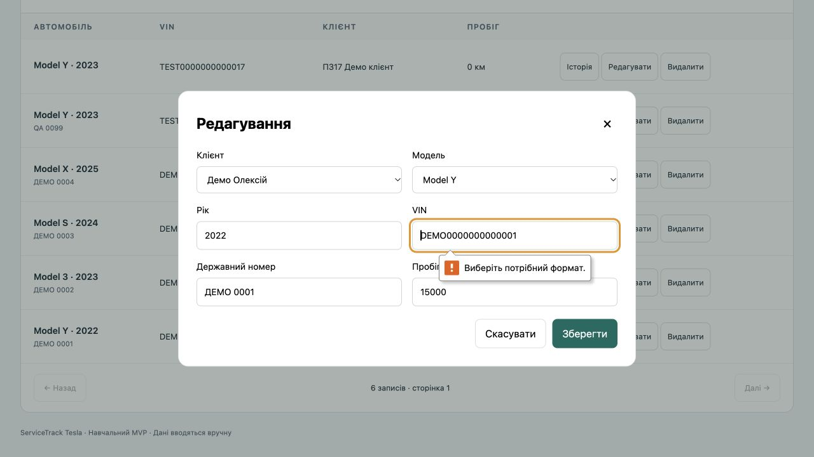

#### Пропозиція та критерії повторної перевірки

Після резервної копії виправити тільки визначені старі демодані без зміни ID/зв’язків. Перевірити валідність усіх VIN і збереження форми. Новий seed не послаблювати.

#### Межі перевірки

Потрібна стара демобаза; чистий seed поточної версії цей дефект не відтворює. Імітацію мережі після перевірки вимкнено. Цей запис документує дефект, а не його виправлення.

### BUG-006 — Закритий діалог замовлення самостійно відкривається після запізнілого запиту

Пріоритет: **Medium**. Статус: **Open — підтверджено, не виправлено**.
Дата: 29.09.2026. Відповідальний: Філатов Олександр Юрійович.
Вимоги/план: NFR02; R22-03.

#### Оточення

macOS, Codex In-app Browser (Chromium), viewport 1280×720, локальний Django-сервер, роль admin; версія коду b6d1fbc. Точну версію браузера не зафіксовано. Усі записи демонстраційні.

#### Опис

Закриття діалогу не скасовує й не робить неактуальним поточний showOrder. Після завершення двох GET викликається showModal, хоча користувач уже закрив вікно.

#### Кроки відтворення

1. Увійти admin → «Автомобілі» → «Історія» для TEST0000000000017.
2. У засобах розробника ввімкнути затримку мережі 2000 мс без обмеження пропускної здатності.
3. У діалозі історії натиснути «ST-0007 · Видано».
4. До відповіді сервера натиснути × «Закрити замовлення». Переконатися, що діалог закрито.
5. Дочекатися відповіді запитів даних та історії (приблизно 4 с).

#### Очікуваний результат

Після явного закриття діалог лишається закритим, доки користувач сам не відкриє інший запис.

#### Фактичний результат

Без нового натискання відкривається картка ST-0007. Зафіксовано послідовність: діалог відсутній при «Завантаження…», потім heading ST-0007 і видимий діалог.

#### Доказ

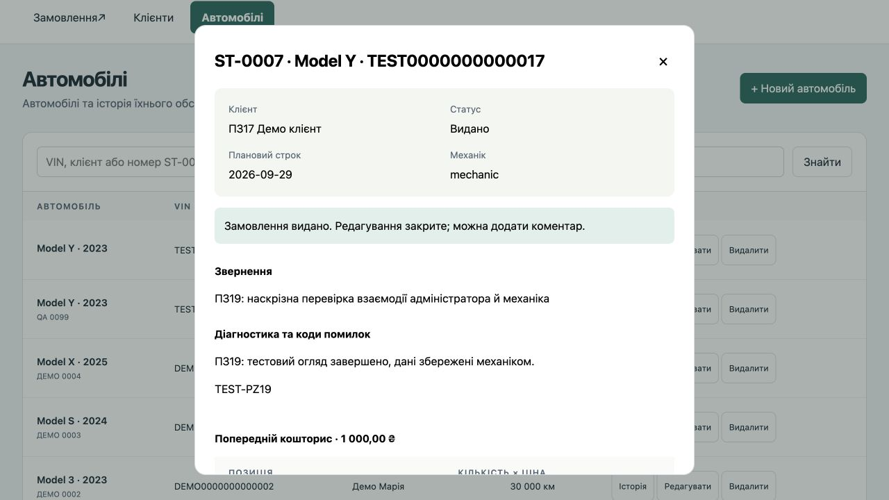

#### Пропозиція та критерії повторної перевірки

На закриття й cancel інвалідовувати запит або скасовувати його. Регресія: завершення GET після закриття не відкриває діалог; звичайне відкриття працює.

#### Межі перевірки

Відтворено у реальному браузері з керованою затримкою. Втрата/зміна даних не спостерігалася. Імітацію мережі після перевірки вимкнено. Цей запис документує дефект, а не його виправлення.

### BUG-007 — Помилка відкриття замовлення з історії показується поза активним діалогом

Пріоритет: **Medium**. Статус: **Open — підтверджено, не виправлено**.
Дата: 29.09.2026. Відповідальний: Філатов Олександр Юрійович.
Вимоги/план: NFR02; R22-03.

#### Оточення

macOS, Codex In-app Browser (Chromium), viewport 1280×720, локальний Django-сервер, роль admin; версія коду b6d1fbc. Точну версію браузера не зафіксовано. Усі записи демонстраційні.

#### Опис

При помилці showOrder повідомлення записується в загальний notice основної сторінки. Діалог історії лишається активним без повідомлення про результат натиснення; фон затемнений та неактивний.

#### Кроки відтворення

1. На звичайному з’єднанні відкрити «Автомобілі» → «Історія» для TEST0000000000017.
2. У засобах розробника ввімкнути Offline для цієї вкладки.
3. У відкритому діалозі натиснути «ST-0007 · Видано».
4. Переглянути діалог і повідомлення на основній сторінці. Після перевірки повернути Online.

#### Очікуваний результат

Помилка відкриття запису відображається всередині активного діалогу, зрозуміло пов’язана з дією та доступна без його закриття.

#### Фактичний результат

Діалог зберігає тільки список замовлень. «Немає зв’язку із сервером…» з’являється на затемненому фоні поза діалогом. На 1280×720 текст візуально видно над вікном; не стверджується, що він повністю невидимий.

#### Доказ

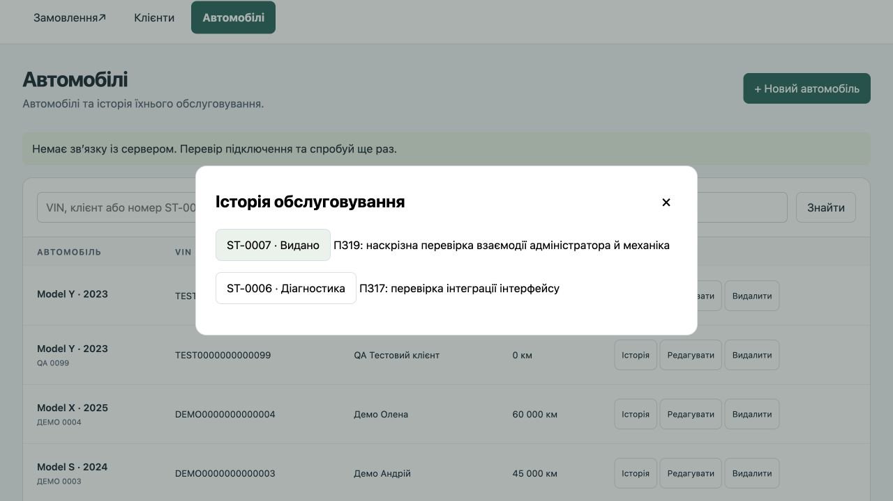

#### Пропозиція та критерії повторної перевірки

Відображати помилки читання в активному діалозі через доступний alert; зберігати можливість повторити дію. Перевірити offline/403/404 і успішний повтор після Online.

#### Межі перевірки

Відтворено Offline у реальному браузері. Перевірка screen reader не проводилася; висновок про доступність обмежений розташуванням за межами modal. Імітацію мережі після перевірки вимкнено. Цей запис документує дефект, а не його виправлення.
