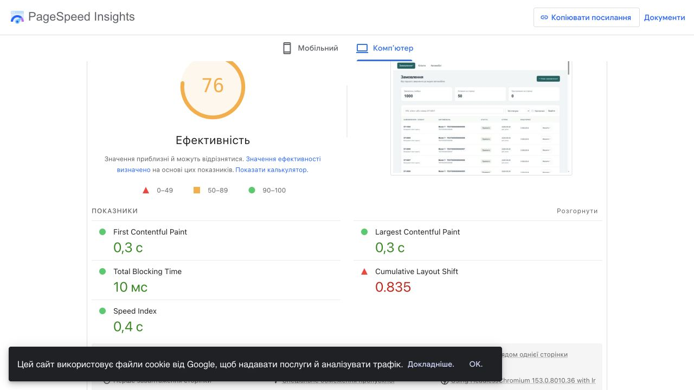
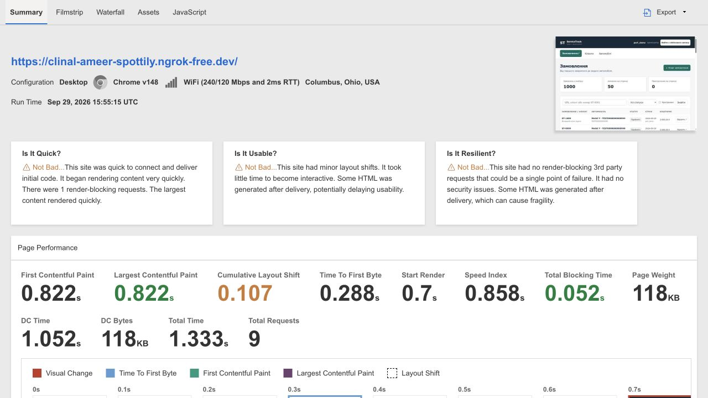

# ПЗ25. Аудит продуктивності ServiceTrack Tesla

Філатов Олександр Юрійович, КН-42. Дата: 29.09.2026. Версія застосунку: `8f0ce4d`.

## Мета та виконання умови

[Умова ПЗ25](https://b.optima-osvita.org/mod/lesson/view.php?id=183986) вимагає Google PageSpeed Insights **і** WebPageTest, визначення 3–5 вузьких місць та рекомендацій щодо усунення. Обидва зовнішні інструменти використано; нижче наведено результати, п’ять проблем і план перевірки покращень. Окреме прикріплення у цьому уроці не потрібне. Матеріал включено до єдиного робочого звіту. Реалізація запропонованих оптимізацій у межах цього аудиту не заявляється.

## Об’єкт, методика та обмеження

Перевірено головну сторінку MVP зі списком замовлень. Для зовнішніх сервісів тимчасово опубліковано ізольоване демо через HTTPS-тунель ngrok: окрема штучна база, 1000 авто, 1000 замовлень, по 3 позиції кошторису, 1000 подій одного замовлення. Код інтерфейсу й бізнес-операцій відповідає зазначеній версії. Демо автоматично надає синтетичну сесію, дозволяє лише читання; POST/PATCH/DELETE повертають 405, admin/login/schema недоступні. Реальні дані та паролі не публікувалися. Після завершення вимірювань тунель і окремий демосервер вимкнено.

Це лабораторний аудит одного першого завантаження в кожному профілі, а не статистика реальних користувачів чи конкурентний навантажувальний тест. PSI повідомив про відсутність даних CrUX. На результати впливають мережа, тунель, регіон агента, емуляція пристрою та сервер розробки Django. Реальний вхід, запис даних і виробниче розгортання не вимірювалися. Різні запуски та інструменти не можна прямо порівнювати як «до/після».

## Зовнішні вимірювання

[PageSpeed Insights — mobile](https://pagespeed.web.dev/analysis/https-clinal-ameer-spottily-ngrok-free-dev/pjle8i3m68?form_factor=mobile), [desktop](https://pagespeed.web.dev/analysis/https-clinal-ameer-spottily-ngrok-free-dev/pjle8i3m68?form_factor=desktop). Час звіту: 29.09.2026, 18:55 GMT+3. Lighthouse 13.5.0, HeadlessChromium 153.0.8010.36; мобільний профіль Moto G Power / Slow 4G, desktop — емуляція комп’ютера зі спеціальним обмеженням мережі.

| Показник | PSI Mobile | PSI Desktop | WebPageTest Desktop |
|---|---:|---:|---:|
| Performance | 99/100 | 76/100 | Числовий бал не надано |
| First Contentful Paint | 0,9 с | 0,3 с | 0,822 с |
| Largest Contentful Paint | 0,9 с | 0,3 с | 0,822 с |
| Total Blocking Time | 40 мс | 10 мс | 52 мс |
| Cumulative Layout Shift | 0,069 | 0,835 | 0,107 |
| Speed Index | 0,9 с | 0,4 с | 0,858 с |
| Time To First Byte | Не виписано | Не виписано | 0,288 с |
| Document Complete | Не виписано | Не виписано | 1,052 с |
| Total Time | Не виписано | Не виписано | 1,333 с |

[WebPageTest / Catchpoint — результат](https://public.catchpoint.com/UI/Entry/WPTITP/ARO7-D-E-B2ADvr5jfHbya6kAA-N). Конфігурація: Desktop, Chrome v148, Columbus, Ohio, USA, WiFi 240/120 Mbps, RTT 2 мс. Час: 29.09.2026 15:55:15 UTC. Один показаний запуск: 9 запитів, 120 675 байтів (інтерфейс округлює до 118 KB), початок рендерингу 0,7 с. У waterfall присутні `/static/app.css`, JavaScript-модулі, `/api/session/` та `/api/orders/?page=1`; скриншот показує саме ServiceTrack Tesla з 1000 записами. Сторінка входу чи заставка тунелю не підмінили застосунок. Звіт містить один HTTP 4xx; у переліку є `/favicon.ico`, але статус конкретного запиту окремо не деталізовано, тому причинний зв’язок не стверджується.

PSI в обох профілях також показав Accessibility 100, Best Practices 100, SEO 50. Це результати автоматичних перевірок, а не гарантія доступності чи безпеки. SEO не є ціллю приватного робочого кабінету. Окремий desktop-аудит затримки документа завершився помилкою; його оцінку не використано. Решта наведених метрик отримана зі звіту.

Рисунок 25.1 — PSI Desktop: основна проблема — CLS 0,835.

Рисунок 25.2 — WebPageTest: метрики та знімок перевіреного застосунку.

## Додаткові локальні вимірювання

Один послідовний клієнт; 5 прогрівів і 50 вимірів списку по 50 замовлень, p95 за nearest-rank (48-й відсортований вимір). Python 3.12.14, Django 5.2.17, SQLite 3.53.1, macOS Darwin 25.6.0 arm64.

- Реальний HTTP через loopback до окремого демо з дисковою SQLite: p95 повної відповіді **20,28 мс**, до читання першого байта **20,21 мс**. Ціль NFR04 < 2 с виконана лише в цьому локальному сценарії.
- Django APIClient з in-memory SQLite: p95 **14,65 мс**, **3 SQL-запити** на список. N+1 у цьому сценарії не виявлено.
- CPU для 50 APIClient-запитів: 0,729 с. Піковий RSS усього тестового процесу: 92 176 384 байти, включно з генерацією даних; це не витрата пам’яті одного запиту.

Локальні результати не включають зовнішню мережу та не замінюють PSI/WPT. Сирі серії: [APIClient](verification/pz25-local.json), [HTTP](verification/pz25-http.json).

## П’ять вузьких місць та рекомендації

| № / пріоритет | Доказ та наслідок | Рекомендоване усунення | Критерій повторної перевірки |
|---|---|---|---|
| 1 / високий. Нестабільність макета | PSI Desktop CLS 0,835: `main.workspace` — 0,813, `.pagination` — 0,022. WPT CLS 0,107. Користувач бачить зміщення робочої області; точний причинний ланцюг ще потребує трасування | Простежити появу блоків після сесії/API; зарезервувати місце для верхніх блоків, таблиці та пагінації, застосувати skeleton відповідного розміру. Не приховувати вміст для покращення бала | 3 однакові запуски mobile/desktop до й після; зафіксувати всі результати, ціль CLS ≤ 0,1 у кожному, перевірити відсутність обрізання та стрибків при помилці/порожньому списку |
| 2 / середній. Доставка статичних ресурсів | PSI: TTL `None` для app.js/app.css/api.js/helpers.js/form-fields.js, потенційна економія кешу 28 KiB. app.css блокує рендеринг; mobile оцінює можливу економію 300 мс. WPT бачить 1 render-blocking request. Це властивості перевіреного деморозгортання | У production використовувати версіоновані імена статики та довгий Cache-Control для них; мінімізувати CSS, виділити необхідні початкові стилі лише якщо повторний замір виправдовує ускладнення. Не кешувати приватні API-відповіді публічно | Перевірити заголовки і зміну URL після релізу, cold/warm завантаження; повторити PSI/WPT. 300 мс і 28 KiB — оцінки інструмента, а не гарантований виграш |
| 3 / середній. Надлишкові деталі у списку | Відповідь на 50 замовлень — 89 835 байтів, включає diagnosis/items/transitions; офлайн-проєкція масиву потрібних таблиці полів — 14 502 проти 89 748 байтів повного масиву | Окремий list serializer; деталі запитувати при відкритті картки. Зберегти потрібні таблиці поля, суму, фільтри, доступ і пагінацію | Порівняти bytes/p95 на тих самих 1000 записах; ціль списку ≤ 25 KB для цього набору, 3 SQL або менше без N+1; API/UI регресія. Проєкція не є реалізованим endpoint чи виміряним прискоренням |
| 4 / середній. Повне послідовне завантаження авто | `allOptions`: 20 послідовних запитів для 1000 авто, 168 355 байтів, 54,72 мс APIClient без мережі. Мережеві затримки накопичуються; ця форма не входила в головний PSI/WPT сценарій | Пошуковий select із серверною фільтрацією, debounce, першою порцією до 50 варіантів і підвантаженням; скасовувати застарілі пошуки | Не більше одного запиту першої порції при відкритті; перевірити вибір авто поза першою сторінкою, порожні результати та гонки пошуку; виміряти час готовності за фіксованої мережевої затримки |
| 5 / середній. Історія без пагінації | 1000 подій: 396 784 байти, 32,92 мс APIClient; frontend формує всі блоки одразу. Це ризик масштабування, а не виміряна затримка DOM у зовнішніх аудитах | Узгоджено змінити API та frontend: перші 50 подій і «Завантажити ще», стабільне сортування, захист від дублювання | Перша відповідь до 50 подій; після всіх порцій ті самі 1000 у правильному порядку без втрат/дублів; зберегти автора/дату/права, порівняти DOM і час відображення |

Порядок: спочатку стабільність макета; далі конфігурація статики для реального розгортання; потім скорочення списків і дозоване завантаження форм/історії. Індекси БД чи CDN без додаткових доказів не пропонуються як першочергове виправлення: локальний список уже виконує лише три SQL-запити.

## Висновок і докази

Початковий вміст з’являється швидко у всіх трьох лабораторних профілях. Найвиразніша виміряна проблема — зміщення макета на desktop. Різниця CLS між PSI та WPT показує залежність результату від умов; усереднювати їх або приховувати гірший запуск некоректно. Три додаткові локальні сценарії виявили обмеження обсягів даних при зростанні бази.

Вимоги аудиту ПЗ25 виконано. Подальші оптимізації та їх ефект потребують окремої реалізації й повторного вимірювання; NFR04 для production не підтверджено. Наступний етап курсу — ПЗ26, перевірка комбінацій браузерів і пристроїв.

Докази: [PSI mobile](verification/pz25-psi-mobile.txt), [PSI desktop з деталями](verification/pz25-psi-desktop.txt), [WPT summary](verification/pz25-wpt.txt), [WPT waterfall](verification/pz25-wpt-waterfall.txt), скриншоти вище та сирі локальні JSON. Посилання на результати збережено, але доступність архівів зовнішніх сервісів надалі не гарантується; тимчасовий URL демо вже вимкнено.
