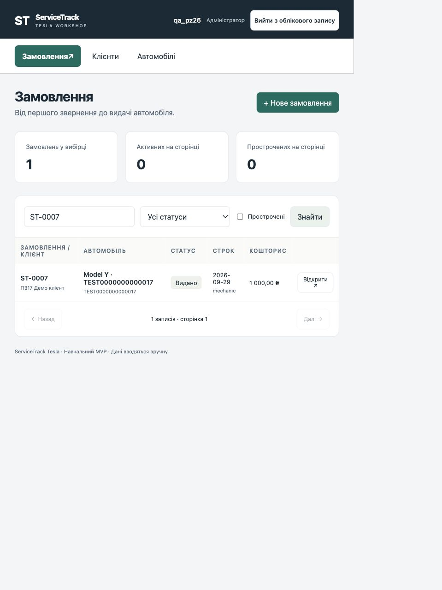
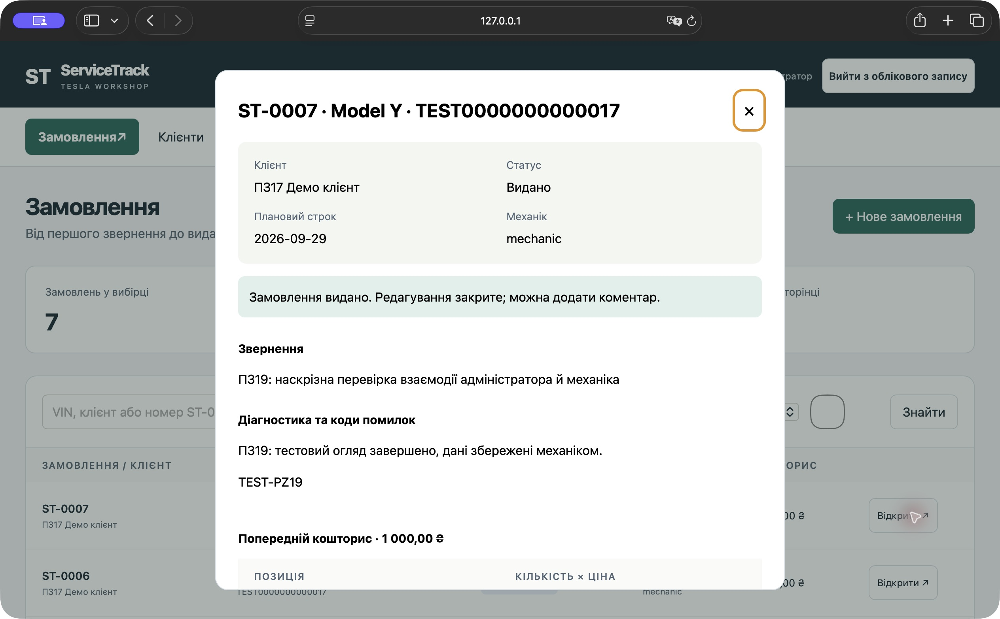
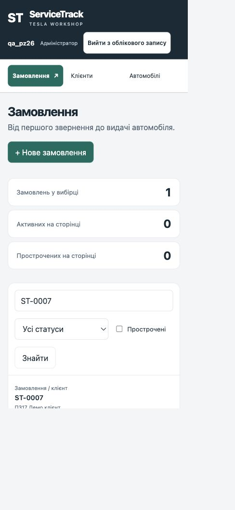

# ПЗ26. Кросбраузерне та адаптивне тестування

Філатов Олександр Юрійович, КН-42. ServiceTrack Tesla. 29.09.2026.

## Умова та обсяг

[Умова заняття](https://b.optima-osvita.org/mod/lesson/view.php?id=183987) перевірена на платформі: обрати 3–4 комбінації «браузер + пристрій», розробити сценарії для 3–4 ключових функцій MVP, провести перевірку та задокументувати помилки. У внутрішньому заголовку уроку помилково №28; тут застосовано номер №26 з навігації курсу. Окреме завантаження результатів не потрібне.

Виконано чотири сценарії у чотирьох конфігураціях: два справжні браузери на macOS та два додаткові адаптивні розміри Chrome. Мобільний і планшетний профілі — **емуляція області перегляду**, не фізичні пристрої, не Android/iOS і не Safari iOS. Перевірка інших ОС та сенсорної клавіатури залишається поза цим прогоном. Ця робота підтверджує сумісність лише в наведених межах.

Пріоритети обрано за сценаріями персон: адміністратор працює за ноутбуком, механік переглядає замовлення на вузькому екрані. Реальної статистики пристроїв користувачів ще немає; частки ринку не вигадувалися. Chrome і Safari дають перевірку двох різних рушіїв, Blink та WebKit.

## Оточення і тестові дані

Версія репозиторію перед тестом `2cb56f2`; код застосунку відповідає `8f0ce4d`. Локальний Django-сервер, macOS 26.7, демонстраційні дані, без зовнішнього тунелю. Створено окремого тимчасового адміністратора `qa_pz26`; після перевірок виконано вихід, обліковий запис деактивовано, пароль зроблено непридатним для входу. Історія тестових коментарів збережена.

| ID | Браузер і пристрій/профіль | Реальний обсяг |
|---|---|---|
| C1 | Google Chrome 154.0.8037.58, ноутбук macOS | Широка область 1600×1000 CSS-пікселів |
| C2 | Той самий Chrome, планшетний розмір | Емуляція 767×1024 CSS-пікселів; не фізичний планшет |
| C3 | Той самий Chrome, мобільний розмір | Емуляція 390×844 CSS-пікселів; не фізичний телефон |
| C4 | Safari 26.6.2, ноутбук macOS | Справжній Safari у звичайному вікні; знімок вікна 2528×1566 фізичних пікселів, це не CSS-viewport |

Фактичні CSS-розміри Chrome перевірено через геометрію документа: масштаб браузера відрізнявся від одиничного. Початковий додатковий прогін C2 мав ширину 960 CSS-пікселів; його повторено на 767×1024, і саме повторний результат включено в матрицю. Тестовий коментар першого прогону з позначкою «768» залишено в історії; він не є доказом фактичної ширини. Після тестів налаштування області перегляду скинуто.

Основний запис: ST-0007, Tesla Model Y, синтетичний VIN TEST0000000000017, статус «Видано», кошторис 1 000,00 грн. У базі 7 замовлень. Перевірки не змінювали статус, суму, клієнта чи автомобіль; додано лише явно позначені коментарі ПЗ26.

## Чотири тестові сценарії

| ID / функція | Кроки | Очікувано |
|---|---|---|
| S1. Вхід та вихід | Відкрити застосунок без сесії; ввести дані тестового адміністратора; увійти; перевірити ім’я/роль і завантаження списку; після решти сценаріїв вийти | До входу форма авторизації; після входу ім’я qa_pz26, роль «Адміністратор» і список; після виходу знову форма входу |
| S2. Пошук замовлення | Ввести ST-0007 і натиснути «Знайти»; перевірити один результат; окремо знайти PZ26-NO-MATCH | Один правильний запис для ST-0007; для відсутнього значення — 0 записів, пояснення порожнього стану і неактивна пагінація; текст лічильника граматично правильний |
| S3. Картка та обмеження виданого замовлення | Відкрити ST-0007; переглянути клієнта, статус, строк, механіка, звернення, діагностику, кошторис та історію; закрити діалог | Правильна картка і сума; повідомлення «Редагування закрите», немає дій зміни виданого замовлення; коментар дозволений; діалог прокручується і закривається |
| S4. Коментар і збереження | Додати унікальний коментар з ID конфігурації; перевірити появу в історії; оновити сторінку, знову відкрити ST-0007 | Текст збережений, автор qa_pz26, дата відображається; після reload коментар залишається в тому самому замовленні |

Для кожного сценарію також спостерігали за читабельністю, доступністю кнопок і полів, прокручуванням та відсутністю зависання. Це якісне спостереження, не новий вимір p95 чи продуктивності пристрою; кількісний аудит наведено у ПЗ25.

## Матриця фактичних результатів

| Сценарій | C1 Chrome широкий | C2 Chrome 767×1024 | C3 Chrome 390×844 | C4 Safari |
|---|---|---|---|---|
| S1 | PASS | PASS | PASS | PASS |
| S2 | Функція PASS, BUG-008 | Функція PASS, BUG-008 | Функція PASS, BUG-008 | Функція PASS, BUG-008 |
| S3 | PASS | PASS | PASS | PASS |
| S4 | PASS, після reload | PASS, після reload | PASS, після reload | PASS, після reload |

16 функціональних перевірок виконано; 12 без зауважень, 4 перевірки S2 мають один спільний косметичний дефект. Це не 16 безумовно успішних перевірок усіх критеріїв. Специфічного для Safari функціонального збою в обраному наборі не виявлено.

На 767 CSS-пікселях збережено табличний вигляд із перенесенням довгих значень; на 390 — картки та вертикальні блоки. Ширина документа дорівнювала scrollWidth: 767/767 та 390/390, тобто горизонтального переповнення сторінки в перевіреному стані немає. Мобільний діалог: clientWidth/scrollWidth 357/357, вертикальна прокрутка потрібна й доступна. Форму коментаря фактично заповнено й надіслано в кожній конфігурації. Наявність прихованої нижче екрана історії при довгому діалозі не трактувалась як обрізання — її перевірено прокручуванням.

У Safari введений через інструмент текст містить «Saari» замість «Safari» у мітці коментаря. Це текст тестового вводу, а не встановлений дефект застосунку; перевірка збереження підтверджує саме фактичний текст. Ідентифікатор C4 і автор збережені.

## Знайдений дефект BUG-008

[GitHub Issue №15](https://github.com/s6a6t6anfil-create/servicetrack-tesla/issues/15), Open, відповідальний — власник репозиторію. Пріоритет Low, важливість Minor. Спільний дефект локалізації, не залежить від браузерного рушія.

**Кроки:** увійти адміністратором → знайти ST-0007 → отримати один результат → прочитати підпис під списком.

**Очікувано:** «1 запис · сторінка 1». **Фактично:** «1 записів · сторінка 1». Дані та кількість правильні. Відтворено в C1–C4 на зазначеній версії.

У `static/app.js`, функція `load()`, слово «записів» задано стало. Запропоноване виправлення: українські форми через Intl.PluralRules або нейтральний підпис «Записів: 1». Для приймання перевірити 0, 1, 2, 5, 11, 21, 22, 25. У цьому завданні дефект задокументовано, не виправлено.

Рисунок 26.1 — Один результат, помилка відмінювання в лічильнику.

Рисунок 26.2 — Картка ST-0007 у справжньому Safari.

Рисунок 26.3 — Адаптивний макет за ширини 390 CSS-пікселів; нижня частина доступна прокручуванням.

## Докази та висновок

Текстові знімки результатів збережено в [каталозі доказів](verification/pz26/): `chrome-*-reload.txt` підтверджують збережені коментарі, `chrome-*-empty.txt` — порожній пошук, `safari-reload.txt`, `safari-empty.txt`, `safari-logout.txt` — відповідні стани Safari. Знімки Safari можуть бути різницями дерева доступності; це первинні журнали інструмента, не додаткові вигадані прогони.

Обраний набір сценаріїв виконано на чотирьох конфігураціях із чесним відокремленням емуляції від фізичних пристроїв. Знайдений косметичний дефект зареєстрований. Раніше відкриті BUG-005–007 не закрито цим прогоном: їхні специфічні сценарії затримки/помилок мережі та редагування старих VIN тут не повторювалися. Фізичні Android/iOS, Firefox/Edge, сенсорна клавіатура та інші ОС залишаються напрямами розширення перевірки; їх проходження не заявляється.

Матеріал додано до єдиного звіту. Наступне заняття — ПЗ27, посібник кінцевого користувача.
