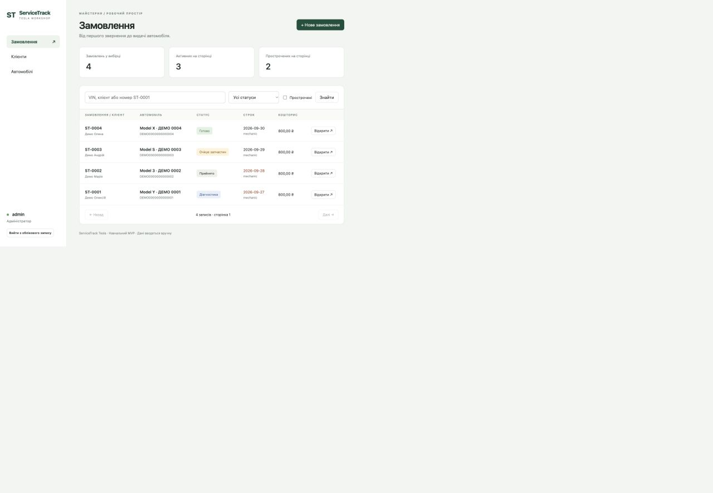
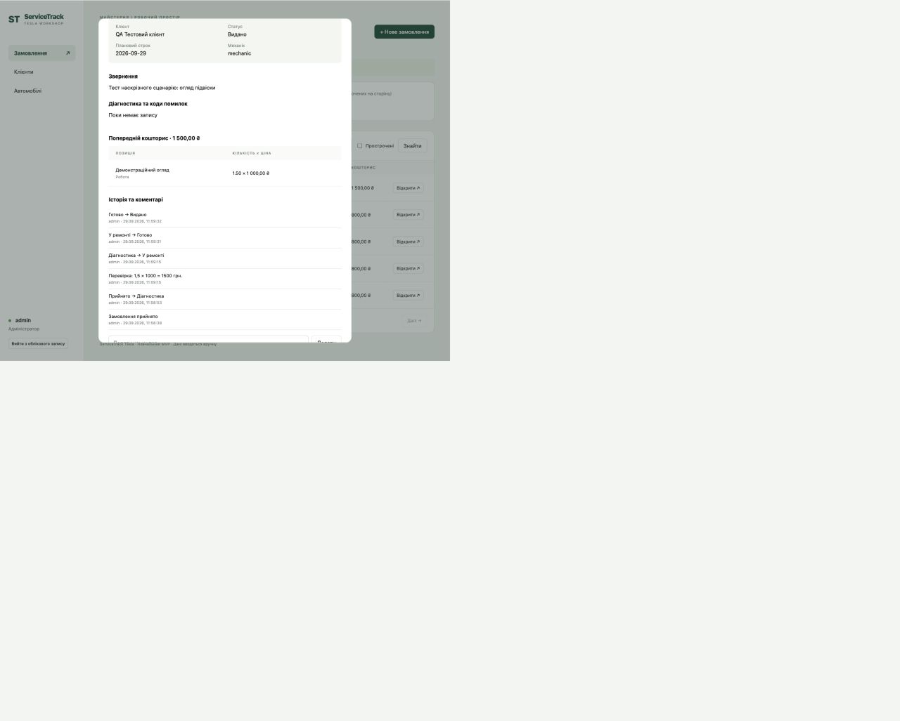

# Посібник користувача ServiceTrack Tesla
Практичне заняття 27. Версія 0.1. Філатов Олександр Юрійович, КН-42.

## Для чого потрібен застосунок
ServiceTrack допомагає вести клієнтів, автомобілі Tesla й ремонтні замовлення. Ти бачиш строк, відповідального механіка, попередній кошторис та історію роботи. Коди помилок вводяться вручну; застосунок не читає автомобіль і не встановлює діагноз.

## Перший вхід
1. Отримай адресу застосунку, ім’я користувача й пароль у адміністратора майстерні.
2. Відкрий адресу в браузері. У локальній демонстрації це http://127.0.0.1:8943/ на комп’ютері, де запущено сервер.
3. Введи ім’я й пароль, натисни «Увійти».
4. Після роботи натисни «Вийти з облікового запису». Ця кнопка доступна і на вузькому екрані.
Самореєстрації немає. Встановлення й запуск сервера виконує відповідальний за програму за README; на робочому місці достатньо браузера. Не вводь справжні дані клієнтів у демонстраційну базу.

## Як додати клієнта
1. Відкрий «Клієнти» → «Новий клієнт».
2. Вкажи ім’я або назву й телефон. Email та примітки необов’язкові.
3. Натисни «Зберегти». Дочекайся повідомлення «Зміни збережено».
Для виправлення запису натисни «Редагувати» в його рядку. Видалення можливе лише без пов’язаних авто; підтвердження попереджає про дію. Механік не створює й не редагує клієнтів.

## Як додати Tesla
1. Спочатку створи клієнта.
2. Відкрий «Автомобілі» → «Новий автомобіль».
3. Обери клієнта й модель, заповни рік, VIN та пробіг; номер необов’язковий.
4. Перевір VIN: 17 символів, без I, O та Q. Дублікат не збережеться.
5. Натисни «Зберегти». Автомобіль із замовленнями видалити не можна.

## Як прийняти автомобіль у ремонт
1. Відкрий «Замовлення» → «Нове замовлення».
2. Обери авто, механіка та планову дату.
3. Опиши звернення клієнта. За потреби додай відомі результати огляду й коди помилок.
4. Збережи запис. Система присвоїть номер ST і стан «Прийнято».

## Як записати діагностику
1. Знайди замовлення й натисни «Відкрити».
2. Натисни «Редагувати».
3. Запиши результати в поле «Результат діагностики», а коди — в окреме поле.
4. Збережи. Механік працює лише зі своїми замовленнями.
Запис діагностики є твоєю текстовою нотаткою; програма не перевіряє її технічну правильність.

## Як змінити статус
У відкритому замовленні натисни кнопку потрібного наступного етапу. Показано тільки дозволені переходи. Після «Готово» адміністратор може підтвердити «Видано». Історія збереже автора й час. Якщо потрібне повернення після видачі, створи нове замовлення для того самого авто.

## Як скласти кошторис
1. Відкрий замовлення → «Додати позицію».
2. Обери «Робота» або «Запчастина», введи назву, кількість і ціну.
3. Збережи. Наприклад, 1,5 години за 1000 грн дадуть 1500 грн.
4. Для виправлення натисни «Змінити» біля позиції. Для видалення — «Видалити» й підтвердь.
Кошторис змінює тільки адміністратор, доки замовлення не видано. Сума попередня; це не фіскальний чек і не облік оплати.

## Як додати коментар і переглянути історію
У картці замовлення введи текст у «Додати коментар» й натисни «Додати». Нижче відображаються записи від нових до старих. Для історії авто відкрий «Автомобілі» → «Історія» біля потрібного запису → номер замовлення.

## Як знайти замовлення
Введи VIN, ім’я клієнта або точний номер на зразок ST-0005 і натисни «Знайти». За потреби обери статус або «Прострочені». Простроченими вважаються незавершені ремонти з датою раніше сьогодні; «Готово» й «Видано» виключені. Картки активних і прострочених рахують поточну сторінку, а загальна кількість — усю вибірку. Для інших записів використовуй «Далі» й «Назад».
На телефоні широку таблицю можна прокрутити горизонтально до кнопки «Відкрити».

## Поширені питання
Не входить? Перевір розкладку й облікові дані; звернися до адміністратора.
Немає замовлення? Перевір фільтри. Механік бачить лише призначені йому записи.
Не зберігається VIN? Перевір довжину, заборонені літери й наявність такого авто.
Не можна видалити клієнта? До нього прив’язані автомобілі; збереження історії має пріоритет.
Помилка сесії? Увійди повторно, тоді повтори дію. Перед повторенням перевір, чи запис уже не з’явився.

## Підтримка
З питань доступу звертайся до адміністратора майстерні. Навчальну версію супроводжує Філатов Олександр, КН-42; канал зв’язку — особисті повідомлення в навчальній платформі Optima. У повідомленні вкажи номер замовлення, дію, час і текст помилки; пароль не надсилай.
