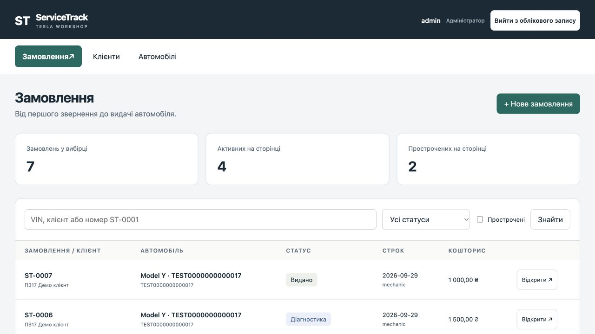
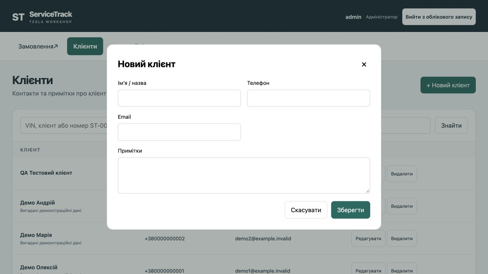
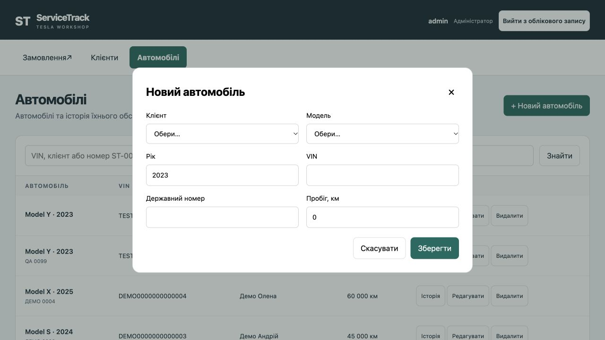
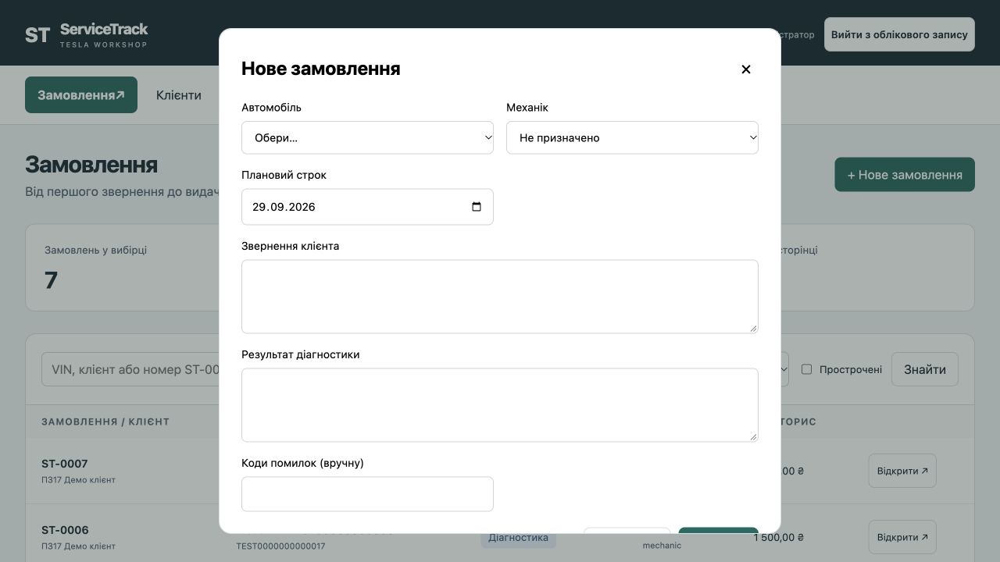
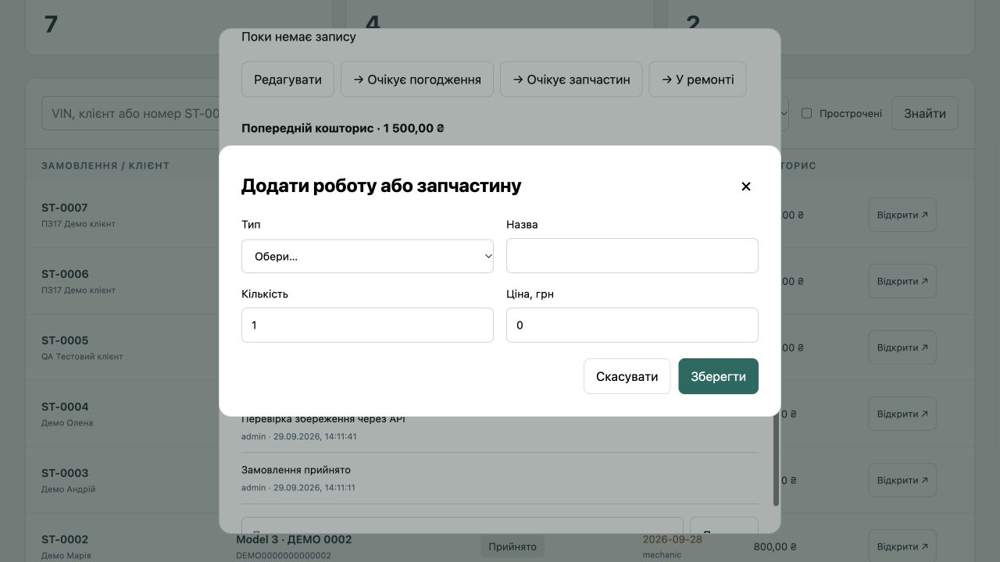
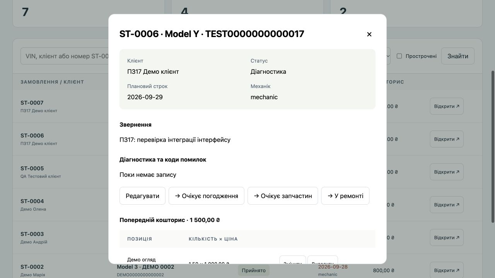

# Посібник користувача ServiceTrack Tesla

Практичне заняття 27. Філатов Олександр Юрійович, КН-42.
Версія посібника 1.1 від 29 вересня 2026 року.

## 1 Для чого потрібен застосунок

ServiceTrack Tesla допомагає тобі вести клієнтів, автомобілі й ремонтні замовлення майстерні. В одному місці ти бачиш звернення, механіка, строк, діагностику, попередню вартість та історію ремонту. Цей посібник пояснює щоденні дії адміністратора й механіка.

Діагностику та коди помилок ти вводиш вручну. Програма не підключається до Tesla, не читає помилки з автомобіля й не визначає несправність. Кошторис не є обліком оплати або фіскальним чеком. На ілюстраціях показані демонстраційні дані.

### Як отримати доступ і підготувати робоче місце

1. Звернися до адміністратора майстерні: отримай адресу застосунку, особисте ім’я користувача, пароль і призначену роль.
2. Відкрий адресу в браузері. Встановлювати окрему програму на своєму робочому місці не потрібно; сервер готує відповідальний за систему.
3. Для локальної демонстрації відкрий http://127.0.0.1:8943/ на тому комп’ютері, де запущено застосунок. На іншому пристрої попроси адресу в адміністратора.

Самореєстрації та відновлення пароля через email немає. Не використовуй чужий обліковий запис і не вводь справжні дані клієнтів у навчальне демо.

### Як увійти та завершити роботу

1. У формі входу заповни «Ім’я користувача» та «Пароль».
2. Натисни «Увійти». Перевір своє ім’я і роль у верхній частині сторінки.
3. Після роботи натисни «Вийти з облікового запису». Має з’явитися форма входу.

<!--page-->
## 2 Як орієнтуватися і знайти замовлення

Угорі є три розділи: «Замовлення», «Клієнти» й «Автомобілі». Адміністратор веде довідники, приймає ремонти, призначає механіка, редагує кошторис і видає авто. Механік працює з призначеними йому замовленнями: записує діагностику, змінює дозволені етапи та залишає коментарі. Відсутня кнопка може означати обмеження твоєї ролі.

### Як знайти потрібний ремонт

1. Відкрий «Замовлення». У «Пошук» введи VIN, ім’я клієнта або номер, наприклад ST-0006.
2. За потреби обери «Статус замовлення» або познач «Прострочені».
3. Натисни «Знайти», перевір автомобіль і клієнта, потім натисни «Відкрити ↗».
4. Якщо нічого не знайдено, очисти пошук, обери «Усі статуси», зніми «Прострочені» й знову натисни «Знайти».

### Як переглянути інші записи та зрозуміти показники

Натискай «Далі →» і «← Назад» під списком. Неактивна кнопка означає, що відповідної сторінки немає. Загальна кількість стосується всієї вибірки, а активні й прострочені замовлення рахуються лише на відкритій сторінці. Прострочений ремонт має дату раніше сьогодні та ще не перебуває у стані «Готово» або «Видано».

<!--page-->
## 3 Як працювати з клієнтами

Ці зміни виконує адміністратор. Спочатку перевір, чи клієнт уже є у списку, щоб не створити дублікат.

### Як додати клієнта

1. Відкрий «Клієнти» та натисни «+ Новий клієнт».
2. Заповни «Ім’я / назва» і «Телефон». За потреби додай Email та «Примітки».
3. Натисни «Зберегти». Дочекайся повідомлення «Зміни збережено» та появи запису в списку.

### Як змінити контакти клієнта

1. Знайди клієнта й натисни «Редагувати» в його рядку.
2. Виправ потрібні поля та натисни «Зберегти». Перевір результат у списку.

### Як видалити помилково створеного клієнта

1. Перевір, що це саме зайвий запис. Натисни «Видалити» й прочитай підтвердження.
2. Підтвердь лише якщо хочеш видалити запис. Клієнта з пов’язаними автомобілями система видалити не дозволить.

Щоб закрити форму без збереження, натисни «Скасувати» або хрестик. Не видаляй потрібні пов’язані записи заради обходу обмеження.

<!--page-->
## 4 Як працювати з автомобілями

Створення, редагування та видалення автомобіля доступні адміністратору. Клієнт має вже існувати.

### Як додати автомобіль Tesla

1. Відкрий «Автомобілі» → «+ Новий автомобіль».
2. Обери «Клієнт» і «Модель», вкажи рік, VIN та пробіг. «Державний номер» необов’язковий.
3. Перевір VIN: рівно 17 латинських літер або цифр, без I, O та Q. Рік має бути від 2008 до 2100, пробіг — від 0 до 3 000 000 км.
4. Натисни «Зберегти». Перевір VIN і власника у списку. Повторний VIN система відхилить.

### Як змінити дані автомобіля

1. Знайди авто, натисни «Редагувати» та звір VIN, щоб не змінити інший запис.
2. Онови потрібні поля й натисни «Зберегти».

### Як видалити зайвий автомобіль

1. Натисни «Видалити» біля потрібного авто й прочитай попередження.
2. Підтвердь дію. Якщо авто вже має замовлення, видалення буде заблоковано для збереження історії.

<!--page-->
## 5 Як прийняти авто та призначити механіка

### Як створити ремонтне замовлення

1. Переконайся, що клієнт і автомобіль уже додані.
2. Як адміністратор відкрий «Замовлення» → «+ Нове замовлення».
3. Обери «Автомобіль», вкажи «Плановий строк» та опиши «Звернення клієнта».
4. Обери механіка або залиш «Не призначено». Відомі результати огляду та коди можна додати одразу або пізніше.
5. Натисни «Зберегти». Новий запис отримає номер ST і статус «Прийнято». Перевір автомобіль, строк та відповідального.

### Як змінити строк або відповідального

1. Відкрий невидане замовлення й натисни «Редагувати».
2. Як адміністратор зміни «Механік», «Плановий строк» або звернення та натисни «Зберегти».
3. Перевір оновлені значення у картці. Якщо механіка не призначено, він не побачить цей ремонт серед своїх замовлень.

Видалення ремонтних замовлень у робочому інтерфейсі не передбачене. Якщо помилився, виправ доступні дані або поясни ситуацію коментарем. Після видачі редагування закривається.

<!--page-->
## 6 Як вести діагностику та етапи ремонту

### Як записати результати діагностики

1. Знайди замовлення, натисни «Відкрити ↗», потім «Редагувати».
2. Заповни «Результат діагностики» та «Коди помилок (вручну)». Вкажи спостереження й виконані перевірки зрозумілими словами.
3. Натисни «Зберегти» й перевір текст у картці. Механік може змінювати діагностику лише у своїх невиданих замовленнях.

### Як перейти до наступного етапу

1. Відкрий картку та звір поточний статус.
2. Натисни кнопку зі стрілкою й потрібним наступним станом. Зміна застосовується одразу, без окремого підтвердження.
3. Перевір новий статус та запис у «Історія та коментарі». Кнопки показують лише дозволені переходи.

Типовий шлях: «Прийнято» → «Діагностика» → «У ремонті» → «Готово» → «Видано».

За потреби з діагностики можна перейти до очікування погодження або запчастин. З очікування погодження — до діагностики, очікування запчастин або ремонту; з очікування запчастин — до діагностики або ремонту. З ремонту можна повернутися до діагностики чи очікування запчастин, а з «Готово» — до ремонту.

### Як видати автомобіль

1. Як адміністратор відкрий замовлення зі статусом «Готово» та звір результат і кошторис.
2. Після фактичної видачі натисни «→ Видано».
3. Переконайся, що з’явилося повідомлення про закрите редагування. Додавати коментарі можна й надалі.

Механік не видає авто. Після «Видано» повернення статусу немає; для повторного ремонту створи нове замовлення. Домовленості з клієнтом відбуваються поза застосунком — зафіксуй їх коментарем.

<!--page-->
## 7 Як скласти та уточнити кошторис

Позиції кошторису змінює адміністратор, доки замовлення не видано. Механік може переглядати суму у доступній йому картці.

### Як додати роботу або запчастину

1. Відкрий замовлення та натисни «+ Додати позицію».
2. Обери «Тип»: «Робота» або «Запчастина». Введи «Назва», «Кількість» і «Ціна, грн».
3. Кількість має бути щонайменше 0,01, ціна — не нижче 0. Використовуй до двох знаків після коми; якщо браузер не приймає кому, введи крапку.
4. Натисни «Зберегти» та перевір позицію і загальну суму. Наприклад, 1,50 × 1000,00 грн = 1500,00 грн.

### Як виправити позицію

1. Натисни «Змінити» поруч із потрібною позицією.
2. Виправ назву, тип, кількість або ціну й натисни «Зберегти». Звір перераховану суму.

### Як прибрати зайву позицію

1. Натисни «Видалити» саме в рядку позиції кошторису.
2. Підтвердь дію у вікні «Видалити цю позицію кошторису?». Перевір залишок позицій і загальну суму.

<!--page-->
## 8 Як користуватися історією та коментарями

### Як додати коментар до ремонту

1. Відкрий замовлення і прокрути картку до «Історія та коментарі».
2. У полі «Додати коментар…» введи текст до 4000 символів та натисни «Додати».
3. Дочекайся появи запису з твоїм ім’ям і часом. Першими показані найновіші події.

Коментарі доступні й після видачі. Окремих кнопок редагування та видалення коментаря немає; для уточнення додай новий запис. Історія фіксує створення замовлення, зміни статусу й коментарі, а не повний журнал редагування кожного поля.

### Як переглянути ремонти конкретного авто

1. Відкрий «Автомобілі» та знайди потрібний VIN.
2. Натисни «Історія» в рядку автомобіля.
3. Натисни номер потрібного замовлення, щоб відкрити його картку. Якщо записів немає, побачиш відповідне повідомлення.

### Як працювати з телефона

Відкрий адресу, отриману від адміністратора. На вузькому екрані список замовлень перетворюється на картки; прокручуй сторінку вниз до потрібної кнопки. Довгі форми й картки замовлень мають власну вертикальну прокрутку. Після збереження перевір повідомлення та результат, а не натискай кнопку повторно одразу.

<!--page-->
## 9 Поширені запитання

### Що робити якщо сторінка не відкривається

Перевір адресу й зв’язок. Для локального демо сервер має працювати на тому самому комп’ютері. Звернися до адміністратора; не змінюй налаштування браузера навмання.

### Чому не вдається увійти

Перевір розкладку, регістр і відсутність зайвих пробілів. Якщо пароль забутий або обліковий запис вимкнено, звернися до того, хто надав доступ. Самостійного відновлення через email немає.

### Чому я не бачу замовлення або кнопки

Очисти фільтри й натисни «Знайти». Механік бачить лише призначені йому замовлення. Попроси адміністратора перевірити призначення та роль. Для виданого ремонту редагування й кошторис закриті.

### Що робити якщо дані не зберігаються

Прочитай текст помилки у формі. Перевір обов’язкові поля, дату, числові межі й VIN. Якщо сесія завершилася, увійди повторно. Перед повторним збереженням перевір, чи запис уже не з’явився: це допоможе уникнути дублювання після обриву зв’язку.

### Чому правильний на вигляд VIN відхиляється

Перевір 17 символів, відсутність I, O та Q і дубліката у списку. Старі демонстраційні VIN, що починаються з DEMO, містять заборонену O; не використовуй їх як зразок справжнього VIN. Якщо такий запис не дає змінити інше поле, повідом адміністратора.

### Чому запис не видаляється або лічильник написано незвично

Клієнт із автомобілями та авто із замовленнями захищені від видалення. Підпис «1 записів» є відомою помилкою тексту лічильника; кількість при цьому може бути правильною. Якщо вікно повторно відкрилося після закриття під час завантаження, дочекайся завершення й закрий його знову. Якщо помилка мережі не видима всередині вікна, закрий його та перевір повідомлення на основній сторінці.

<!--page-->
## 10 Підтримка та коротка пам’ятка

### Як звернутися по допомогу

З питань входу, ролі, адреси системи або призначення механіка звернися до адміністратора майстерні, який надав тобі доступ, через ваш узгоджений робочий канал. Окремої служби з гарантованим часом відповіді у навчальній версії немає.

За навчальний проєкт відповідає Філатов Олександр Юрійович, КН-42. Помилку програми можна зареєструвати в GitHub Issues репозиторію ServiceTrack Tesla:
https://github.com/s6a6t6anfil-create/servicetrack-tesla/issues

1. Перевір, чи немає вже такого повідомлення серед відкритих Issues. Для створення звернення потрібен обліковий запис GitHub; якщо його немає, передай опис адміністратору.
2. Напиши, що хотів зробити, які кроки виконав, що очікував і що побачив. Додай час, браузер, пристрій та точний текст помилки.
3. За потреби додай скриншот, приховавши справжні імена, телефони, VIN та інші дані клієнтів. Репозиторій публічний. Пароль, коди входу й особисті дані не надсилай.

### Що перевірити перед завершенням роботи

Переконайся, що зміни збережені, призначений правильний механік і строк, кошторис відповідає введеним позиціям, а статус відображає фактичний етап ремонту. Важливі домовленості занеси в коментар. Заверши роботу кнопкою «Вийти з облікового запису».

### Де знайти потрібну дію

Початок роботи — розділ 1. Пошук — розділ 2. Клієнти — розділ 3. Автомобілі — розділ 4. Приймання та призначення — розділ 5. Діагностика й статуси — розділ 6. Кошторис — розділ 7. Історія та телефон — розділ 8. Усунення типових труднощів — розділ 9.
