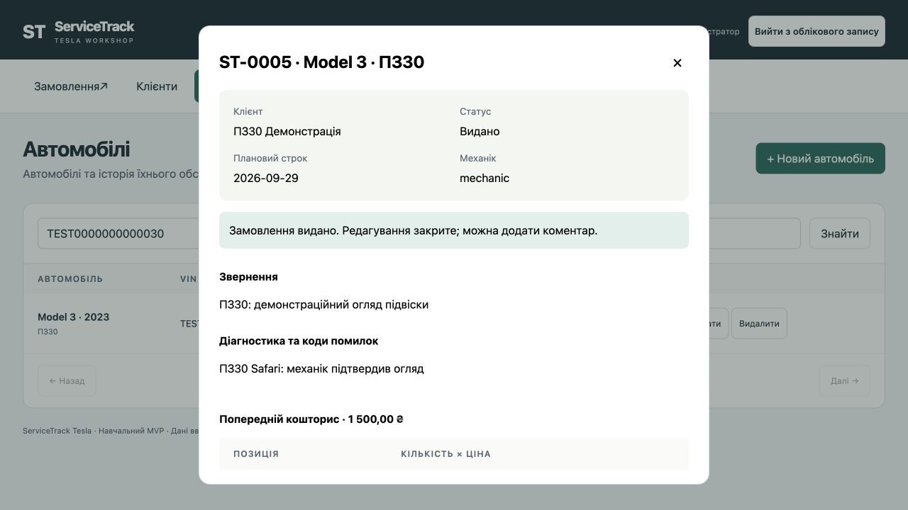
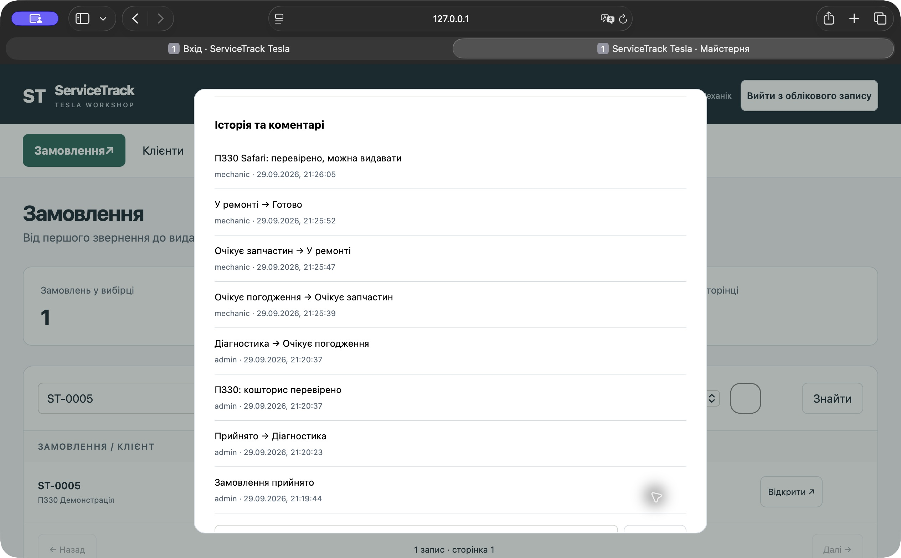
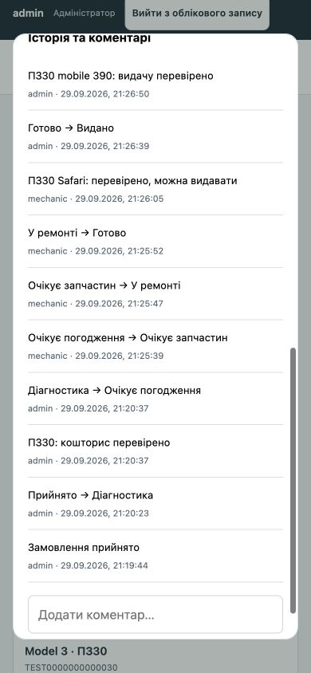
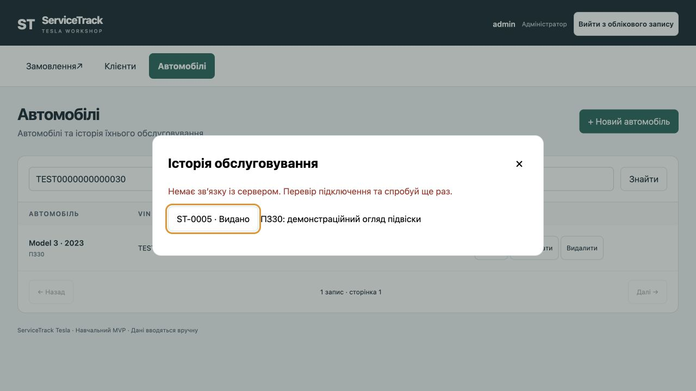

# ПЗ30. Фінальна перевірка функціоналу та підготовка демонстрації

Філатов Олександр Юрійович, КН-42. ServiceTrack Tesla. 29.09.2026.

## Умова та обсяг

[Умова заняття №30](https://b.optima-osvita.org/mod/lesson/view.php?id=183995): детальний checklist ключових функцій MVP, наскрізне тестування, щонайменше два браузери й мобільний пристрій або емуляція, фіксація та виправлення знайдених помилок. Внутрішній заголовок уроку №33 не збігається з навігацією курсу. Прикріплення файлу для цього заняття не потрібне.

Перевірено робочу гілку fix/pz30-final-check поверх c304bcb. Автоматичні перевірки виконувалися в ізольованих тестових базах; браузерна перевірка — на окремій демонстраційній базі з вигаданими даними. Застосовано реальні браузери Codex IAB (Chromium) і Safari (WebKit), а також viewport 390×844 CSS px у IAB. Це емуляція розміру екрана, не випробування на фізичному смартфоні. Контроль розміру: innerWidth=390, innerHeight=844, scrollWidth=390.

## Детальний checklist ключових функцій

Позначення доказів: UI — фактичні дії в браузері; API — інтеграційні запити Django test client; T — автоматичні тести. API/T не названо браузерним E2E. Статус «пройдено» стосується наведеного сценарію, а не всіх можливих комбінацій даних.

| № / вимога | Дія та очікування | Фактичний результат / доказ |
|---|---|---|
| 01 / FR01 | Вхід адміністратора й механіка відкриває відповідну роль | Пройдено UI: admin в IAB, mechanic у Safari |
| 02 / FR01 | Неправильний пароль не відкриває дані; вихід завершує сесію | Пройдено UI: повідомлення «Перевір ім’я користувача та пароль»; вихід IAB390 і Safari повертає форму входу; API без сесії403 |
| 03 / FR01 | Механік не змінює клієнтів/ціни та не видає авто | Пройдено UI: немає кнопок ціни/видачі; T mechanic_scope, mechanic_write_permissions, mechanic_cannot_deliver |
| 04 / FR02 | Створити клієнта, перечитати, змінити дані | Пройдено UI створення «ПЗ30 Демонстрація», повторне використання у формах; API POST/GET/PUT/PATCH |
| 05 / FR02 | Видалення без зв’язків дозволене, із зв’язками заборонене; обов’язкові поля | Пройдено API DELETE204 окремого запису, protected_delete400, invalid_customer400 |
| 06 / FR03 | Створити авто з клієнтом, моделлю, роком, VIN і пробігом | Пройдено UI: Model 3, 2023, TEST0000000000030, 0 км, номерПЗ30; API читання/зміна/видалення незв’язаного авто |
| 07 / FR03 | Некоректний/повторний VIN, від’ємний пробіг та небезпечне видалення відхиляються | Пройдено T vehicle_invalid_and_duplicate_vin, required_and_boundary_fields, protected_delete; нормалізація lowercase — окремий T |
| 08 / FR04 | Створити замовлення, отримати номер, дату й механіка | Пройдено UI: ST-0005, 2026-09-29, mechanic; API/T перевіряють required fields та активного механіка |
| 09 / FR05 | Діагностика зберігається між ролями й браузерами | Пройдено UI: Safari записав «ПЗ30 Safari: механік підтвердив огляд», IAB прочитав після reload; ручні коди та їх збереження покриті T/API |
| 10 / FR06 | Провести замовлення всіма основними статусами, зберегти автора/час | Пройдено UI: Прийнято → Діагностика → Очікує погодження → Очікує запчастин → У ремонті → Готово → Видано; T перевіряє всі пари переходів і rollback аудиту |
| 11 / FR07 | Створити кошторис; кількість×ціна; змінити/видалити позицію | Пройдено UI:1, 50×1000=1500 грн; API PUT/PATCH/DELETE позиції; T Decimal/negative price, API quantity0→400 |
| 12 / FR08 | Додати коментар, побачити автора/час та історію | Пройдено UI в IAB, Safari й390px; коментарі обох ролей прочитані у фінальній картці; API порожній текст400 |
| 13 / FR09 | Пошук за номером/VIN, фільтр статусу | Пройдено UI: ST-0005 і TEST0000000000030; фільтр «Видано» дає1 запис; overdue/invalid query покриті T |
| 14 / FR10 | Відкрити історію авто й потрібне замовлення | Пройдено UI: Model 3 → Історія → ST-0005; показано саме пов’язане замовлення; API history200 |
| 15 / FR11 | Видача блокує редагування, але дозволяє коментар | Пройдено UI: зникли кнопки редагування/кошторису, додано mobile-коментар; T closed_order_immutable і closed_order_comment |
| 16 / FR12 | Лічильники відповідають вибірці | Пройдено UI: після видачі вибірка1, активних0, прострочених0; Safari після reload бачить5 замовлень, 3 активних, 2 прострочених |
| 17 / адаптивність | Картка, пошук, фільтр, коментар і вихід на вузькому екрані | Пройдено UI390×844; горизонтальне переповнення відсутнє; фізичний телефон не тестувався |
| 18 / стійкість UI | Після закриття вікна повільний запит не відкриває його знову | Пройдено: мережева затримка1500 мс, закриття під час запиту; після завершення loading=false, openDialogs=0; регресійний T |
| 19 / повідомлення | Збій мережі при відкритті замовлення з історії видно в діалозі | Пройдено UI offline: alert усередині історії; мережу відновлено; регресійний T |

## Наскрізний сценарій та два браузери

1. IAB/admin: створено клієнта й авто; створено ST-0005 зі скаргою «ПЗ30: демонстраційний огляд підвіски» та механіком mechanic.
2. IAB/admin: додано роботу «ПЗ30 Огляд», 1, 50×1000 грн; переведено до діагностики, збережено діагноз і коментар; статус «Очікує погодження».
3. Safari/mechanic: знайдено ST-0005, уточнено діагноз, послідовно пройдено очікування запчастин, ремонт і готовність; додано коментар «ПЗ30 Safari: перевірено, можна видавати». Ціну й видачу механік змінити через UI не може.
4. IAB/admin після reload: підтверджено дані Safari та суму1500 грн; виконано видачу. Редагування закрите.
5. IAB390×844: додано коментар до виданого замовлення, застосовано фільтр «Видано». Після повторного відкриття з історії коментар залишився.
6. Safari після reload: ST-0005 має статус «Видано» і1500 грн. Обидві ролі вийшли із системи; неправильний пароль у IAB не дав увійти.

## Виправлені дефекти

| Дефект | Виправлення | Перевірка |
|---|---|---|
| BUG-005 / Issue 9 | Команда repair_demo_vins: dry-run за замовчуванням, --apply лише для4 точних старих DEMO VIN і позначки вигаданих даних; DEMO замінено на DEMX без зміниID/зв’язків | Тести scope/idempotence/collision; перед зміною створено SQLitebackup; у старій демобазі виправлено4 записи |
| BUG-006 / Issue 10 | Закриття/cancel інвалідують версію запиту деталей, запізніла відповідь не відкриває вікно | T + фактичний браузерний сценарій із затримкою1500 мс |
| BUG-007 / Issue 11 | Повідомлення спрямовується в alert усередині відкритого діалогу | T + фактичний offline-сценарій, знімок нижче |
| BUG-008 / Issue 15 | recordCount правильно утворює «1 запис», «2 записи», «5 записів», включно11–14 | Табличний T; UI1 запис та5 записів |

Виправлення перевірені у робочій гілці. GitHub Issues залишаються відкритими до злиття змін; статус Issue не означає відсутність виправлення у цій версії. Старі звіти ПЗ23/26/27/29 відображають стан на час їх створення. Поточний розділ є доповненням про усунення дефектів; вже подані PDF не переписуються заднім числом.

Автоматичний результат: **32 серверні тести PASS, 22 клієнтські тести PASS**, інтеграційний контракт **26 успішних операцій+10 негативних випадків PASS**. Точні відповіді API — [pz30-api.json](verification/pz30-api.json). Резюме перевірок — [pz30-checks.md](verification/pz30-checks.md).

## Сценарій демонстрації, 6–7 хвилин

0:00–0:40 — проблема майстерні та дві ролі.0:40–2:00 — клієнт, авто, замовлення.2:00–3:00 — діагностика механіка.3:00–4:00 — кошторис і статуси.4:00–5:00 — видача, блокування, історія.5:00–6:00 — мобільний екран і обмеження ролей.6:00–7:00 — тести, виправлені дефекти, межі MVP.

Перед показом: запустити окрему демонстраційну базу, перевірити вхід обох ролей, підготувати незавершене замовлення; для нового VIN використовувати унікальне17-символьне значення без I/O/Q. Вже виданий ST-0005 використовувати для демонстрації історії й блокування, не намагатися редагувати. Паролі не включати до слайдів або публічного репозиторію. Знімки є резервною ілюстрацією, не заміною живого показу.

## Межі висновку

Основний процес від приймання до видачі працює в перевіреній версії; чотири відомі дефекти виправлено. Детальний checklist розрізняє UI, API й автоматичні перевірки: усі варіанти CRUD не повторювалися вручну в кожному браузері. Це не вичерпний аудит всіх комбінацій вимог ТЗ: окремими розширеними перевірками залишаються історія/пагінація понад 50, граничні суми, конкурентні зміни та production-експлуатація. Незалежне людське review ПЗ18 і справжній UAT ПЗ28 не проведені; цей технічний E2E їх не підміняє. Готовність до публічного захисту та реального бізнесу не оголошується автоматично.
