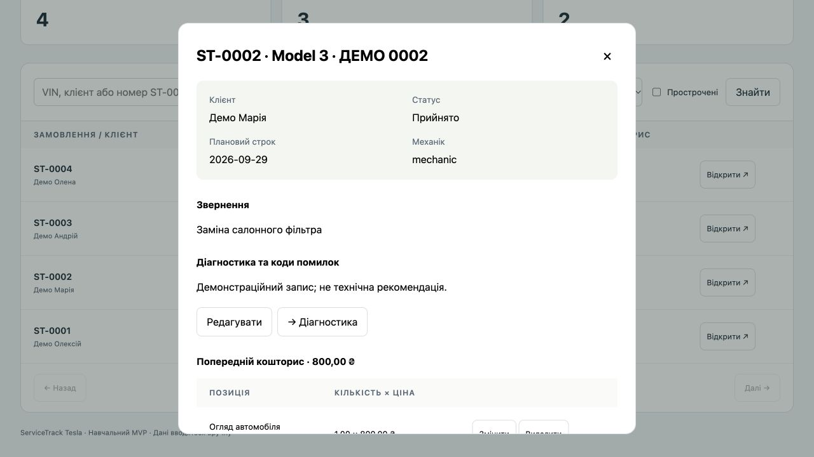

# ПЗ33. Фіналізація презентації та підготовка демонстрації

Філатов Олександр Юрійович, КН-42. 30.09.2026.

[Умова №33](https://b.optima-osvita.org/mod/lesson/view.php?id=184000) передбачає єдиний стиль, короткі тези, візуалізацію, стримані анімації, сценарій демонстрації, тестові дані та технічну готовність. Внутрішній заголовок №36 не збігається з навігацією. Форми подання файлів у цьому уроці немає.

## Презентація

Збережено вісім слайдів ПЗ32, шрифт Helvetica Neue, палітру та розміри заголовків. Порівняння конкурентів подано редагованою таблицею, архітектуру — схемою, результат перевірок — числовими акцентами, MVP — фактичним скриншотом. Тези доповіді є у нотатках кожного слайда.

Додано однаковий плавний перехід Fade середньої швидкості за кліком. Автоматичного перегортання немає; анімація не нав’язує темп доповіді. Вісім переходів перевірено у структурі PPTX; усі кінцеві слайди відрендерено й переглянуто. Зміст слайдів порівняно зі збереженим ПЗ32 — незмінний. Відтворення анімації саме в PowerPoint не перевірялося; перед захистом потрібно відкрити режим показу на обраному пристрої.

Файл: [ПЗ33 ServiceTrack Tesla](presentations/ПЗ_33_ServiceTrack_Tesla.pptx).

## Готові тестові дані

Додано tools/demo.py: новий запуск створює окрему базу в .demo/, два облікові записи й чотири вигадані замовлення. Основна база не використовується. Повторне використання конкретної сесії можливе через --session; зайнятий порт завершує запуск із поясненням. Пароль випадковий, зберігається лише локально у файлі Вхід.txt з правами0600, не в репозиторії.

| Замовлення | Авто | Початковий статус | Призначення для показу |
|---|---|---|---|
| ST-0001 | Model Y | Діагностика | Приклад діагностики та прострочення |
| ST-0002 | Model 3 | Прийнято | Основний наскрізний сценарій |
| ST-0003 | Model S | Очікує запчастин | Альтернативний етап ремонту |
| ST-0004 | Model X | Готово | Резервний короткий сценарій видачі |

У кожному замовленні вже є клієнт, авто, механік і робота «Огляд автомобіля» за800грн. Дати формуються від дня створення бази; це навчальні приклади, не сервісні рекомендації. Для кожної нової репетиції можна створити свіжу сесію, не видаляючи попередню.

## Сценарій живого показу, приблизно 6 хвилин

| Час | Дії | Що пояснити й перевірити |
|---|---|---|
| 0:00–0:40 | Показати список і знайти ST-0002 | Клієнт, авто, механік, строк і статус уже пов’язані |
| 0:40–1:30 | Відкрити картку та перейти до діагностики | Приймання не потребує повторного створення клієнта |
| 1:30–2:30 | Увійти як mechanic; уточнити діагноз і додати коментар | Механік бачить свої роботи; не змінює ціну й не видає авто |
| 2:30–3:30 | Повернутися як admin; змінити наявну позицію на1,50×1000 | Кошторис стає1500грн. Змінити стару позицію, а не додавати1500до800 |
| 3:30–4:40 | Пройти погодження, ремонт і готовність | Кожний перехід залишається в історії з автором і часом |
| 4:40–5:20 | Адміністратор видає авто | Кнопки редагування зникають; коментар доступний |
| 5:20–6:00 | Автомобілі → історія; повторно відкрити замовлення | Дані збережено, видно кошторис і послідовність подій |

Для швидкого переходу між ролями підготувати два різні браузери або окремі профілі. Дві звичайні вкладки одного браузера можуть мати спільну сесію. Пароль вводити до початку трансляції або не показувати файл облікових даних аудиторії.

## Запуск і резервний план

З кореня репозиторію: `.venv/bin/python tools/demo.py`. Відкрити адресу, яку виведе програма. Шлях до локального файлу входу теж виводиться; сам пароль у консоль не друкується. Ctrl+C зупиняє лише цей сервер. Для підготовки без запуску: `--prepare-only`. Для продовження: `--session <каталог_сесії>`. Якщо порт зайнятий, обрати інший через `--port`; не завершувати чужий процес.

Установлені залежності потрібні заздалегідь. Основні екрани локального демо працюють без зовнішніх бізнес-сервісів. Інтернет потрібен для відкриття Moodle/GitHub і віддаленого показу; його перевіряють перед самим захистом. На поточному ноутбуці відкрито сторінку курсу, запущено окреме демо, виконано вхід admin і відкрито ST-0002 з чотирьох підготовлених записів. Повний E2E двох ролей уже зафіксовано у ПЗ30; його не видаємо за нову репетицію доповідача.

Якщо застосунок не відкривається: перевірити, чи сервер запущено, і використати адресу з його повідомлення. Якщо час обмежений: ST-0004 → видача → історія. Якщо живий показ зірвався: використати скриншот слайда5 та відкрито пояснити, що це запис результату попередньої перевірки, а не поточна дія.

## Репетиції та стан готовності

Підготовлено технічні матеріали й початковий стан демо. Потрібні дві особисті репетиції: перша з підказками для освоєння дій; друга з таймером, без читання повних нотаток, на пристрої захисту. Записати фактичний час, труднощі й виправлення після кожної. Ці репетиції та публічний захист ще не проведені. Реальний UAT і незалежне review також залишаються відкритими.

Докази технічних перевірок: [pz33-readiness.json](verification/pz33-readiness.json). Під час перевірки нового засобу запуску підтверджено окрему базу,4замовлення,2користувачі,незмінність основної БД,відхилення неправильного каталогу сесії та зайнятого порту. Повторний запуск повного набору прикладних тестів не був потрібний: бізнес-логіку не змінено.

